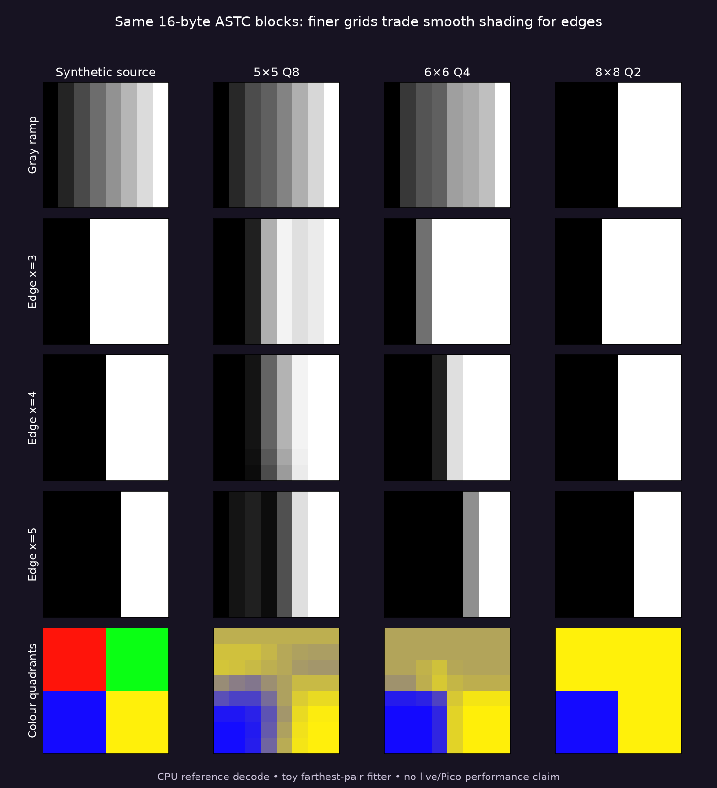

# Finer ASTC weights: format gate, not a live quality win

A reference decoder accepts all **15 synthetic 8×8 blocks**, each exactly **16 bytes**, with one partition and direct RGB CEM8. The tested modes are ordinary 5×5 Q8 (`0x0F3`), 6×6 Q4 (`0x108`) and 8×8 binary Q2 (`0x544`). This establishes that finer weight grids fit the existing texture footprint; it does not establish an encoder, bandwidth or headset performance improvement.

| Synthetic input | 5×5 Q8 RGB MSE | 6×6 Q4 RGB MSE | 8×8 Q2 RGB MSE |
|---|---:|---:|---:|
| Gray ramp | 59.93 | 218.07 | 4644.64 |
| Vertical edge at x=3 | 1124 | 1568 | 0 |
| Vertical edge at x=4 | 2035 | 256 | 0 |
| Vertical edge at x=5 | 1124 | 1568 | 0 |
| Four saturated colour quadrants | 7587.94 | 6438.55 | 9096.92 |

The binary mode exactly preserves these ideal two-colour aligned edges, but badly posterizes the ramp. The 6×6 mode trades fewer weight levels for more spatial control; it is not universally better. These results motivate **selective** trials rather than replacing every block mode.

## Reproduce and scope

Run `./run-local.sh` with the recorded local astcenc AVX2 build, or supply `ASTC_GATE_SOURCE` and `ASTC_GATE_LIBRARY` for a matching build. It compiles with assertions enabled, verifies legal block modes, packs and parses each mode/partition/CEM, checks public reference decompression success, and reproduces the recorded CSV and image bytes. The build is CPU-only and requires AVX2/F16C/POPCNT. It does not install dependencies.

[Runnable source](gate.cpp), [raw rows](raw.csv), [figure script](figures.py). `comparison.ppm` retains original decoded pixels; displayed panels use nearest-neighbour scaling to expose artifacts. MSE is averaged over 64 pixels and three 8-bit RGB channels. Transition width is the middle-row count between 10% and 90% endpoint luminance, only meaningful for the binary-edge fixtures.

**Fitter limit:** this harness uses farthest-pair endpoints and least-squares weights. It does not reproduce the live shader's PCA endpoint fit, q6 endpoint refit or dual-plane selection. It can test physical-mode legality and a synthetic tradeoff, not rank production quality. Endpoint capacities differ: Q64/Q80/Q192 respectively.

The final two ragged `phase_pair` CSV rows are unaligned output-to-output MSE alongside source-to-source MSE. They include intended motion and must not be interpreted as jitter or temporal stability. The [separate moving-pattern gate](followup/README.md) adds explicit motion alignment and block selection; it remains synthetic and uses the same toy fitter. There is no Pico hardware measurement, GPU dispatch cost, compressed-frame size, live motion quality or photon-latency result here. No production shader, installed app or live option changed. Same raw block size does not imply same Zstd payload size or hardware time. Experimental compact-header compatibility is also a separate gate.
