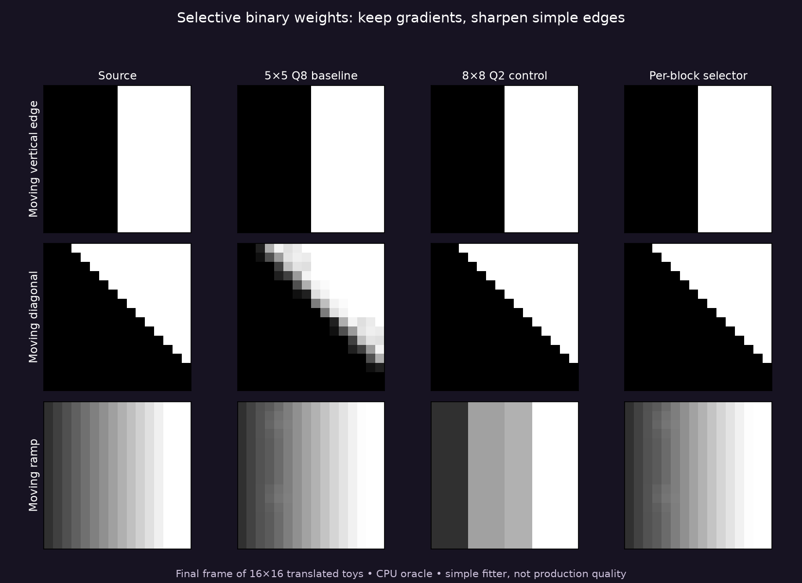

# Selective finer weights: moving synthetic patterns

This CPU-only follow-up passes three reference-decoded constant probes and compares six frames each of translated edge, diagonal and ramp patterns. A selector keeps the 5×5 Q8 baseline unless an 8×8 binary Q2 block has lower measured RGB SSE. Each 16×16 image contains four ASTC blocks; standard constant blocks are used for uniform regions.

| Sequence | Baseline / selector RGB MSE | Baseline / selector motion-aligned MSE | Selected blocks | Sum of Zstd frame bytes, baseline / selector |
|---|---:|---:|---:|---:|
| Vertical edge | 635.21 / 0 | 499.84 / 0 | 10/24 | 211 / 186 |
| Diagonal edge | 903.50 / 0 | 518.59 / 0 | 16/24 | 281 / 300 |
| Gray ramp | 8.37 / 8.37 | 14.41 / 14.41 | 0/24 | 286 / 286 |

The selector exactly fits these deliberately simple two-colour edges and leaves gradients alone. **The diagonal takes more compressed bytes despite lower error.** This supports a selective research gate, not blanket replacement or a compression win.

Temporal MSE compares each decoded frame with its predecessor shifted by the known source motion, excluding the uncovered border. Source-aligned MSE is zero in all three translated sequences. It measures a synthetic block-phase artifact; it is not live jitter or headset motion quality. Black, (128,64,200) and white constant probes report MSE zero; these use astcenc's standard constant encoder rather than candidate CEM8 mode packing.

## Reproduce

`./run-local.sh` uses the same local astcenc AVX2 reference build as the [initial gate](../README.md), plus system libzstd. Override `ASTC_GATE_SOURCE` and `ASTC_GATE_LIBRARY` for matching builds. It independently reruns reference decoding and compares raw CSV and emitted pixels. Assertions are enabled. [Raw rows](raw.csv), [source](motion_gate.cpp), [figure script](figures.py).

Zstd level3 reuses a CCtx but compresses each64-byte ASTC image independently; reported bytes sum six frames. These tiny frames are **not production packets**, native images or realistic entropy statistics. The simple farthest-pair endpoint fitter is inherited from the initial gate and does not match live PCA/q6 endpoint refit/dual-plane selection. Selection uses a full reference decode, not a proposed GPU-cost implementation. No encoder timing, Pico GPU cost, freshFPS, HEVC parity or photon latency is established. All inputs are synthetic; private photos and production apps remain untouched.

Next gate compares candidates against actual retained production-encoded native blocks with precisely matched source pixels. No live shader change is justified by these toys alone.
