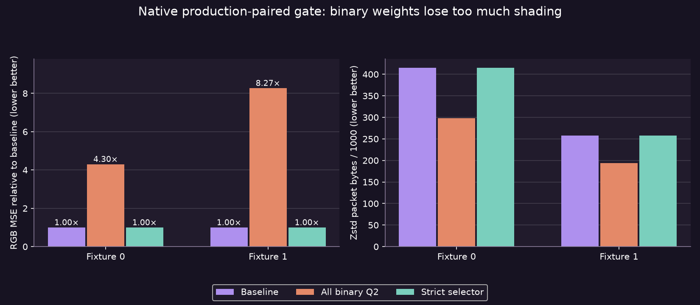

# Native production-paired ASTC binary weights: rejected

The real-image gate rejects wholesale 8×8 binary weights and finds too little benefit from strict block selection to justify shader work. This compares **two retained 2176×2176 source images** with matching output from the actual native ASTC8×8 q6 encoder shader. They are unrelated photographs, not stereo captures or moving VR footage. Root independently rebuilt the public harness, verified fixture/shader hashes and reproduced every aggregate row.

| Fixture | Baseline RGB MSE | All binary weights | Strict selector | Selected blocks / 73,984 | Packet bytes: baseline → selector |
|---|---:|---:|---:|---:|---:|
| 0 | 26.7308 | 115.0400 | 26.6794 | 158 (0.214%) | 414,921 → 414,945 |
| 1 | 4.79806 | 39.6868 | 4.79803 | 1 (0.00135%) | 257,982 → 257,987 |

All-Q2 packets total491,855 bytes versus baseline672,903 (26.9% fewer), but image RGB error increases4.30×/8.27×. The selector's combined RGB SSE improves only0.163%, while packets grow29 bytes. These results are specific to the reused-baseline-endpoint candidate; they do not disprove every possible Q2 endpoint fitter. They are enough to reject **this candidate** as a useful production improvement.

## Actual gate

Each eye contains73,984 standard16-byte ASTC8×8 blocks. All candidate blocks parse as legal one-partition CEM8 mode`0x544` and reference-decode. The candidate repacks the baseline's decoded endpoint pair into Q192 endpoints with one binary weight per pixel; source pixels choose the closer endpoint. The selector uses the actual reference-decoded error and retains baseline unless candidate RGB SSE is at most80% of baseline. Baseline dual-plane blocks remain the comparison; the candidate uses one plane. No native texture-footprint or image-resolution change occurs.

RGB is read from retained RGBA8 UNORM source bytes; alpha is ignored, matching shader`direct_rgb=1` and RGB×255. ASTC reference endpoint unpacking expands channels to16-bit; this harness converts back by dividing257 before candidate decisions. That scale was corrected before all recorded rows. Inputs and baseline block hashes match the archived fence recheck and overlap copies. Zstd level3 compresses each whole eye independently; baseline frame bytes plus the ordinary24-byte packet header match archived production packets exactly.

## Reproduce

`./run-local.sh eye0.rgba eye0.raw.astc eye1.rgba eye1.raw.astc` writes aggregate CSV to stdout. Supply headerless2176²RGBA8 sources and matching native ASTC8×8 payloads of exactly1,183,744 bytes. The public harness rejects missing, short or extra input data. The matching astcenc AVX2/F16C/POPCNT build and system Zstd1.5.7 are recorded in [provenance](manifest.txt); override `ASTC_GATE_SOURCE`/`ASTC_GATE_LIBRARY` if needed. Assertions remain enabled. [Source](gate.cpp), [raw results](raw.csv), [figure script](figures.py). No image pixels or generated payloads are published.

This is a CPU reference **format and spatial-error gate**, not an encoder-speed test. No new GPU shader, production code, live option, Pico app or user session changed. No motion sequence, perceived quality, fresh FPS, HEVC parity, power or photon latency was measured. RGB MSE cannot independently establish perceptual quality or jitter. The toy edge success from the [earlier gate](../astc-fine-weights-gate/followup/README.md) therefore does not warrant live activation. A balanced6×6Q4 candidate has a separate bounded gate pending.
