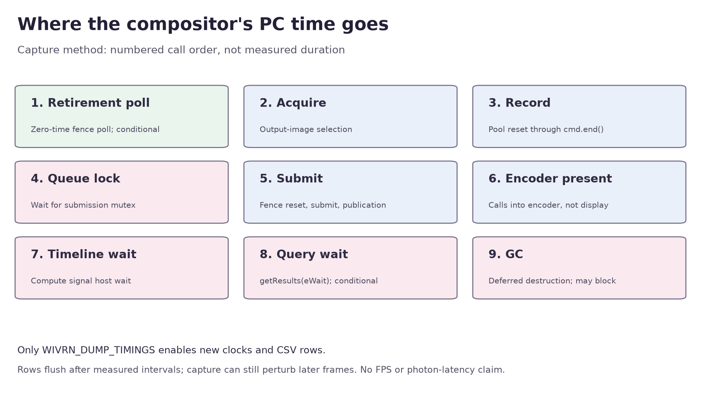

# Compositor PC host timing: opt-in capture, no measured gain

The compositor now records nine separate PC host intervals when the existing `WIVRN_DUMP_TIMINGS` CSV file is open. Earlier GPU query timestamps and broad encoder waits cannot identify CPU recording, queue-lock contention, synchronous encoder dispatch, timeline/query waits or cleanup separately. This change prepares that measurement; it does not optimize a wait or claim a live latency reduction.

Published source: `2f53c2cbcd3ba08202b92c53f8bb7ba4ef6685ac` ([commit](https://github.com/nerdrx/wivrn-nx/commit/2f53c2cbcd3ba08202b92c53f8bb7ba4ef6685ac)). Build and checks ran on these same source hashes before commit; no install or capture activation.

Source parent: `2cfb14faca86d6aff5826549e76238bfd06c8dde`, branch `pyrowave-probe`. Only `server/compositor/compositor.cpp` and `server/driver/wivrn_session.h` changed. The new file predicate and every new clock/format/dump are guarded. Disabled mode still has ordinary branch/local-state work; zero total overhead is not claimed. Existing waits, timeout/drop behavior, encoder signal scope and retirement guard remain.



## Exact scopes

| CSV event suffix | PC interval | Qualification |
| --- | --- | --- |
| `retirement_poll` | Zero-time `waitForFences` call | Present only when a prior recording submission is pending; includes ready and timeout polls |
| `acquire` | `acquire_image` | May return no image |
| `record` | Command-pool reset through `cmd.end()` | Includes CPU command recording and any synchronous work inside it; not GPU execution |
| `queue_lock` | Acquisition of the submit queue mutex | The subsequent submit duration is separate |
| `submit` | Fence reset, `submit2`, generation publication | While the queue mutex is held; not GPU completion |
| `encoder_present` | Synchronous calls into encoder backends | Ends before encode-request notification; may include slot waiting; not display presentation or worker completion |
| `timeline_wait` | Existing host wait for the compute timeline value | Timeout preserved; not a pure GPU-execution duration |
| `query_wait` | `getResults(...eWait)` | Absent after timeline timeout; CPU wait for GPU queries |
| `gc` | Deferred swapchain garbage collection | Default destruction may wait device-idle |

Rows are emitted after all stamped intervals finish. On retirement timeout or failed acquisition, completed early intervals emit before returning. Busy/disconnected/no-clock-offset exits before the capture block do not emit host rows. Exceptions interrupting a call are not captured as completed intervals. Stage durations do not sum to total commit time: encoder health checks, setup gaps, notification, motion-field send, stats and CSV output are outside some boundaries.

Each new row uses the existing CSV prefix plus two fields:

```text
event,frame_id,end_pc_monotonic_ns,255,begin_pc_monotonic_ns,outcome
```

Outcome is `submitted`, `timeline_timeout`, `retirement_timeout` or `no_image`. `submitted` means the normal timeline branch completed, not fresh headset delivery or full recording-fence retirement. Successful rows use the pacer's `info.frame_id` carried into encoder/frame feedback. Early rejected rows use the current compositor/pacer frame ID before lookup. The source route establishing that mapping is documented in [TIMING_AUDIT.md](TIMING_AUDIT.md).

## Verification and use

The complete configured `wivrn-server` target builds successfully; [raw output and exact source hashes](raw/build/). The source-linked helper gate passes **34 checks** normal and halt-on-error ASan/UBSan; the adapted retirement lifecycle gate passes **37** in both modes. Independent root replay matches the generated code byte-for-byte. They use fake clock/formatter/session/Vulkan boundaries, plus static source-placement checks. They do not execute the full compositor. [Method details](SOURCE_CHECKS.md), [helper method](source-gate/README.md), [lifecycle method](lifecycle/README.md), [raw checks](raw/).

`extract_host.py --self-check` uses synthetic parser fixtures. It validates row fields, stream sentinel, frame/range/outcome and duplicate stage IDs. Missing stages stay missing; they are never substituted with zero duration. Real-input summaries report nearest-rank p50/p95/p99 by stage **and outcome**, with sample counts. Parser fixtures are not runtime measurements.

For a later explicitly authorized isolated session with this server source, set the already-supported `WIVRN_DUMP_TIMINGS` to a writable file before launch. No such capture was activated here. Then process the resulting file:

```sh
python3 extract_host.py /path/to/timings.csv --output /path/to/host-intervals.csv
```

Pair successful host rows with existing encoder GPU/wait diagnostics, `frame_bytes` and `feedback_spans`; [matched span extractor](../matched-delivery-spans/extract_spans.py) retains the network-side scope. Do not use stage counts as fresh FPS. Headset feedback timing is separate from these PC-only intervals.

CSV mutex locking, formatting, tracing and per-row flushes occur after the reported intervals, but can perturb later frames and overall scheduling. Compare captures under matched conditions and validate the culprit with a tracing-off repeat before promoting a latency change. No claims about physical photon latency, HEVC parity or live quality follow from this diagnostic.

## Offscreen boundary

No existing local harness calls the real `layer_commit` or `layer_squasher::do_layers`. Production motion/ASTC shader tests exercise narrower workloads. Building a genuine squasher test requires its Vulkan bundle, HMD/pose dependency and valid swapchain views. [Harness inventory](HARNESS_AUDIT.md), [source review](PATCH_REVIEW.md). No empty-command test was reused as a compositor timing result.

No installation, restart, Pico work, active application changes or runtime diagnostic activation occurred. The next useful step is actual matched compositor/encoder/delivery capture, then a targeted change to the measured dominant wait with image/mirror lifetime gates intact.
