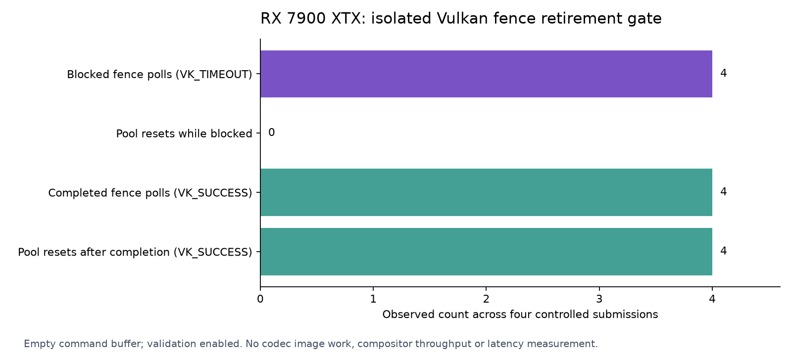

# Compositor recording retirement: narrow source guard

The PC compositor now associates its recording submission with a dedicated fence. A later commit polls that fence before acquiring an output image or resetting its shared command/query resources. If work is still pending, it clears the incoming frame bookkeeping and returns without recording. This addresses a source/spec reuse concern; no actual compositor fault was reproduced.

Published source: `2cfb14faca86d6aff5826549e76238bfd06c8dde` ([commit](https://github.com/nerdrx/wivrn-nx/commit/2cfb14faca86d6aff5826549e76238bfd06c8dde)), branch `pyrowave-probe`. Built before commit; the retained source hashes identify the same changed files.

Source base: `09e7951a6e3273e35dccfacefebdd27303211866`, branch `pyrowave-probe`. The owned change is 24 diff lines in `server/compositor/compositor.cpp` and `.h`. It preserves the existing compute-stage encoder signal and end-of-commit timeline/query/motion paths. Fence and semaphore generation publication occurs only after successful submission. No installation, restart or experimental option activation occurred.

## What this establishes

- The configured complete server target builds with the changed source. [Full build output and source hashes](raw/build/).
- Actual extracted new source branches pass **37 checks** in normal and ASan/UBSan runs, independently rebuilt by root, with byte-identical extraction. They cover failed acquire and submit → timeout → late completion → resubmit with distinct semaphore values. [Runnable source gate and scope](SOURCE_METHOD.md), [raw Luna evidence](raw/source-luna/), [independent raw replay](raw/source-root/). These checks use fake Vulkan-Hpp objects. This is separate from the complete build and does not execute the compositor on a GPU.
- A standalone headless Vulkan program on the RX 7900 XTX holds its own submissions behind host-signaled timeline values. Four zero-time fence polls return `VK_TIMEOUT`; no pool reset occurs while blocked. After release, all four fence waits, completed polls and pool resets return `VK_SUCCESS`. Explicit Khronos validation with synchronization validation requested reports no errors or unexpected warnings. This uses an empty command buffer: no real image, codec, mirror or compositor pipeline is exercised. [Raw API rows and logs](raw/gpu/), [runnable API gate](run-gpu-check.sh).
- A separate 37-check CPU model passes normal and ASan/UBSan, including an illustrative additional-consumer lifetime. Root independently replays both. Its extra consumer is an assumption about a shared resource, not the actual mirror buffer layout or a native image acquire policy. [Model scope](MODEL_METHOD.md), [Luna evidence](raw/model-luna/), [root evidence](raw/model-root/).

The GPU test requests validation explicitly and disables implicit layers only in its own child process. Ordinary `vulkaninfo` records a missing `vkGetInstanceProcAddr` in the installed LSFG layer; no layer files, global settings or user applications were changed. The first API run exited 1 because it counted ten loader filter announcements as warnings. Those logs are retained. The final test counts only that exact general-message announcement separately; all other warnings and all errors remain failures. Ten expected announcements and zero unexpected warnings are recorded. [Loader filter contract](https://github.com/KhronosGroup/Vulkan-Loader/blob/main/docs/LoaderLayerInterface.md).

## Ownership corrections

The actual WiVRn factory wraps the native compositor in Monado's multi-system compositor. Its dedicated worker serially calls native commit; client IPC commit paths are not direct concurrent calls into this callback. The layer accumulator stores raw swapchain pointers. Delivered client slots and deferred destruction provide surrounding ownership.

Importantly, default swapchain cleanup already locks the queue and calls `vkDeviceWaitIdle` before freeing image resources. Garbage collection after a timeline timeout can therefore block; its presence does not prove premature destruction. The patch does not remove that protection or change image-use counts. [Corrected actual-route audit](RETIREMENT_OWNERSHIP.md), [independent patch review](PATCH_REVIEW.md).

The Vulkan contract requires non-pending command buffers before a pool reset; a submit fence signals after its submitted command buffers complete. The patch uses that fence for recording-resource reuse rather than widening the semaphore signal used by encoders. [Pool reset requirement](https://docs.vulkan.org/refpages/latest/refpages/source/vkResetCommandPool.html), [submission fence contract](https://docs.vulkan.org/refpages/latest/refpages/source/vkQueueSubmit2.html).

## Limits and next measurement

This is a correctness guard, not a measured latency optimization. It adds a submit fence and one nonblocking readiness check on subsequent accepted commits; their normal-path cost is unmeasured. It can skip a commit when the recording submission is still pending. Full compositor validation, frame-drop behavior, mirror-buffer ownership, downstream encoder lifetimes and device-loss behavior are not established by the standalone API test or CPU models. Existing live profile and performance remain unverified here.

Do not remove the end wait or default destruction waits from these results. The next useful gate pairs real producer/slot/fence timings with fresh stereo delivery, then tests any deferred-wait design with explicit resource generations and image-use lifetime. Native 90/240 fresh FPS, HEVC parity and physical photon latency remain unproven.
