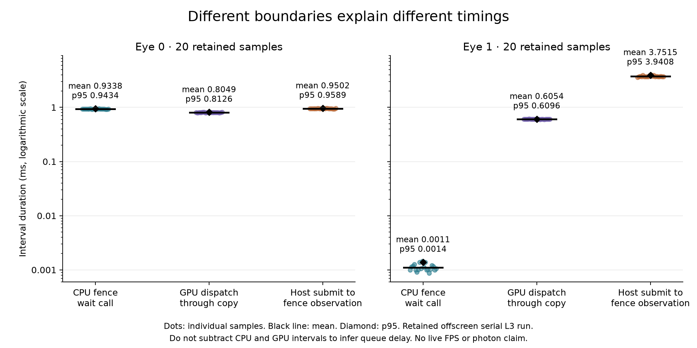

# Native PC ASTC fence attribution audit

Read-only source/report audit. No tests, builds, GPU runs, or source edits.
The inspected checkout is `a98d5ac0`; `831aafed` is the parent revision for
the new sender-wait counter. The earlier fence harness pins the production
shader from `d3f428bb`; keep those data/source scopes distinct.

## Existing evidence and scopes

| Evidence | Measures | Does not attribute |
| --- | --- | --- |
| `fence-recheck/results/serial-20-uninstrumented.csv` | Complete serial two-eye call, uninstrumented wall baseline. | Any substage. |
| `fence-recheck/results/three-mode.csv` and `fence-recheck/summary.csv` | 20 serial L3 samples: CPU record/submit, per-eye `vkWaitForFences` call, submit-to-fence wall, timestamp dispatch and dispatch-through-readback, Zstd, packet path. Both eye submissions precede waits. | Production prior-slot wait, actual compositor semaphore readiness, isolated queue delay, separately timed query retrieval or invalidation. |
| `fence-overlap-recheck/results/three-mode.csv` | 20 matched serial/async pairs; right-eye packet path overlaps caller's left-eye path. Same queue, both submits first, byte-identical output. | Live compositor/slot contention, why an older long fence wait happened, GPU speedup. |
| `production-overlap-gate/trace-lanes/AUDIT.md` | Source review of Perfetto track ownership and API pairing. | Runtime slice validity: no Perfetto capture was possible because the configured SDK is absent and stubs are no-ops. |

The fence recheck reports 20 serial samples with p50/p95 submit-to-eye-0-fence
0.951/0.959 ms, eye-0 wait-call 0.934/0.943 ms, and GPU dispatch-through-copy
0.805/0.813 ms. Eye 1's submit-to-fence is 3.708/3.941 ms, but its wait call is
only 0.0011/0.0014 ms because the serial observation starts after eye 0's
readback and packet work. It is not a 3.7 ms GPU wait. The parallel follow-up
reduces complete-call wall while per-eye GPU timestamp sums remain effectively
unchanged. Raw files and reports are under
`overnight-recovery/fence-recheck/` and
`overnight-recovery/fence-overlap-recheck/`.

## Timestamp and generation audit

On current source `a98d5ac0`, `video_encoder_astc.cpp:172-199` creates the
optional pool only for exact `WIVRN_NX_ASTC_GPU_TIMING=1`, and checks the queue
family's nonzero `timestampValidBits` plus a finite positive period. Each slot
owns one command buffer/fence (`video_encoder_astc.h:19-27`) and uses query IDs
`2*slot` and `2*slot+1` (`video_encoder_astc.cpp:277-292`). The pair resets in
that slot's new command buffer; its start is `COMPUTE_SHADER` immediately before
dispatch. Its end is `BOTTOM_OF_PIPE` after the compute-to-transfer barrier,
block-buffer copy, and transfer-to-host barrier. The submit waits on the
compositor semaphore at `COMPUTE_SHADER | TRANSFER` (`:294-299`), so the start
timestamp is stage-gated until the input dependency is satisfied. It brackets
dispatch-through-readback work, not kernel-only time and not the earlier wait.

`encode(slot)` waits the same slot fence before reading that slot's query pair
without a WAIT flag (`:302-324`). `present_image` clears `s.valid` before record/submit and sets it only after
successful submit (`:236-246,294-299`); its submission-time fence timeout also
clears validity. Separately, `encode()`'s fence timeout returns empty without
clearing `s.valid` (`:302-307`). The base idle setter still releases its state
gate on return, so a later ASTC `present_image` must retain its Vulkan fence
guard before re-recording. Thus query association is by slot index, slot fence,
and validity bit, without an explicit frame-generation token. This is a
lifecycle association, not a generation-ID assertion; do not remove the
subclass fence as redundant.

The production CPU `fence+invalidate` accumulator spans `encode()` entry through
query retrieval and `vmaInvalidateAllocation` (`:302-325,469-473,515-517`). It
combines CPU fence wait, query-result retrieval, and invalidation; there are no
separate durations for those three. The GPU query count/mean/percentiles are
reported separately (`:499-535`). The sender wait newly added at `a98d5ac0`
surrounds `shared_sender->wait_idle(this)` in `video_encoder.cpp:765-788`; it
does not cover either earlier base busy-state wait or ASTC subclass fence
wait.

The standalone fence harness (`fence-recheck/src/main.cpp:205-253,320-369`)
uses four IDs per eye: top-of-pipe, compute-before-dispatch, compute-after-
dispatch, bottom-of-pipe. It resets the pool each recorded frame, uses one
fence/query pool per eye, submits both eye command buffers, then waits, fetches
query results after fence completion, invalidates mapped memory, and packs.
The test's one-frame loop serializes readback/packing before reuse, so query ID
reuse is naturally paired in that harness. It contains no native rotating-slot
wait and no compositor timeline semaphore wait in those two submits. The
timestamp interval uses same-queue GPU ticks and a valid-bit mask; no
CPU-minus-GPU subtraction is justified.

## Attribution limits and next gap

- **Prior-slot CPU busy wait:** base `video_encoder::present_image` advances
  `present_slot` then waits on `state[present_slot].wait(busy)` before calling
  the ASTC subclass (`video_encoder.cpp:696-734`, wait at 704). This can cover
  prior sender wait, encode work, and packet push until `idle_setter` releases
  the state in base `encode` (`:745-837`).
- **Subclass GPU-fence guard:** only after the base state gate does ASTC
  `present_image` wait on the slot's Vulkan fence (`video_encoder_astc.cpp:236-246`).
  Neither old standalone fence run models a busy production slot; the
  `a98d5ac0` sender-wait counter measures only `wait_idle` and covers neither
  slot wait.
- **Input readiness:** standalone uploads finish before trials. Production waits
  for the compositor semaphore at compute/transfer stages. The GPU timestamp
  start is therefore after the dependency; CPU submit/fence wall may include
  the wait. These scopes cannot be subtracted to estimate semaphore delay.
- **Queue/scheduler contention:** CPU wait includes driver/queue backlog,
  semaphore blocking, device execution, fence signaling, and host wakeup. The
  GPU timestamp excludes time before its compute-stage start and includes
  dispatch/readback work once timestamped. Their difference is not queue delay.
- **Query/invalidate overhead:** standalone samples do not separately time
  query retrieval, invalidation, or host memcpy. Production combines query
  retrieval and invalidate with fence wait in `fence+invalidate`.

The one justified next measurement, beyond the sender-wait diagnostic, is a
short actual-compositor run with two separate per-stream spans: the base
`state[present_slot].wait(busy)` CPU wait, then the ASTC subclass
`vkWaitForFences` guard. Tag each with slot and monotonically increasing
submission generation, and pair with existing submit/fence and GPU timestamp
samples. This distinguishes normal prior-encode lifecycle backpressure from
the defensive GPU-fence guard. Keep CPU and GPU clocks separate; the result
still cannot isolate semaphore readiness or queue delay. Avoid another
standalone synthetic fence run; existing native checks already bound that case.

## Root verification and retained figure

Root checked actual base/subclass call order and corrected two earlier audit
errors: the base CPU busy-state wait comes first; backend encode timeout does
not itself clear `s.valid`. The subclass fence guards possible outstanding GPU
work after the base state has become idle, so removing it is not justified.

The figure reuses the existing20 offscreen `serial_l3` rows, with no new timed
run. Individual samples, mean and nearest-rank p95 are shown for three distinct
boundaries. Eye1's late host observation includes preceding serial eye0 packet
work; its actual fence wait is about1microsecond. No panel estimates queue delay
or adds these unlike intervals. The fixture/raw byte counts belong to the
earlier shader-pinned native harness; this is not a current-source/live test.



```sh
python3 plot_scopes.py
```

Raw rows are retained unchanged in `retained-serial.csv`; original source
`fence-recheck/results/three-mode.csv`. Source hash in `provenance.txt`.
No private images/payloads are published. The next small implementation targets
only the base CPU busy gate as default-off180-call mean/max; detailed
per-generation GPU/compositor traces remain a separate future gate.
