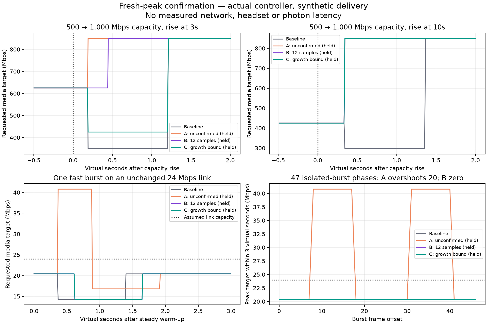
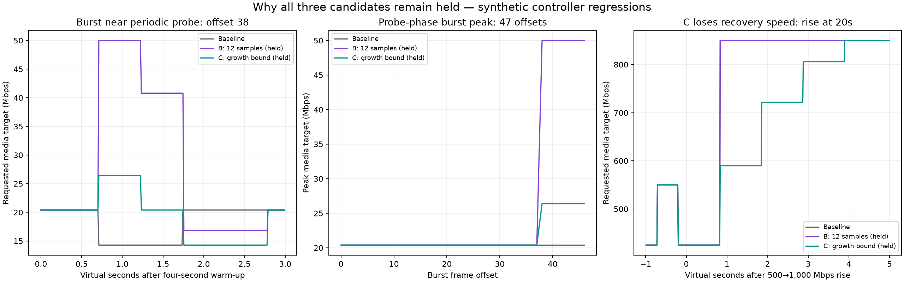

# Fresh capacity, burst outliers and recovery — three held candidates

**Production remains clean at source `6902940fcd1cb15cef2337e9d6ab85cc266ebbd4`. All three candidates are held.** The baseline server was rebuilt after reverting a temporary B working-tree integration. No client install, live restart or option activation occurred.

The controller can mistake returning bandwidth for congestion: its ten-second capacity maximum rises immediately, while its recent delivery-rate p90 still contains the slower preceding two seconds. Comparing these different cohorts produces a slowdown ratio of two on a clean capacity increase. We reproduced this without deliberate loss or display drops, then tested three corrections against adverse controls.

The figures and times below are deterministic **actual-controller CPU replays with synthetic delivery**. They do not establish measured Wi-Fi, Pico frame rate, live quality or photon latency.





## Candidate decisions

| Variant | Change | Helpful result | Failing gate | Decision |
|---|---|---|---|---|
| A | Compare maximum with post-peak loaded-rate p90 | Removes clean-rise false cuts | 20/47 steady burst phases double target to40.8 Mbps on24 Mbps link | held |
| B | Require12 post-peak samples; hold unconfirmed ordinary steady increases | Fixes A's steady burst overshoots; faster recovery in two phases | Nine late probe phases jump to50 Mbps on24 Mbps link | held and reverted |
| C | Bound all native upward targets after startup by observed p90 with the existing gain | Caps B's probe-phase spikes at26.4 Mbps | 20 s capacity-rise recovery delays from20.833 to23.900 s | held |

A records the timestamp at which the maximum rises and computes a separate p90 from loaded, matched-rate samples at or after that epoch, within the existing fresh two-second window. It has no minimum cohort count. One fast sample can therefore become the whole p90.

B requires at least12 such samples before using this p90 for ordinary BBR slowdown. Before that count, ordinary steady target increases are held. Startup, deliberate probes, forced probe completion and direct quality mode retain their policy. Those probe exceptions fail: at burst offsets 38–46, the target rises20.4→50 Mbps at phase frame64, then 40.8 at111, falls 16.8 at158, and returns 20.4 at251. Baseline instead cuts20.4→14.28 at64 and returns 20.4 at157. The first easier steady-phase sweep had missed this regression.

C also bounds upward targets during probes and forced completion: it applies the existing gain to the post-peak p90 once ready, or the existing recent p90 before that. With no loaded rate it holds the target. Startup/direct quality remain unchanged. This stops the large probe spike but also caps genuine growth when the repeatable rate trails the maximum modestly. The 20 s rise ramps589.8→721.4→806.1→850 Mbps rather than recovering directly. At the 3 s rise it creates a625→425 Mbps transition, so it also fails to preserve B's clean upward trajectory.

The12-sample constant is the existing estimator threshold, not a fixed wall-clock grace period. A ready cohort can disagree with the maximum; a persistently lower p90 still triggers slowdown. Epoch resets occur on estimator flush, strict maximum growth, loaded-sample expiry and acute seeding/capping. Even tiny numeric rises reset the epoch; no material-growth threshold was added. Actual loss/utilisation/radio controls remain independent of this confirmation. Maximum-individual-eye utilisation and aggregate quality scaling were not replaced by merged-eye utilisation.

## Recovery comparison

The table measures the first modeled sender-start row requesting at least840 Mbps after a500→1,000 Mbps capacity rise. The ceiling is1,000 Mbps; steady recovered target is850 Mbps. Requested media target is not wire throughput. All timestamps are virtual seconds.

| Capacity rise | Baseline first≥840 Mbps | B first≥840 Mbps | C first≥840 Mbps |
|---|---:|---:|---:|
| 3 s | 4.211 | 3.447 | 4.211 |
| 5 s | 5.236 | 5.236 | 5.236 |
| 10 s | 11.367 | 10.344 | 10.344 |
| 20 s | 20.833 | 20.833 | 23.900 |

B avoids baseline's625→350 Mbps cut at3 s and425→297.5 Mbps cut at10 s. Its gains in those scenarios are0.764/1.022 virtual seconds, but its probe-outlier regression prevents integration.

The500→300 and500→250 Mbps collapse CSVs are byte-identical between baseline and B. Their estimate-driven cuts remain near 210/175 Mbps, settling near255/212.5 Mbps. C's250 Mbps trace also matches exactly. Its300 Mbps trace differs in126 target rows by at most47 bps from endpoint rounding; sender times, estimates and state transitions match. This tiny difference is not the reason C is held.

Each steady burst phase injects one loaded frame reporting48 Mbps arrival on an otherwise24 Mbps assumed link. Forty-seven offsets plus no-burst control produce12,960 rows per variant over three virtual seconds. Baseline/B/C have zero above-capacity requested targets in that particular sweep; A fails20/47. The separate sweep after four additional virtual seconds includes the ordinary periodic probe. Its no-burst baseline/B trace is20.4→26.4→20.4 Mbps; the intentional26.4 Mbps probe is not scored as an isolated-burst failure. B's50 Mbps peak is 1.89× that no-burst peak. C caps the failing offsets at26.4 Mbps, but later cuts remain.

The separate ten-second adversarial replay includes clean-rise, isolated-high, repeated-high, app-limited, loss-after-rise and no-feedback controls. Isolated outliers can still cause false later cuts; frequent outliers still oscillate toward the floor. No candidate is claimed to solve either weakness. Advancing time without feedback leaves target and estimate unchanged: expiry requires sufficient feedback to evaluate, not a background wall-clock timer.

## Method and verification

The stereo fixture uses production `bitrate_controller`, `pacing_slot` and `shard_pacer` helpers, two serial equal-payload eyes and fully filled target media budgets. Capacity changes at actual modeled sender start, not desired display time. Ten scenarios each run3,600 virtual frames at nominal90 Hz. Paired late controls begin decode-result-without-display feedback at25 s, after the initial rise; these are later display-drop controls, not loss-at-rise tests.

Single-stream fixtures import the pinned production BBR harness with main renamed. Wire timing is `max(pacing window, payload/capacity)`, not a captured network trace. The first phase sweep begins after steady warm-up; the second adds360 frames (four virtual seconds) before placing the burst.

All three candidates pass the existing five controller suites normally and under halt-on-error ASan/UBSan. Root's temporary B source integration additionally passes four new outcome checks: clean capacity-rise minimum/final target and two A-failing steady burst phases. That is BBR 90 checks, budget 4,346, NX direct 31, radio 50 and AIMD-loss-only assertions. The configured full server built with B, then built successfully again after restoring6902940f. **Passing suites/build did not catch B's new probe-phase regression; the later trajectory gate did.** The added regressions are archived with the held B evidence, not committed into production alone.

Root's corrected public runner independently reproduces all12 retained B CSVs from the initial three fixtures byte-for-byte. Final public reproduction matches all14 retained C CSVs byte-for-byte, including both probe-phase tables; validation logs accompany the data. The SHA manifest pins controller snapshots and include order selects their header before the checkout header.

The first A drafts mixed a changed class with an old header; these ABI-mismatched runs are excluded. The initial stereo event tracker advanced only on decreases; it was corrected to update after every feedback before retained traces. Recovery transitions are derived independently from raw target rows. The public wrapper's binary/output-directory name collision was fixed before successful reproduction.

## Reproduce

Use a configured source checkout with `build-server` generated headers and fetched Monado/Boost dependencies. Controller snapshots and imported BBR harness are pinned here. No headset or window is opened.

```sh
bash run.sh /absolute/path/to/wivrn-nx baseline /tmp/nx-rate-baseline
bash run.sh /absolute/path/to/wivrn-nx exploratory-A /tmp/nx-rate-A
bash run.sh /absolute/path/to/wivrn-nx confirmed-B /tmp/nx-rate-B
bash run.sh /absolute/path/to/wivrn-nx growth-bounded-C /tmp/nx-rate-C
python check.py
python plot.py
```

`run.sh` outputs new traces outside the report. `check.py` verifies retained evidence and writes `recovery-summary.csv`; a successful evidence check means the recorded failure findings are reproduced, not that a candidate passes acceptance. Compare fresh CSVs with the retained mode before relying on reproduction. A's probe-phase follow-up was not required after its steady-phase rejection; its public runner can generate it but no retained A probe trace is claimed.

[Controller snapshots and hashes](SOURCE_SHA256.txt), [raw trace checksums](EVIDENCE_SHA256.txt), [raw traces](raw/), [validation logs](validation/), [evidence checks](check.py), [figure source](plot.py), [bounded next-design audit](NEXT_GATE.md).

Fixtures omit encoder cost, real feedback delay/jitter, capped queues/drop decisions, FEC, repair traffic and decoder/display execution. Synthetic unbounded ideal-service lag is not an observed sender backlog. Native 90/240 fresh FPS, HEVC parity and physical photon latency remain unproven. The earlier held native late-probe guard remains off and needs a combined recovery gate before reconsideration.
