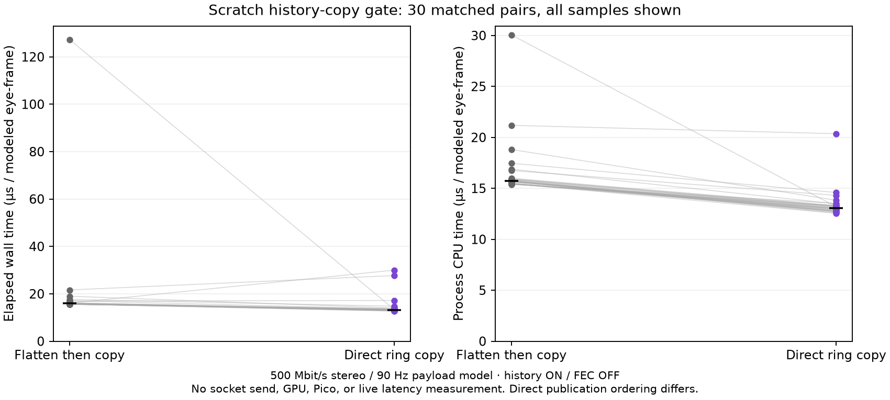

# Direct history serialization scratch gate

No production files changed. Scratch-only prototype tests one possible way to avoid materializing a flattened recovery blob before inserting it into history. Preserve the original aggregate-only first run in `first-run-summary.md`; the reproducible per-frame capture is in `reproduced/`.

## Gate results

The final normal, ASan/UBSan, and TSan builds and correctness runs all exited 0; each run log is retained in `reproduced/` with a matching `.exit` file. The checks require exact collected bytes against `fec::encode_blob` + original `shard_history::push`; successful decode of view info, timing info, and deterministic payload; ring wrap and eviction; disabled and secondary-path behavior; and producer/read/decode plus enable/disable concurrency. The concurrency payload is constant per test shard, so this establishes safe decode/locking for returned blobs, not frame-identity correctness under every schedule.

One alternating matched 30-pair trial, after 20 warm-up frames per treatment, used persistent history rings and a persistent legacy output vector. Each modeled eye frame carried 347,222 payload bytes (500 Mbit/s aggregate stereo at 90 Hz), split on the non-FEC 1400-byte shard budget with view info on shard zero and timing on the last. Raw per-frame wall/process-CPU rows are in `reproduced/timing.raw.csv`; host/build context and full aggregate output are alongside.

```text
legacy_encode_blob_then_ring_push: wall p50/p95 0.0159/0.0190 ms; process CPU p50/p95 0.0157/0.0188 ms
direct_spans_into_ring:             wall p50/p95 0.0132/0.0172 ms; process CPU p50/p95 0.0130/0.0143 ms
```

Both treatments retained 10,450,680 blob bytes over 30 samples. The observed median saving is about 2.7 microseconds per frame (~0.24 ms CPU/s per eye at 90 Hz). The tail is noisy and desktop load was uncontrolled; treat this as a scratch microbenchmark, not a production or headset claim. The direct path removes the flattened vector's extra write/read but still copies once into owned ring storage.

The existing `tests/fec_history_bench.cpp` was run once unchanged in the first pass; its correctness compares reusable FEC blob handling against separate encoding. See `fec_history_bench.log` in this directory. It is not a measurement of this direct helper, and was not repeated.

## Raw paired comparison



Recomputing the retained CSV gives direct-minus-legacy paired mean CPU **−3.1803 µs**, improving 30/30 pairs. Wall mean is **−5.5388 µs**, improving 27/30 pairs; the plot retains the large legacy wall outlier rather than hiding it. These means are distinct from the median differences above. At 90 Hz the paired CPU mean corresponds to about **0.286 ms CPU/s per eye**, a modeled rate conversion rather than a live measurement. Percentiles in the original capture use sorted index `floor((n−1)*p/100)`; no uncertainty or repeatability claim is established by one short run. See [computed summary](paired-summary.json), [source hashes](source-sha256.txt), and [raw CSV](reproduced/timing.raw.csv).

## Integration limit

The prototype writes and publishes directly to history under the ring lock. In the real sender, plaintext must be snapshotted before socket send because send encrypts payload spans in place; `collect_retransmits` can read history concurrently without taking `SendData`'s outer encoder mutex. Direct insertion therefore lets a NACK observe a shard before its original send finishes. Staging ring writes safely requires additional reservation/commit semantics around wrap, eviction, and concurrent disable. For a few microseconds per frame with a noisy tail, reject production integration.

Regenerate the figure from archived rows with `python3 plot.py` (matplotlib required).

## Reproduction

From any directory, pass a source checkout with its configured `build-server` dependencies:

```sh
/path/to/history-direct-gate/run-local.sh /path/to/wt-pyrowave-probe
```

The script uses the scratch headers beside itself and writes all compile/run logs, exit codes, context, timing CSV, and summary under `reproduced/`. Set `CXX` to select another compiler executable. The source checkout used here was commit `831aafed88e16569aa09d78f2d34d812ce8a9b6c`; the script recorded an empty `git status --short`.
