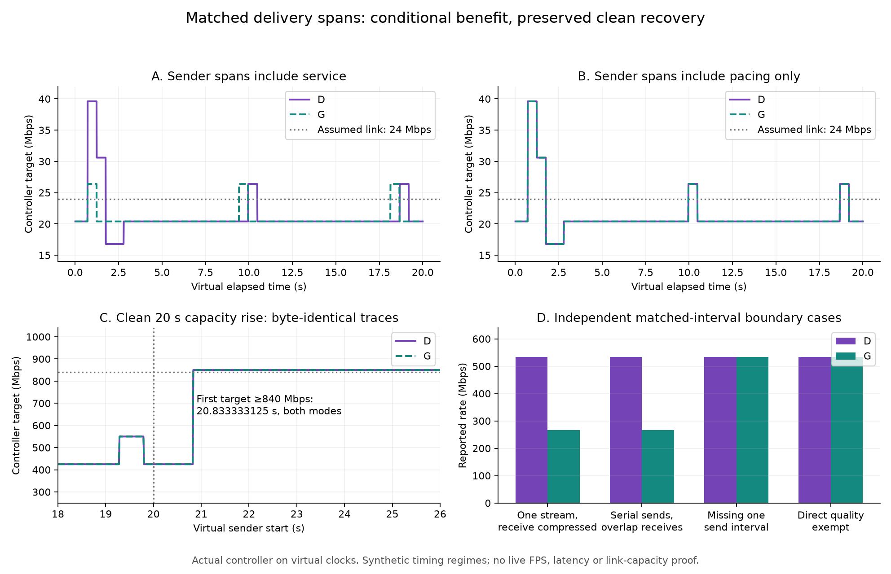

# Matched delivery spans: a conditional recovery guard

The new G prototype preserves clean recovery while suppressing some false rate records **only when sender timestamps contain a longer service span than compressed receive timestamps**. A pacing-only sender control produces no improvement at all. G therefore remains an unintegrated scratch experiment. Production controller D remains unchanged.

A separate seven-line diagnostic change is integrated and pushed as [09e7951a](https://github.com/nerdrx/wivrn-nx/commit/09e7951a6e3273e35dccfacefebdd27303211866). It adds exact byte and paired feedback timestamp rows to the existing opt-in timing dump. The server builds successfully; nothing was installed, restarted or enabled.



## Results

Actual C++ controller, synthetic virtual clocks. Each noisy regime has 17 scenarios × two phases × 1,800 frames = 61,200 rows per controller. Both sender regimes and both controllers give 244,800 noisy rows. Independent stereo capacity tests add 72,000 rows across D/G. These are control traces, not measured FPS or network throughput.

| Gate | D | G | Interpretation |
|---|---:|---:|---|
| One 1.5× receive-rate anomaly, phase 360, service sender: peak target | 39.600001 Mbps | 26.400002 Mbps | Avoids the false overshoot in this model |
| Same service case: minimum target | 16.8 Mbps | 20.4 Mbps | Avoids the later false cut in this model |
| Repeated 1.25× service case: final target | 16.8 Mbps | 20.4 Mbps | Useful modeled stability |
| Pacing-only sender: all 61,200 rows | Reference | Byte-identical | No benefit, including the bad spike/cut |
| Ten valid-metadata stereo capacity traces | Reference | Byte-identical | All clean rise/collapse behavior preserved |
| 20 s rise: first target ≥840 Mbps | 20.833333125 virtual s | Same | Earlier F's recovery regression is absent |

Normal and halt-on-error ASan/UBSan runs pass all five suites: BBR 101 checks, budget 4,346, NX 31, radio 50, and the AIMD loss-only assertions. Existing legacy suite inputs mostly retain zero send timestamps and exercise fallback; the new focused checks exercise valid metadata. Root separately verifies **19** matching/accounting cases, including serial and overlapping eyes, send gaps, missing/reversed/zero endpoints, unmatched bytes, app-limited receive spans, loss, duplicate updates, independent clock-origin shifts and direct-quality exemption. Public G replay independently reproduces all 13 captured CSVs exactly.

## Candidate representation

For receive-valid streams contributing byte counts, G separately unions sender and receiver intervals. It divides the same matched bytes by `max(send_union_duration, receive_union_duration)` when every contributing stream has a valid send pair. It preserves D's receive-only sample otherwise. Only a complete, positive, ordered pair may populate sender state; complementary incomplete feedback cannot fabricate a pair. Absolute sender and receiver origins are never compared.

Receive-based loaded admission and utilisation remain unchanged. Direct-quality sampling is exempt. Loss, radio, AIMD, gains and startup policy are unchanged. [Frozen candidate source and suites](G/README.md), [independent acceptance output](gates.json), [full extrema](summary.csv).

## Why this remains held

The service model uses a sender span limited by modeled link service. The pacing model uses the sender pacing interval, while receive time still reflects link service. Both are deliberately explicit assumptions. Actual UDP sender span includes pacing, setup and earlier send-call time; it excludes the final send syscall and is not NIC departure time. Socket backpressure may lengthen it, but that has not been measured here. Actual receive timestamps are software handler/reassembly measurements, not hardware arrival stamps. [Source semantics audit](SEMANTICS.md).

The existing broad `send_end` dump marker also differs from the terminal shard's in-band endpoint. Substituting that marker would hide this distinction. The new diagnostic exports exact raw `feedback.send_begin/end` alongside receive endpoints in **one row**. No matched live capture was found or collected this turn. G has no full-server build, integration or live activation. There is no claim of lower photon latency, fresh 90/240 FPS, HEVC parity or improved live motion quality.

## Opt-in measurement and reproduction

For a later authorized isolated session, set existing `WIVRN_DUMP_TIMINGS` to a CSV path when launching the server built with the diagnostic. This work did not launch that session. New rows use the existing first four fields `event,frame,server_event_ns,stream`; `frame_bytes` appends bytes, and `feedback_spans` appends raw headset-domain `send_begin,send_end,receive_begin,receive_end,sent_to_decoder`.

```sh
python3 extract_spans.py capture.csv matched.csv
python3 test_extract.py
python3 analyse.py raw
python3 plot.py
bash run.sh /path/to/source D /tmp/nxvc-matched-D
bash run.sh /path/to/source G /tmp/nxvc-matched-G
```

The extractor reports matched geometry and descriptive rates, preserves duplicate feedback semantics and marks lost/incomplete frames. It is **not** a controller replay: it omits frame-ring eviction, mode/quality state and loaded admission. It must not label these rates physical capacity or motion-to-photon latency. `synthetic-capture.csv` and `synthetic-paired.csv` are parser fixtures, explicitly synthetic. An older dump lacking these new rows is rejected.

Raw CSVs are losslessly gzip-compressed under `raw`; `analyse.py raw` reads them directly. `run.sh` uses the frozen matching controller/header, the independent harness and existing source/build dependencies. Build evidence is under `validation`; no binaries, APKs or private photos are published. Diagnostic dumping itself adds formatting, locking and file I/O when enabled, so use it for bounded measurements and retain that observer limitation. When disabled, these new rows add no formatting or clock reads.
