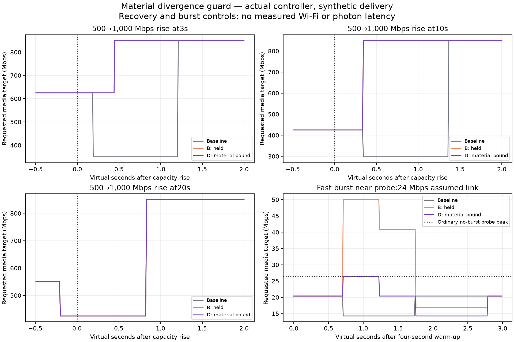

# Faster BBR recovery with bounded burst growth

**Source-side controller correction; not installed or measured in a live headset session.** This follows the [three held recovery candidates](../fresh-peak-confirmation/README.md). Candidate D passes their retained recovery, steady-outlier, probe-outlier and capacity-collapse gates. Native ASTC uses this generic controller branch **when BBR is active**; its runtime control-law selection remains unverified. Source defaults to AIMD and direct quality mode is unchanged.



## Result

The old controller compares a freshly increased capacity maximum with a p90 still containing slower prior delivery. That can cut the target when capacity actually returns. D separates post-peak evidence for slowdown, confirms its sample cohort, and bounds a conflicting maximum's upward growth—including periodic probes and their completion.

| Synthetic 500→1,000 Mbps capacity rise | Baseline first target≥840 Mbps | D first target≥840 Mbps | Improvement |
|---|---:|---:|---:|
| at 3 virtual seconds | 4.211 s | 3.447 s | 0.764 virtual seconds |
| at 5 virtual seconds | 5.236 s | 5.236 s | unchanged |
| at 10 virtual seconds | 11.367 s | 10.344 s | 1.022 virtual seconds |
| at 20 virtual seconds | 20.833 s | 20.833 s | unchanged |

The 3s trajectory keeps at least625 Mbps rather than cutting to350; the 10s trajectory keeps425 rather than cutting to297.5 Mbps. D preserves B's improvement without C's delayed 20s recovery. These are requested media targets and virtual sender timestamps, **not observed network throughput or photon latency**.

Both 500→300 and 500→250 Mbps collapse CSVs match baseline byte-for-byte: targets, sender timing, estimates and state transitions. No-burst periodic probing also matches baseline exactly. Forty-seven steady isolated-burst offsets plus a no-burst control show no above-capacity target in the short three-second sweep. In the separate probe-phase sweep, D's peak never exceeds the ordinary no-burst probe peak (26.4 Mbps, with≤2 bps numerical tolerance); held B reached50 Mbps on the same assumed24 Mbps link.

D still makes deliberate periodic probes above an assumed link's capacity. Isolated fast samples can still cause a later false cut: in the plotted probe example, D eventually falls to14.28 Mbps before recovering, later than baseline's immediate false cut. The frequent-outlier adversarial case also remains weak. This is a scoped recovery/growth correction, not a general solution to noisy delivery timestamps, queue latency or stream stutter.

## Implementation

- Record the time of a new estimator maximum; compute a separate p90 over matching loaded samples at or after that epoch in the existing fresh two-second window.
- Require the existing12-sample estimator threshold before that cohort drives native BBR slowdown. Actual loss, utilisation and radio controls retain their existing policy.
- Bound positive growth only when the estimator maximum exceeds the selected evidence rate by the existing slowdown ratio (strictly greater than1.6). Below that conflict threshold, preserve the maximum-based growth policy so ordinary recovery is not capped by the p90.
- Apply that bound during probes too. Ordinary growth cannot be pushed below the current target; forced probe completion may drain to the evidence-based steady target. With no loaded evidence, preserve B's unconfirmed steady hold.

Startup and direct quality mode retain their policy. No gains, intervals, packet validation, FEC, repair rules, stream masks, utilisation definition, codec rungs or client protocol changed. The epoch still resets on every strict maximum rise, including tiny changes; that limitation needs a separate jitter gate. Moderate outliers below the material-conflict threshold are not newly rejected. The guard deliberately reuses existing constants rather than adding another tuning control.

## Verification and source scope

Integrated and pushed in WiVRn NX source [412a2bfe](https://github.com/nerdrx/wivrn-nx/commit/412a2bfe9ef54333fdc35cf9919c6443fa409909). The configured server build includes this change; the installed client and running profile were not changed.

The implementation was first frozen as cpp SHA256 `b51927e3d10842d29f1df801ee2d065845009c2453d49e1bd1b49a5a82325605`, header `32c058ff5715fd4fb57ad394a13100e39bd3e9755edfb5f5a6a1425f146d493a`. Root's independent stereo gate uses the corrected shared-pacer fixture; the public runner reproduces all14 retained D CSVs byte-for-byte. Figures are inspected, and portable hashes bind the snapshots and raw tables.

The actual source adds six outcome regressions for clean capacity growth, steady burst phases and late probe burst phases. All five controller suites pass normally and with halt-on-error ASan/UBSan: BBR92 checks, budget4,346, NXdirect31, radio50 and AIMD-loss-only assertions. The complete configured server target builds successfully. Source changes are confined to controller cpp/header and these regressions. No client install, option activation or server restart occurred; v4/parallel-eye/poll/terminal experiments remain untouched.

The [actual native-path audit](NATIVE_SCOPE.md) pins baseline6902940f: native ASTC returns ordinary data to `SendData`, whose frame-byte callback carries no quality metadata. Two eye streams therefore use generic BBR when selected, not NX direct's quality-to-payload mapping. AIMD is the source default; server/client control can choose BBR. Neither installed controller mode nor live2176² extent is inferred from these synthetic checks.

## Reproduce

Use a configured source checkout with generated `build-server` headers and fetched Monado/Boost dependencies. The adjacent held report supplies pinned fixtures and their imported production harness. The frozen D header is placed first in include order.

```sh
bash run.sh /absolute/path/to/wivrn-nx /tmp/nx-material-bound
python check.py
python plot.py
```

Fresh outputs go outside the report. `check.py` verifies the retained data against the adjacent baseline and writes the table; compare fresh CSVs with `raw/` to verify reproduction. [Raw traces](raw/), [source/data hashes](EVIDENCE_SHA256.txt), [normal/SAN/build evidence](validation/), [figure source](plot.py).

The reused fixtures include actual controller/pacing helpers with synthetic, fully filled budgets; the stereo cases have two serial eye jobs and capacity changes at modeled sender start. They omit encoder contention, real feedback jitter/delay, capped queues, dropped frames, FEC/repair load and decoder/display execution. Nominal90 Hz fixture iteration and isolated CPU tests do not establish fresh90/240 FPS, HEVC parity, live motion quality or physical latency. The held native late-probe suppression option is still off; it needs its own combined recovery gate.
