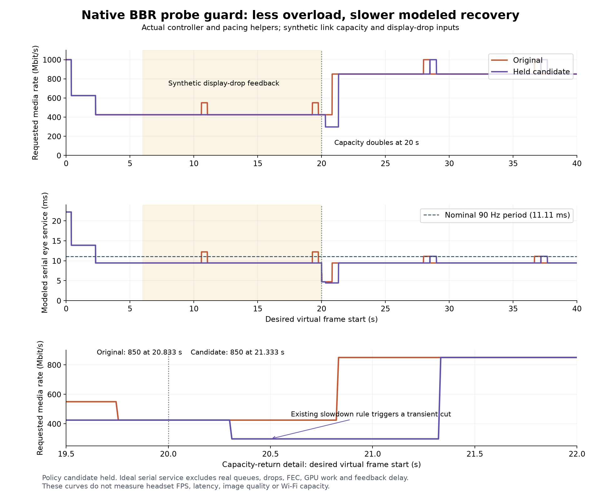

# Native BBR probe headroom: candidate held after recovery regression

**Decision: retain the experiment, restore production source.** A small guard suppressed two deliberate overload probes while display-drop feedback was present, but its interaction with existing BBR rate-window logic delayed modeled recovery by 0.5 seconds. This does not justify shipping the guard yet. Source remains `6902940f`; no install, server restart, setting activation or Pico test occurred.



## Result

Actual production controller and pacing helpers, synthetic 500 Mbit/s capacity increasing to 1 Gbit/s at virtual 20 seconds, 1 Gbit/s ceiling:

| Feedback during 6–20 s | Original probe entries | Candidate entries | Candidate peak media target |
|---|---:|---:|---:|
| Clean | 2 | 2 | 550 Mbit/s |
| Images dropped before presentation, both eyes | 2 | 0 | 425 Mbit/s |
| Dropped images on eye 1 only | 2 | 0 | 425 Mbit/s |
| Zero decode-result timestamp, synthetic input boundary | 2 | 2 | 550 Mbit/s |

All eight traces finish at 850 Mbit/s after the capacity increase. Clean and zero-timestamp controls have exactly unchanged dynamics after removing label columns. One-eye and both-eye drop cases match. Root independently reproduced all 28,800 rows byte-for-byte against Luna's traces.

The important failure is in the **trajectory**, not the final value. Original reaches ≥840 Mbit/s at desired virtual 20.833333 s; candidate at 21.333333 s. Candidate first cuts 425→297.5 Mbit/s despite zero injected packet loss. Root traced the actual production log:

```text
Automatic bitrate v2: backing off, 425.0 -> 297.5 Mbit/s (estimate 500.0 Mbit/s, gain 0.70, recent 500.0 Mbit/s over 181 samples, slowdown x2.00, p90 utilisation 0.43, 0 lost, 170 late over 181 frames)
```

The new maximum estimate rises while the recent delivery-rate window still contains older samples. Their ratio crosses the existing 1.60 slowdown threshold. The printed estimate is after backoff caps it; the slowdown ratio is calculated before that cap. The original's recent probe/drain had flushed older samples, so it avoids this cut in this schedule. Independent source review supports this explanation; the retained log confirms the ratio and loss/utilisation inputs.

## Change tested

The candidate adds `(quality_mode or s.late == 0)` to ordinary BBR's **steady-state probe admission**. It leaves startup, already-active probes, steady gain, radio and loss handling, and NX-direct quality-mode policy unchanged. No probe-duration or encoder representation change was tested.

The existing drop predicate requires nonzero `received_from_decoder`, zero `blitted`, and zero `times_displayed`. A zero decode-result timestamp alone is not a drop. This boundary is synthetic server input, not a captured current-client callback. ASTC can stamp that field after async upload submission; it does not establish GPU completion or why an image was discarded.

## Method and validation

The model requests 90 Hz, splits fully loaded target bytes equally across serial eye jobs, and uses the actual shared `pacing_slot` and `shard_pacer` arithmetic. Both eye jobs are assumed ready together. Drop markers apply during desired virtual 6–20 s; capacity doubles at 20 s. Synthetic feedback has no return delay. An unbounded ideal sender service schedule accumulates startup debt, so its virtual times are **not measured transport recovery times**.

Candidate normal BBR and strict ASan/UBSan tests: 90 checks pass. Five controller suites pass: BBR, BBR budget (4,346), NX-direct/AIMD (31), AIMD loss-only, radio (50), plus three ordering/boundary checks. Full configured server builds passed for both candidate and restored baseline. Clean builds do not erase the behavioral failure above. Raw logs, candidate source, patch, hashes, CSVs and SVG figure are retained here; no binary or private photograph is published.

Reproduce without editing production source, using source checkout `6902940f` with its existing configured dependencies:

```sh
bash model-run.sh /path/to/wt-pyrowave-probe /tmp/probe-model
bash run.sh /path/to/wt-pyrowave-probe /tmp/probe-independent
bash root-run.sh /path/to/wt-pyrowave-probe /tmp/probe-regressions
python3 plot.py
```

`check.py` verifies row/control consistency and explicitly reports **POLICY GATE: HOLD**; exit zero means the retained result reproduced, not that the policy is accepted. `run.sh` expects the original to fail the no-upward-probe assertion and the archived candidate to pass. `root-run.sh` tests the archived candidate rather than the restored production controller.

## Limits and next gate

No actual encoder payload distribution, framing/FEC, bounded queues/supersession, radio variability, decoder/GPU work, compositor, feedback delay or real application load is modeled. There is no demonstrated fresh FPS, equal-quality bitrate saving, headset smoothness, HEVC parity or photon-latency improvement.

Next: distinguish a rising capacity estimate from a genuine delivery slowdown using aligned evidence. Test capacity step-up/down, stale/app-limited samples, loss and radio holds before reconsidering probe admission. Do not weaken real congestion backoff to make this one fixture pass.
