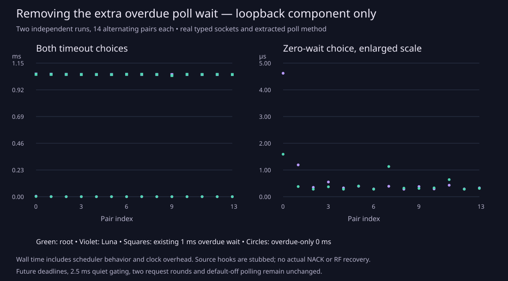

# Quiet recovery polling: remove the already-due wait

Source changes are committed and pushed: [TCP byte-buffer fixes](https://github.com/nerdrx/wivrn-nx/commit/74eb889dbd6345deb2369b7486bcc93d50782769) and [overdue recovery timeout](https://github.com/nerdrx/wivrn-nx/commit/85cbc28657c2fb1134a938d81d3c3f490415accb). Recovery polling remains **default off**. Nothing was installed, enabled or restarted; no Pico test was performed.

When the existing recovery path has already confirmed that a repair deadline is due, it now passes a zero timeout to `poll` instead of sleeping another nominal millisecond. Future deadlines still round upward to whole milliseconds; the 2.5 ms quiet gate, two-request-round limit, unknown-tail behavior and 100 ms ineligible fallback remain. In the ordinary caller sequence, the subsequent NACK check updates its timestamp or exhausts its budget before the next deadline calculation. This removes a specific artificial wait, not a frame of decode or transmission work.

## Measured component result

| Independent run | Existing overdue wait, mean | Overdue-only zero wait, mean | Mean paired reduction |
| --- | ---: | ---: | ---: |
| Luna, 14 alternating pairs | 1.052558 ms | 0.722 µs | 1.051836 ms |
| Root, 14 alternating pairs | 1.051647 ms | 0.493 µs | 1.051154 ms |

[All 56 normal-run rows](paired-poll.csv), [summary including ranges and medians](summary.json), [source provenance](source-provenance.json), [Luna log](raw/luna-normal.log), [independent root log](raw/root-normal.log). The values are **wall time inside the projected poll method**, including OS scheduling and clock overhead. They are neither NACK latency nor RF recovery, fresh FPS, end-to-end streaming or photon latency. The zero-wait measurements are nonzero nanosecond readings; clock resolution does not make them instantaneous.

The real three-argument `wivrn_session::poll` template is extracted byte-for-byte from `client/wivrn_client.h`. It runs with real production typed UDP/TCP sockets, serialization and the actual kernel `poll` over local loopback pairs. Session construction/handshake, selector/path hooks, secondary draining and primary-arrival updates are stubs. `process_packets`, XR clocks, the actual accumulator callback/NACK send and rendering are not executed. The post-poll service count is just a counter, not a sent repair request. Both generated C++ files match exactly; root independently verified the production method occurs once with its recorded hash.

A finite burst of eight typed UDP packets drains before the timeout supplier; a real serialized TCP control packet reaches the visitor. An idle 3 ms supplied timeout takes about 3.06 ms on this host. These are bounded fixtures, not sustained traffic. Source inspection found the pending-drain loops consume existing buffers rather than repeatedly refilling them; the UDP batch is at most 20 datagrams. No starvation or queue-limit change was justified. [Caller and deadline audit](AUDIT.md).

## Real defects found and fixed

Strict sanitizer execution exposed two TCP byte-buffer defects: an initial zero-length copy passed a null source pointer, then the existing awkward-frame regression exposed unaligned 32-bit prefix loads. The fix skips copying an empty span and reads all three length prefixes with four-byte `memcpy`. It preserves existing wire bytes, native byte order, framing limits, encryption and send-failure handling. These are correctness fixes, not measured speedups.

[Original empty-copy failure](raw/initial-empty-copy-san.log), [unaligned-prefix failure after the first fix](raw/initial-unaligned-san.log), [TCP patch](raw/tcp-fix.diff), [overdue helper/regression/doc patch](raw/overdue-integrated.diff). The initial failure artifacts are deliberately retained as failures, not final validation.

Final validation:

- Actual typed poll projection: **32 assertions**, normal and full-TCP halt-on-error ASan/UBSan; independent root rebuild also passes. Assertions include the 28 paired poll-return/service-counter checks, not 32 independent scenarios. Sanitizer wall-time rows are excluded from performance analysis.
- Existing real TCP framing/encryption/failure regression: **107 checks**, normal and strict ASan/UBSan. [Normal](raw/tcp-normal-final.log), [sanitizers](raw/tcp-san-final.log).
- Existing accumulator/window/FEC/deadline regression, including four new overdue/future/max-wait checks: **255 checks**, normal and strict ASan/UBSan. [Normal](raw/accumulator-normal.log), [sanitizers](raw/accumulator-san.log).
- Configured host `wivrn-server` build: success. [Full build log](raw/server-build.log). This does not build or install a current Android APK. Production source hashes identify the exact compiled files; build occurred before committing those unchanged source bytes.

## Reproduce

Run `bash run-check.sh SOURCE_CHECKOUT /absolute/scratch/output` from any directory. The checkout needs its existing configured `build-server` generated headers/Boost PFR, g++, OpenSSL, spdlog and fmt. No server, GPU, application or headset session is launched. Binaries remain in scratch.

For a reproducible historical comparison, the runner includes **the retained pre-change helper** from `baseline/nack_deadline.h` before checkout includes. The baseline calls that helper; the local candidate overrides only the already-due case to zero. The archived helper hash is `d7dcb34651c34eca75ee4d62082ee8fca82e76cfec6ff77f5f7c0491577ff5a5`. Both archived and current header hashes are recorded. The published runner was independently rerun against the new source: all 32 normal/full-TCP sanitizer assertions pass and all 14 baseline waits exceed the zero-wait cases; [normal log](raw/public-normal.log), [sanitizer log](raw/public-san.log). This prevents a current zero-wait helper from silently turning the comparison into zero-versus-zero. The current production helper is validated separately by the accumulator regression.

Existing TCP regression recipe: `tests/tcp_desync_test.cpp` links `common/wivrn_sockets.cpp`, `common/crypto.cpp` and `common/smp.cpp` with `-lcrypto`. Accumulator regression: `tests/accumulator_test.cpp` links `common/smp.cpp` with `-lcrypto`. Retained source revisions and patches identify the tested boundaries. The extracted code and archived helper retain their WiVRn GPL notice in [NOTICE.txt](NOTICE.txt).

Figure regeneration: `python3 plot.py`, then `rsvg-convert -o poll-wait.png poll-wait.svg`. The published figure was rendered and visually inspected. No private images are included.

## Remaining gate

Measure actual client network wake-up, real NACK request/reply and frame-completion timestamps in an explicitly authorized isolated session before enabling this trial. Confirm idle power, clock behavior, losses/reordering and fresh stereo delivery on the Pico. Component timing does not establish smoother live recovery or HEVC parity. No change to the native live profile is claimed.
