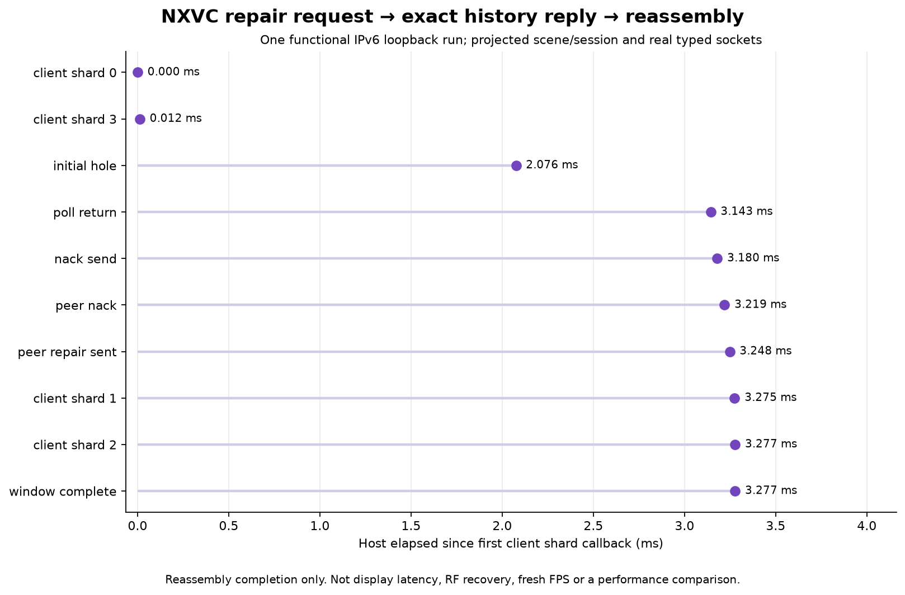

# NXVC repair correlation gate

The previously separate receiver-method and typed-poll checks are now joined: an actual typed UDP NACK retrieves the exact missing plaintext blobs from real sender history, and actual typed UDP replies complete the receiver's shard set. This is a functional loopback gate with projected scene/session boundaries, not the complete WiVRn client/server or a live recovery benchmark.



## What passes

Normal and halt-on-error ASan/UBSan each pass **21 assertions**. Root independently rebuilds the published recipe and checks the exact generated source and outcome/event sequence against Luna's frozen run. Host timestamps are expected to differ between runs.

Frame 40, stream 2 has four tiny synthetic payload shards. Shards 0 and 3 arrive; known interior shards 1 and 2 are withheld. The exact production deadline and NACK methods build a single request for those two indices. A bidirectional IPv6 loopback UDP pair serializes that request. The peer serves the real `shard_history::collect` results, reconstructs ordinary data shards with `fec::decode_blob`, and sends them back. Received payload lengths and bytes match the originals, first-shard view metadata and final-shard timing metadata survive, and `shard_set::complete()` becomes true.

Separate direct method checks confirm that real parity reconstruction suppresses a redundant NACK, requests stop after two rounds, and the newest frame's unknown tail stays unrequested. Those additional cases use virtual decision times and recording callbacks; they are not socket round trips.

## Timing boundary

The figure shows **one normal functional run**, starting at the first client shard callback. It retains initial-hole observation, actual poll return, NACK send callback, peer request receipt, peer reply send, client reply callbacks and reassembly completion. Completion is timestamped immediately in the inserting visitor. Timestamping it after the poll returns would incorrectly include an unrelated idle poll wait.

The fixture's setup and its 2 ms receive-loop timeout contribute to the displayed timeline. The quiet gate uses the existing 2.5 ms threshold and millisecond timeout rounding. The sender and receiver are driven sequentially in one host process, without game, radio or decoder load. This is neither a baseline/candidate comparison nor a latency distribution. Sanitizer timestamps are retained only as correctness evidence.

No fresh FPS, HEVC parity, headset recovery time, motion quality, GPU cost or photon latency is established. The payloads are synthetic bytes, not encoded native ASTC frames.

## Exact source and seams

Source snapshot: [`85cbc286`](https://github.com/nerdrx/wivrn-nx/commit/85cbc28657c2fb1134a938d81d3c3f490415accb), clean and already pushed before this gate. `generate.py` extracts the exact `next_nack_deadline`, `poll_nacks`, `try_nack`, three-argument typed `poll` body and production window alias. Actual socket, packet, serialization, shard, deadline, FEC and history helpers compile from that checkout. Source spans, hashes and generated C++ are retained under `raw/`.

Scene/configuration/session hook stand-ins join those components. Initial and repaired shards enter real `shard_set::insert`; the real accumulator constructor, `push_shard`, `push_parity`, `pump`, decoder, XR and rendering are excluded from this socket gate. The peer uses actual history helpers, but not the full server session/compositor/encoder handler, retransmission rate caps, pacing, encryption handshake or secondary-path routing. The first TCP-request draft was replaced with bidirectional UDP before acceptance. Production encryption and validation behavior were not changed.

Root's separate [exact-method retirement check](retirement/README.md) covers `poll_nacks`, `try_nack`, `pump` and `try_submit_front` with a decoder stub. It confirms a conditional opt-in deadline-service gap and retains its controls and limitations. See the [source-flow audit](SOURCE_FLOW.md) for the complete call path.

## Failure retained

An earlier draft indexed shard 3 after the first poll, when only shard 0 had arrived and the vector was still one element long. The harness aborted on a bounds assertion. The accepted recipe checks vector size before indexing and fails early if setup is incomplete. `raw/harness-bounds-failure.log` retains that failure; it is a test-fixture bug, not a reproduced production defect.

## Reproduce

With the existing configured checkout and RTK:

```sh
bash run-check.sh /run/media/nerdrx/Lex/claude/nx-scratch/wt-pyrowave-probe /tmp/nx-repair-loopback
python3 plot.py
```

The plot reads the retained normal log, not a new run. Generated methods retain the original GPL notice. No source feature, device property, live profile, installation or session was changed. No private photos are used or published.

## Next gate

A quiet-frame fix needs both a retirement wake-up and actual retirement service; adding a pump call alone leaves the 100 ms fallback when repair rounds are exhausted. Test exact caller behavior and disabled-option boundaries before changing the opt-in source. Keep live recovery polling and deadline properties off until an explicitly authorized isolated run supports activation. Full network-loop and real fresh-frame correlation remain required.
