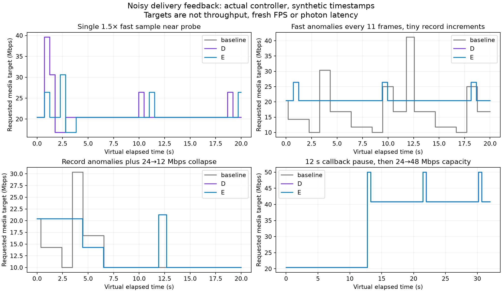

# Noisy feedback: smaller probe spikes, remaining steady growth

**Offscreen controller investigation. Candidate E is held; production remains source412a2bfe (D).** No server, headset install, runtime mode, or profile changed. These are virtual controller targets, not measured bandwidth, latency or fresh FPS.



## What the new test finds

A single moderately fast delivery sample can inflate the maximum without crossing D’s 1.6 material-conflict threshold. Near a periodic probe, a modeled 24 Mbps link then receives a requested media target of 33.0 or 39.6 Mbps. These samples are synthetic timestamp anomalies; they are not evidence that a real radio can sustain those rates.

Candidate E applies D’s existing loaded-rate p90 bound throughout probe growth and forced probe completion, including smaller conflicts. It preserves the ordinary steady-growth rule, gains, startup and direct-quality behavior. The previous maximum still drives steady growth, which leaves a significant failure case.

| Single anomaly, phase360 | D peak | E peak | Peak reduction |
|---|---:|---:|---:|
| Implied capacity 1.25× ordinary capacity | 33.0 Mbps | 26.4 Mbps | 20.0% |
| Implied capacity 1.50× ordinary capacity | 39.6 Mbps | 30.6 Mbps | 22.7% |

The ordinary no-anomaly probe peaks near26.4 Mbps. E’s 1.5× case still reaches30.6 Mbps because steady growth can use the inflated maximum. It also retains the later16.8 Mbps false cut; the plotted trace shows that some excursions move in time rather than disappear. A lower peak alone does not prove smoother playback.

## Recovery controls and the hold decision

Root independently rebuilt E against the public fixtures and reproduced all14 retained legacy gate CSVs byte-for-byte. All eight 3/5/10/20s clean/late capacity-rise traces match D exactly, including its faster3/10s recovery. The250 Mbps collapse is exact. The300 Mbps collapse differs on126 rows by at most47 **bits/s**, with all byte counts, timing, estimates and state fields unchanged. The no-burst probe summary differs only by2 bits/s in peak target; entry, return, minimum, final and frame counts match.

Those numerical differences fail the originally requested byte-exact control gate. They are not a demonstrated material regression. The failed strict check is retained in [validation](validation/strict-gate.log); the analysis check records their precise scope instead of silently calling them exact. E remains a source snapshot rather than a production change while the remaining steady-growth admission problem is investigated. Five existing suites pass normally and under halt-on-error ASan/UBSan (BBR92 checks, budget4346, NXdirect31, radio50 and AIMD-loss-only assertions). No complete server build or live test is claimed for E.

## New noisy-feedback coverage

[The new fixture](noisy.cpp) runs17 scenarios at two starting phases,1800 virtual feedback frames each:61,200 rows per mode,183,600 across baseline/D/E. It imports the pinned actual-controller harness, uses a nominal90 Hz virtual clock, and fills the abstract media budget. The two phases start immediately after quiet or after another360 feedback frames. This fixture is single-stream; the separate legacy capacity gate models serial stereo service.

Coverage includes ordinary delivery; tiny record increases totaling0.36%; isolated and repeated1.25/1.5× fast samples; explicit loss; an app-limited128-byte period;1/5/12-second callback pauses with stable or doubled capacity; and fast anomalies every11 frames with tiny increasing record values, both with and without a later24→12 Mbps collapse.

On the repeated-record anomaly example, D holds the ordinary20.4 Mbps target between probes while baseline oscillates as low as10 Mbps. This is useful additional evidence for D’s confirmation guard, not a new production change. The collapse variant still shows a later overshoot near21.25 Mbps on an assumed12 Mbps link. E does not resolve that case. The [epoch audit](EPOCH_AUDIT.md) identifies how tiny strict maxima can keep the12-sample cohort unconfirmed, but these models do not justify an arbitrary new jitter margin. Actual loss and severe-utilisation backoff still execute.

The callback-pause cases simply advance the host clock without enqueueing more frame callbacks. They do not simulate a network outage, missing-frame ring pressure, repair traffic or reconnect. All modes rediscover modeled capacity in the plotted pause/rise example; this does not measure real stall recovery.

## Reproduce and inspect

```sh
bash run.sh /absolute/path/to/wivrn-nx /tmp/nx-noisy-feedback
bash run-gates.sh /absolute/path/to/wivrn-nx /tmp/nx-noisy-gates-E
python check.py
python plot.py
```

A configured checkout supplies generated headers and dependencies. Outputs go outside the report. The adjacent reports supply pinned baseline/D source and fixtures; [source-E](source-E/) is the held candidate, cpp SHA256 `28c27b0d8593f001065af04c790c01aadbd9b1da766ef121585735063d0bf567`, header `32c058ff5715fd4fb57ad394a13100e39bd3e9755edfb5f5a6a1425f146d493a`. [Raw new traces](raw/), [legacy E gates](gates-E/), [summary table](summary.csv), [normal/SAN and reproduction evidence](validation/), [portable hashes](EVIDENCE_SHA256.txt) and [figure source](plot.py) are retained. `check.py` verifies structure and recorded comparisons; it explicitly reports the failed strict acceptance criterion. `validation/strict-gate.py` intentionally exits nonzero on the held candidate.

Native ASTC uses generic BBR only when BBR is selected; AIMD is the source default. [The actual-path audit](../material-recovery-bound/NATIVE_SCOPE.md) does not establish the installed control law. These fixtures omit actual image encoding, GPU fences, network queues, packet loss scheduling, real feedback delay, decoder and display. They never establish native90/240 fresh FPS, HEVC parity, motion quality or physical photon latency. Supplied private photographs are not used or published.
