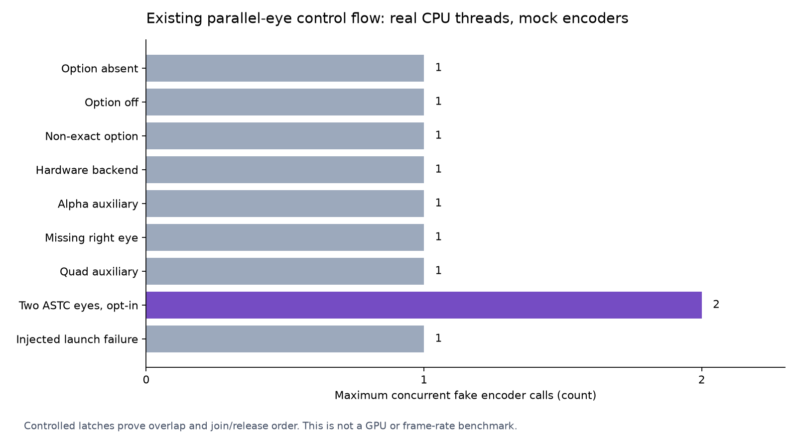

# Parallel-eye lifecycle gate and compositor retirement boundary

This checks the existing default-off two-eye scheduling mechanism with real CPU threads and controlled fake encoders. It does not measure GPU speed, live frame rate or latency, and does not enable the option.

The gate extracts the current `encoder_work` snapshot/eligibility/dispatch/join/image-release block rather than rewriting those production branches. Normal tests use real `std::async(std::launch::async)`; a separately identified one-call seam injects launch failure. Encoder backends, session, image data and log sink are mocks. The control skeleton is real source; this is not a running compositor.

## Checked boundaries

- Exact opt-in; missing/hardware/auxiliary streams use the serial path.
- Both controlled ASTC calls can coexist; a blocked right eye keeps the image busy.
- The right-eye future completes before the image becomes reusable.
- Snapshot ownership keeps the original encoder alive across replacement, then releases it after completion.
- Each eye's standard exception permits the other eye to finish; worker-launch failure falls back once per eye.
- Alpha and quad role fixtures use the current source's actual quad stream index.

## Results

| Replay | Unmodified branch | Injected launch failure |
|---|---:|---:|
| Luna normal | 60 checks, 0 failures | 64 checks, 0 failures |
| Luna ASan + UBSan | 60 checks, 0 failures | 64 checks, 0 failures |
| Independent root normal | 60 checks, 0 failures | 64 checks, 0 failures |
| Independent root ASan + UBSan | 60 checks, 0 failures | 64 checks, 0 failures |

The extracted source, failure seam and provenance are byte-identical across both replays. Root separately checks observed release/snapshot/eligibility invariants. Controlled eligible calls overlap; serial paths do not. Exception cases do not force overlap and their observed concurrency is scheduler-dependent. No TSan was run and no race-freedom claim follows.

Source revision: `09e7951a6e3273e35dccfacefebdd27303211866`; extracted compositor lines 1659–1721, actual four-stream role constants (quad index 3). [Runnable method](METHOD.md), [independent verification](VERIFICATION.txt), [Luna raw evidence](raw/luna/), [root raw evidence](raw/root/), [retained hashes](evidence-sha256.json).

Runnable checks, raw observed rows and final source hashes are retained. They cannot establish API synchronization, native buffer ownership under driver failure, GPU/pacer/network contention, packet/FEC/history behavior or Pico smoothness. The older offscreen overlap measurement remains a separate historical scope, not a new measurement here.

## Why the compositor wait cannot disappear yet

The current compositor shares one recording command pool, command buffer and query pool across commits. Each commit resets those resources and later waits before collecting queries and motion readback. The ASTC backends have their own slot fences; those are separate resources.

The source audit identifies a conditional timeout-retirement concern: after the existing wait times out, `motion_unsafe` prevents estimator reuse, but the next command-pool reset precedes that motion guard. No separate full-submission retirement fence was found at that reset. This has not been reproduced on Vulkan or attributed to any GPU reset. [Current source and primary-spec audit](RETIREMENT.md).

Vulkan prohibits resetting a pool while one of its command buffers remains pending. Semaphore signal scope also depends on the signal stage mask. These requirements mean that a compute-stage timeline value alone is insufficient evidence for dropping full-submission lifetime protection. [Command-pool rule](https://docs.vulkan.org/refpages/latest/refpages/source/vkResetCommandPool.html), [semaphore scope](https://docs.vulkan.org/refpages/latest/refpages/source/VkSemaphoreSubmitInfo.html).

The next bounded implementation gate should give recording resources explicit completion/generation association and test timeout followed by another commit. It must preserve image/encoder ownership and retirement before any reuse. Only then can a later experiment defer waits or use more than one recording slot. A mock can validate control transitions; Vulkan validation and a real compositor remain necessary for API correctness and performance. No healthy-path or timeout behavior changed in this gate.
