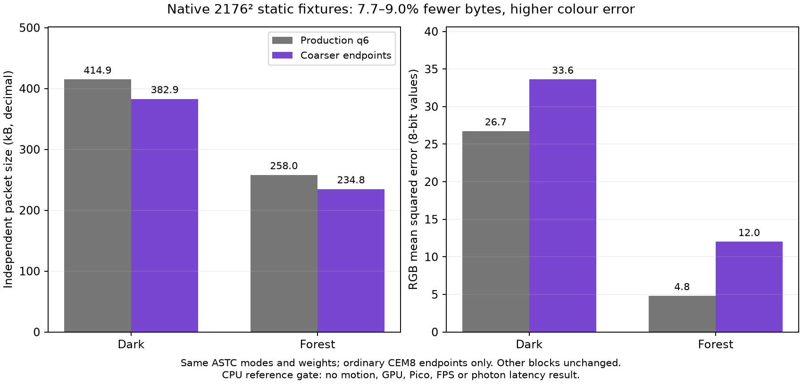

# q6 Q64-to-q5 endpoint coarsening gate

CPU/reference-only, scratch-only; no production files or fixtures were modified. The gate uses the exact hash-matched 2176×2176 RGBA8 and raw q6 ASTC inputs from `../astc-production-selector-gate/manifest.txt`. It round-checked the shader bit mapping against astcenc for every eligible block. For ordinary one-partition CEM8 RGB mode `0x0F3`/QUANT64 only, it rounds the six raw endpoint codes to the q5 step-two lattice with 63 saturation. All non-endpoint bits, including mode and weights, remain byte-identical. Other modes/blocks are copied unchanged. If the rounded endpoints reverse the CEM8 RGB-sum order, that block stays baseline and increments the guard count.

The candidate blocks parse back as the original mode, partition count, CEM8 format and Q64 endpoint quant method; the independent astcenc reference decoder accepts the complete frame. Full RGB SSE/MSE/PSNR is against the exact matching RGBA8 input. Zstd uses a reused CCtx at level 3; reported packet totals add the standard 24-byte header. No decoded pixels, private images, or candidate ASTC payloads were written.

## Result

`raw.csv` contains aggregate-only rows:

- Dark: 72,802/73,984 ordinary blocks; 67,771 changed. 17 endpoint-order candidates were retained unchanged. Zstd frame 414,897→382,899 bytes (7.71% smaller; packet 414,921→382,923), while PSNR fell 33.8607→32.8659 dB (−0.9948 dB).
- Forest: 73,873/73,984 ordinary blocks; 66,299 changed. Four endpoint-order candidates retained unchanged. Zstd frame 257,958→234,779 bytes (8.99% smaller; packet 257,982→234,803), while PSNR fell 41.3201→37.3394 dB (−3.9807 dB).

The byte goal passed; the predeclared quality limit of at most 0.1 dB loss failed badly on both fixtures. Reject integration. This is rejection under the predeclared numerical gate, not proof of visible distraction. This closes this single uniform q5-endpoint gate, not every possible mixed precision policy. No GPU, encoder CPU timing, moving-scene quality or live measurement was performed.



Regenerate the figure with `python3 plot.py` (matplotlib required). [Root review and independent replay](ROOT_REVIEW.md).

## Validation and reproducibility

Normal build/run and ASan+UBSan build/run completed successfully; sanitized CSV matches `raw.csv`, with empty `san.log`. astcenc decompression is reset before each independent decode. Every baseline block parses; all eligible candidate blocks parse after mutation, and every bit outside the six endpoint fields is asserted identical. Baseline raw Zstd packet totals match the retained production check exactly: 414,921 and 257,982 bytes.

The first harness draft terminated with signal 11. The agent attributes this to its large stack-allocated astcenc `block_size_descriptor`; no debugger trace or original full stderr was retained. `gate.cpp` now allocates it on the heap; successful final normal and sanitizer runs follow. This was a scratch harness failure, not a product/runtime failure.

Fixture hashes (source/input payloads remain in their original private locations):

```text
eye0 RGBA8 9d1aa653c578751e6491d8c7786183b283de190d1928dc172959387e0da1355e
eye1 RGBA8 8dbe4a025512bd0cff3dfd38f632ee7c487b6430eb5090ddba8c6ca2705e5f5f
eye0 q6 ASTC 0fd34edf33c98730f399f70c6b1295490b16dc620edc3ad3af86ea07488a2d06
eye1 q6 ASTC 022c14587c4e9adb3aab06b429d4b7f574198d20e3076b60a94fe227d0171f80
```

## Reproduce

`run-local.sh` accepts the four fixture paths and host-local astcenc paths, then
builds/runs normal and ASan+UBSan variants. It records host/compiler/Zstd/library
and fixture/source hashes in `context.txt`, build logs, stderr logs, exit codes,
and aggregate-only CSVs. Both exits are 0; `raw.csv` and `san.csv` are byte-identical
(SHA-256 `b5a2b6a4cc9d66bdc572916b72ff5dd38f9048959a9f28e1d16c0621aca34dfc`).
The host used GCC 16.2.1, libzstd 1.5.7, and the AVX2 static astcenc library
whose hash is recorded in `context.txt`.

```sh
ASTC_SOURCE=/path/to/astc-encoder/Source \
ASTC_LIBRARY=/path/to/libastcenc-avx2-static.a \
./run-local.sh /path/to/eye0.rgba /path/to/eye0.raw.astc \
               /path/to/eye1.rgba /path/to/eye1.raw.astc
```

`first-attempt.log` is a retrospective note about the initial signal 11, not an original crash capture; the fixed
harness allocates astcenc's large `block_size_descriptor` on the heap. This was
a harness-only failure, not a product/runtime failure.

Sanitizers cover the harness; the linked prebuilt astcenc static library is not rebuilt with sanitizer instrumentation. Endpoint rounding uses explicit positive half-ties upward, `min(2*((q+1)/2),63)`; it is a candidate on the q5 lattice, not a reproduction of every GPU implementation of GLSL half-ties.
