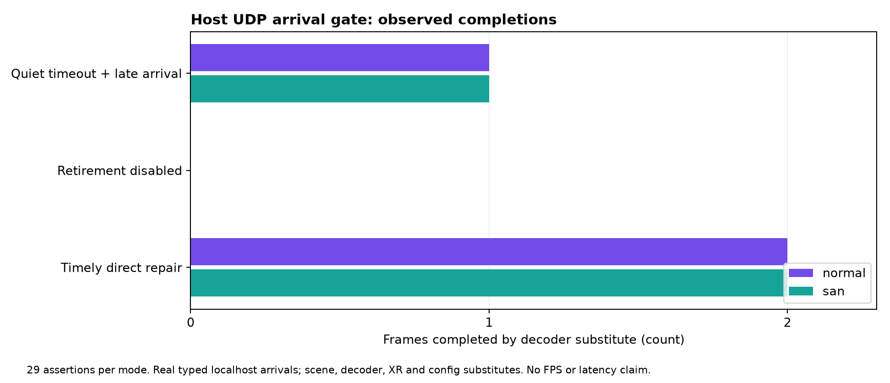

# Actual UDP arrivals through quiet retirement

**29 checks pass in normal and halt-on-error ASan/UBSan builds.** Unlike the earlier prefilled-window fixture, this host gate sends typed video data shards over real IPv6 localhost UDP and hands received packets to the exact production `push_shard` body. Receipt timestamps come from a continuously read host monotonic clock, rather than backdated setup or advancement around polls.



The broken frame has a missing interior shard; the following frame is complete. With quiet recovery and deadline retirement enabled in the fixture, two repair requests are recorded, the older frame retires and the newer frame reaches the decoder substitute once with exact expected payload bytes. A late missing shard actually arrives through UDP and is refused as old without another completion. With retirement disabled, the front remains after more than two configured display periods. A directly injected timely missing shard completes both frames in order, with exact expected payload bytes. This timely control is not a response to a wire NACK.

## Executed boundaries

Seven accumulator bodies (`push_shard`, both deadline selectors, `poll_nacks`, `try_nack`, `pump`, `try_submit_front`), the actual `process_packets` caller body and the typed poll template match current production byte-for-byte. [Runnable source verification](verify-source.py), [output](source-check.log), generated CPP and provenance are retained. Source remains unchanged `6e2293d58acc8b7a20e9276ae25f5e97257b37d9`.

Actual serialization/deserialization, localhost UDP/TCP and Linux polling execute. TCP is the idle control socket. Accumulator construction, real XR time conversion, property/config sampling, decoder implementation and stream/path hooks remain substitutes. The visitor routes stream 0 in the fixture rather than executing the complete real scene. Parity drain is a no-op because these cases contain only data shards; no parity recovery is claimed. NACKs and feedback go to scene logs, not the wire/history server. Decoder input copies preserve payload order and discard the abandoned partial frame when its index changes; no ASTC parser, texture upload, GPU, viewer or display executes.

The configured period is 11.111111 ms; it does not establish 90 FPS. Counts and timestamps are functional evidence, not a paired latency benchmark, p95/p99, throughput, radio recovery, HEVC comparison, thermal or photon result. No Android/Pico execution was performed for this gate. The actual Pico client was discovered running and left untouched; see the [corrected device process guard](../quiet-retirement-android-cpu/README.md). No production source, app, setting, property, install or live session changed.

## Reproduce

```sh
bash run-check.sh /path/to/wivrn-nx /path/to/output san
python3 verify-source.py /path/to/wivrn-nx /path/to/output
python3 figure.py
```

The recipe uses the configured host cache for generated protocol/version headers and Boost PFR, plus installed OpenSSL/spdlog/fmt. It reuses the published sibling extraction scripts. The public recipe was independently run by root; final normal and sanitizer outputs are retained. Nine executed bodies and the final generated hash were independently checked.

The inherited CPP includes earlier method checks and prefilled fixtures that its new `main` does not call; the reported 29 assertions are the new arrival cases only. Initial missing global alias compile failure is retained in `iterations/`, alongside the earlier 26-check outputs before late-receipt assertions were added. Root also corrected a timestamp read after window reset, feedback counts, removed a detached repair thread and extended the disabled control beyond the retirement boundary before acceptance. There is no claim that those draft issues were production defects.

The remaining gate is the actual client constructor/clock/property/decoder/display path with matched live binaries and explicit session authorization. Component correctness does not justify silently enabling the experiment.
