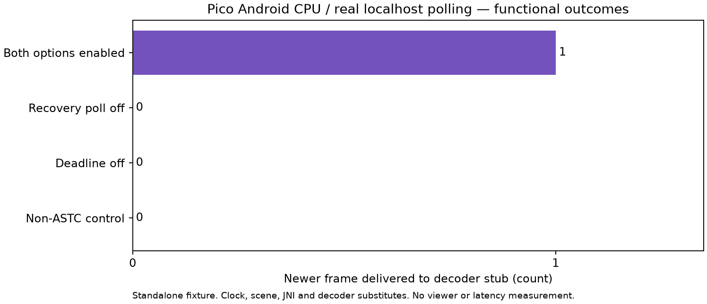

# Quiet retirement: standalone CPU checks on the Pico

The existing host socket fixture now runs successfully on the connected Pico's Android CPU: **96 method checks + 72 joined checks, zero failures**, repeated once through the published device runner. The eligible quiet timeout releases the newer frame once; disabled controls retain the incomplete front. This verifies the standalone Android CPU/socket path, not the live viewer or a latency improvement.



## Hardware and execution

ADB reports model `A8110`, arm64-v8a, Android 10 / API 29. Before each short execution, the headset is `Asleep`, display `OFF`, target WiVRn process absent and no owned test process. Recovery/deadline/queue properties are unset. A single owned ELF is pushed to `/data/local/tmp/nx_quiet_gate`, byte-verified with SHA256, run under a 5 second timeout, then removed. The headset remains asleep/OFF and properties unchanged after both runs. No APK, app launch, screen wake, signing, session restart, route/driver/clock changes or property activation occurs. Device serial remains in scratch and is omitted from public metadata.

The ELF is API 29 AArch64, built with cached NDK 29.0.14206865, static libc++, OpenSSL and spdlog. It needs only Android system `libc`, `libm`, `libdl`, `liblog`; no extra shared runtimes are copied. [Build recipe](build-android.sh), compiler logs, dependency/output hashes and ELF inspection are retained. Source is unchanged [`6e2293d5`](https://github.com/nerdrx/wivrn-nx/commit/6e2293d58acc8b7a20e9276ae25f5e97257b37d9).

## Exact scope

The generated CPP is byte-identical to the accepted [host fixture](../quiet-retirement-kernel/README.md). Android adds one visible no-op `application::instance().setup_jni()` fixture declaration because the actual caller's Android branch invokes it; neither the caller nor poll bodies change. [Sole scaffold addition](jni-fixture.diff), [root verification](SOURCE_VERIFIED.md). Real typed UDP/TCP localhost sockets and Android/Bionic kernel polling execute. Constructors, path hooks, scene, application settings, XR clock and decoder remain substitutes; no packets are sent. Primed repair rounds go to a scene stub, not the wire. Received bytes and poll returns are zero in all cases.

The clock is seeded from a monotonic reading with a synthetic receipt 10 ms in the past, then advances by wall time around each poll. It omits time outside that wrapper. The fixed period is 11.111111 ms. Initial enabled request 13 ms / observed 13.154 ms is a single fixture wait, **not Pico streaming latency**. Disabled cases request 100 ms and are stopped during their second poll. This is two functional replays, not a timing distribution, sustained load or paired performance experiment. No Android sanitizer run is claimed; host normal/ASan/UBSan checks were previously retained.

Actual accumulator/stream construction, `push_shard`, real repair transmission, Android properties/JNI, XR, Wi-Fi, GPU decode and display remain untested here. No fresh FPS, HEVC parity, motion quality, thermal/power or photon claim follows. Both live experiments remain default-off, with observed properties unset.

## Reproduce

Requires this checkout's existing native cache and an explicitly authorized idle headset; the runner refuses an awake display or running target process or owned test process.

```sh
bash build-android.sh /path/to/wivrn-nx /path/to/android-ndk /path/to/scratch-output
python3 run-device.py DEVICE_SERIAL /path/to/scratch-output/kernel-gate-android /path/to/results
python3 figure.py
```

The build recipe has a fixed configured arm64 cache and Linux NDK toolchain layout; another configuration needs corresponding paths. `run-device.py` was actually replayed successfully and retains its results in `public-device-repro/`. Binaries stay in scratch/build, not GitHub. Next meaningful gate is explicitly authorized live Android execution with matched binaries and actual frame receipts/retirement/fresh display correlation; do not repeat unchanged CPU checks as a viewer claim.
