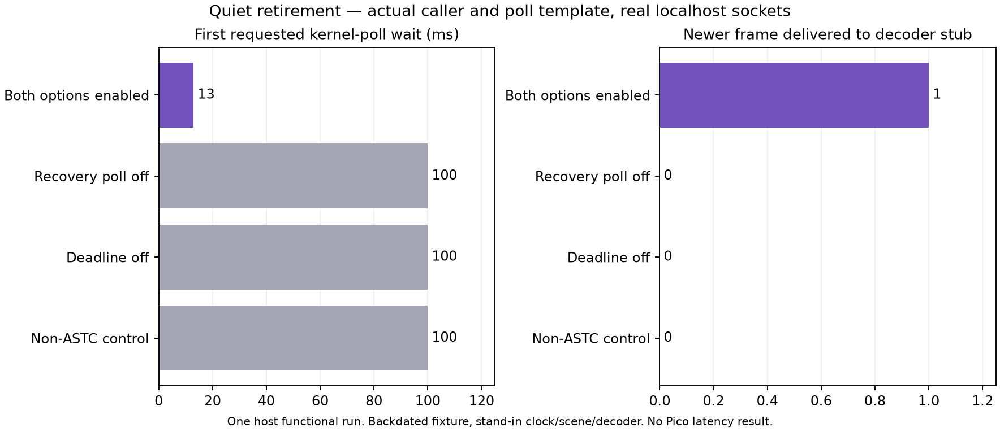

# Quiet retirement through actual kernel polling

The new default-off retirement fix now passes a host functional test joining the actual polling caller, the actual client poll template and six extracted accumulator methods. Quiet Linux socket timeouts release a complete newer frame after the fixture exhausts repair rounds. Disabled controls retain their waiting behavior. This closes the virtual-session gap from [item 33](../quiet-retirement-service/README.md), while Android/XR/display execution remains untested.

Source is pinned to [`6e2293d5`](https://github.com/nerdrx/wivrn-nx/commit/6e2293d58acc8b7a20e9276ae25f5e97257b37d9). No production changes, signing, installation, session restart or property activation occurred. [Current-source unsigned APK review](package/README.md) verifies artifact continuity for a later device gate.



## Method

The generator extracts the six accumulator methods and production window/shard/deadline helpers through the earlier published runner. It also extracts the exact `client_session::poll` template and compiles current typed UDP/TCP sockets against actual `wivrn_sockets.cpp`, `crypto.cpp` and `smp.cpp`. Both sockets are connected on localhost; no packets are sent. Path-selector/reconnect hooks, scene, decoder and clock interfaces are substitutes. The `process_packets()` function body is exact; its member qualification changes only to place it in the projected namespace. Source/body/CPP hashes are retained.

A broken front frame with a confirmed interior hole and a terminal shard is followed by a complete newer frame. The fixture primes two repair rounds virtually; those requests go to a scene stub, not the wire. First receipt is seeded 10 ms before a host monotonic reading. Fixed display period is 11.111111 ms. The stand-in clock advances by measured wall duration around each real poll; it does not continuously query XR or account for time outside that wrapper. The decoder completion callback stops the enabled loop; controls stop during their second poll so the fixture remains bounded.

Normal and halt-on-error ASan/UBSan execute the earlier 96 method checks, then 72 additional joined checks. Both options enabled: one timeout releases frame 1 to the decoder stub. Recovery-off, deadline-off and non-ASTC: two 100 ms requests leave frame 0 blocked. All captured poll returns are 0 and received bytes 0. Requested wait and observed wall time are logged; they are single functional samples, not repeated timing statistics or a performance comparison. The setup intentionally backdates a frame, so a ~13 ms first wait is not the stream's latency or a 13 ms recovery promise.

## Scope and remaining gates

This executes a projected caller on real sockets/kernel poll, not the real stream/accumulator constructors, `push_shard`, production scene callbacks, actual repair transmissions, secondary-path behavior, XR clock, Android properties, decoder/GPU or display. No fresh FPS, HEVC parity, Wi-Fi loss/recovery, smoothness, power or photon latency claim follows. Scheduling, msceiling and changing-period limitations remain. Both experiments stay default-off.

Before live acceptance, explicitly authorize an isolated Android test and correlate actual receipts, repair exhaustion, poll service, retirement and fresh display delivery with matched binaries. Existing user sessions must not be silently changed. [Harness iteration failures](ITERATIONS.md) are preserved separately from accepted outputs.

## Reproduce

With the same configured source checkout, RTK, Python, g++, OpenSSL/spdlog/fmt and generated include paths:

```sh
rtk proxy bash run-check.sh /path/to/wivrn-nx /path/to/scratch-output
python3 figure.py
```

The public generator depends on the two adjacent published extraction scripts, not private scratch paths. Normal and sanitizer raw logs, generated CPP, source/helper provenance and scientific figure input CSV are retained. The package verifier uses scratch binary output; no APK/ELF or private photo is published.
