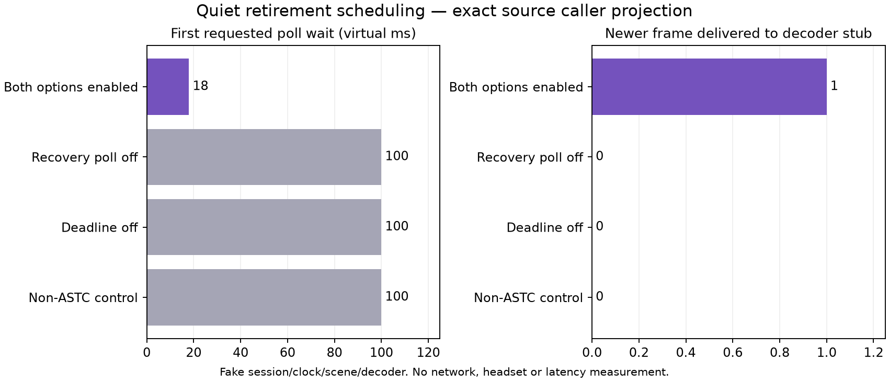

# Quiet retirement: wake up and release the blocked frame

The default-off recovery/deadline experiment could spend both repair rounds, then leave an incomplete front blocking an already-complete newer frame during quiet traffic. Prior source checks reproduced the stall after 100 ms of virtual silence. Source [`6e2293d5`](https://github.com/nerdrx/wivrn-nx/commit/6e2293d58acc8b7a20e9276ae25f5e97257b37d9) now schedules the existing two-display-period retirement and pumps the window before requesting further repairs.

**Integrated, built and pushed; not installed or enabled.** This fixes a scoped scheduling defect, not a measured live latency problem.



## Evidence

| Gate | Result | What it establishes |
| --- | --- | --- |
| Six exact accumulator methods, production window/shard/deadline helpers | 96 checks, normal and halt-on-error ASan/UBSan | Eligible retirement survives exhausted repairs or disabled retransmission; releases newer frame once; invalid/disabled controls and rounding |
| Exact `stream::process_packets()` body, projected session/clock | 60 additional checks per mode | Supplier chooses retirement wake-up, post-poll service releases frame; controls retain fallback |
| Existing actual accumulator regression | 255 checks per mode | Shared window/shard/deadline behavior remains covered |
| Configured Android arm64 native `wivrn` target | Build exit 0, ELF AArch64, new method symbol | Real client translation units compile/link; no APK/install/device proof |

In the caller fixture, frame 0 has a confirmed interior hole and terminal shard; frame 1 is complete. After two NACK rounds at approximately 2.5 and 5 ms, retirement remains scheduled at first receipt +22.222222 ms for a fixed 90 Hz period. The next requested poll wait is **18 ms** after ceiling the remaining ~17.222221 ms. At that virtual wake-up, frame 0 retires and frame 1 reaches a decoder stub exactly once. Recovery-off, deadline-off and non-ASTC controls request 100 ms and do not release it in this quiet fixture. These numbers are deterministic fixture outputs, not elapsed timings or a speedup measurement.

## Change and limits

`next_poll_deadline()` takes the earlier repair or eligible retirement deadline. Empty/complete fronts, no newer complete frame, expired scenes, nonpositive/overflowing periods and invalid/rolled-back receipt times supply no retirement deadline. `poll_nacks()` services the existing opt-in pump before repairs. Existing two-round repair budget, FEC, window/skew policy and disabled defaults remain unchanged.

Both Android options remain separate and default off: `debug.wivrn.nx.recovery_poll=1` at network-thread startup and `debug.wivrn.nx.astc_deadline=1` when the accumulator is constructed. Nothing was activated. The retirement policy was already arrival-driven; this change supplies quiet wake-up and service.

Future waits round up to milliseconds, OS scheduling can delay service, and changing display periods are observed on subsequent polls. Entirely absent frames without first receipt retain existing window/skew behavior. This is not a strict two-frame wall-clock guarantee. The caller projection substitutes session, clock, scene and decoder; it does not execute the real constructor, `push_shard`, socket poll, network thread, XR/Vulkan decode or display. No fresh FPS, HEVC parity, quality, power or photon claim follows.

## Reproduce and inspect

On the pinned source commit, with RTK, Python, g++, OpenSSL, spdlog/fmt and the checkout's generated includes available:

```sh
bash run-all.sh /path/to/wivrn-nx /path/to/output
python3 figure.py
```

The public wrapper regenerates exact source projections and runs normal/sanitized checks. Source drift is visible in provenance hashes; do not treat a later extraction as this pinned evidence. [Method scope](METHOD_GATE.md), [source audit](AUDIT.md), [source patch](source.patch), [caller rows](caller.csv), `methods/`, `caller/`, `regression/` and `android/` retain evidence. The first full Android recompile completed 23 steps but its initial tool output was partly truncated; subsequent full incremental logs are retained. The post-commit rebuild refreshed version metadata and ELF hash. No binary or private photo is published.

Next gate: explicitly authorized isolated Android execution correlating actual arrivals, wake-ups, retirement and fresh display delivery. No live session should be restarted or changed silently.
