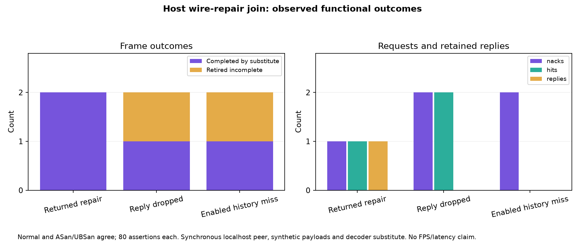

# Quiet recovery joined to wire repair

**80 assertions pass in normal and halt-on-error ASan/UBSan runs.** The previous arrival fixture injected a missing shard directly; this gate sends the actual NACK over reverse typed UDP, receives it at a synchronous primary-path peer, looks up retained blobs with production `shard_history::collect`, decodes the selected blob and returns a typed data shard through UDP into exact production `push_shard`.



| Case | Peer NACKs | History hits | Replies | Retired | Decoder substitute completions |
|---|---:|---:|---:|---:|---:|
| Returned repair | 1 | 1 | 1 | 0 | 2, in order |
| Reply deliberately dropped | 2 | 2 | 0 | 1 | 1 newer frame |
| Enabled history with no retained blob | 2 | 0 | 0 | 1 | 1 newer frame |

Both modes reproduce those counts. Assertions check stream/frame/index/bitmap, payload length and exact bytes, completion order and feedback distinguishing incomplete retirement (`sent_to_decoder == 0`) from completion. Initial receipts use continuous host monotonic time. History is enabled in every final case; case2 has no stored blobs. The first iteration's disabled-history control is retained separately.

## Scope and reproduction

Nine executed production bodies still match source `6e2293d58acc8b7a20e9276ae25f5e97257b37d9`: seven accumulator methods, the network caller and typed poll. Actual UDP serialization/deserialization, Linux poll, history locking/copying and FEC blob encode/decode execute. [Provenance](provenance.json), [source-check output](source-check.log), final CPP, raw normal/SAN/compiler logs and runnable generator are retained. The public runner was independently replayed by root.

```sh
bash run-check.sh /path/to/wivrn-nx /path/to/output san
python3 ../quiet-arrival-host/verify-source.py /path/to/wivrn-nx /path/to/output
python3 figure.py
```

It reuses the sibling kernel/arrival generators and configured host native headers/cache. There is no concurrent repair worker in this fixture: the simulated peer services a pending wire request synchronously before the next client poll. Its callback replaces the real server NACK handler, sender queues/pacing/primary-path eligibility. No real repair worker, RF delay, bandwidth contention or server streaming runs. TCP is an idle control socket. The accumulator constructor, XR conversion, configuration/property reads, scene/path hooks, parity drain and decoder remain substitutes. Feedback is logged, not transmitted. Packet bytes are tiny synthetic test payloads, not a valid ASTC frame or native stereo load.

The 11.111111ms configured period is not a 90FPS result. No paired latency savings, sustained throughput, quality, HEVC parity, thermal or photon claim follows. No Pico execution, installation, session restart, profile change or experiment activation occurred. Production source remains untouched. Next meaningful receiver proof requires the actual client constructor/clock/property/decoder/display path and real traffic with matched binaries; repeating this unchanged host check is not that proof.
