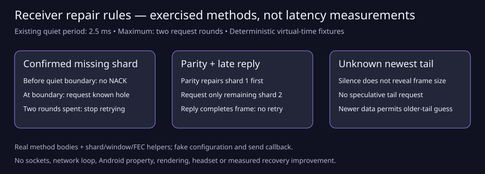

# Receiver NACK method gate

The current receiver NACK methods pass 60 assertions in normal and halt-on-error ASan/UBSan runs. These are correctness assertions, including slot setup checks, not 60 independent scenes. No latency or bandwidth gain is measured; no codec, transport or recovery policy change was made. Source: `2f53c2cbcd3ba08202b92c53f8bb7ba4ef6685ac`.

## Observed decisions

| Fixture | Result |
| --- | --- |
| Known older-frame hole, one nanosecond before / at quiet boundary | No request / request shard 2 |
| Second quiet boundary, then exhausted two-round budget | Second request / no third request |
| Newest frame with confirmed interior hole | Request shard 2 without needing a successor |
| Newest frame with no end marker or interior hole | No tail request |
| Older incomplete frame followed by newer data | Request inferred next shard |
| Retransmission disabled, non-ASTC polling, expired scene | No request |
| Real parity reconstruction, then another outstanding hole | Repair shard 1; NACK requests only shard 2 |
| Late requested shard arrives after parity repair | Actual shard set becomes complete; no further NACK |

[Raw per-action virtual-time decisions](decisions.csv), [normal log](raw/normal.log), [sanitizer log](raw/san.log), [exact source/method provenance](raw/provenance-captured.txt), [dependency hashes and independent extraction verification](raw/source-verification.json).

`request_count` is the number of newly captured callback requests for that action, not cumulative history; `rounds` is cumulative per-frame request rounds. Times are virtual nanoseconds. Normal and sanitizer outputs match byte-for-byte across Luna and independent root builds. Generated C++ also matches exactly; root retained its build log and normal/sanitizer outputs under `raw/root-*`. Initial report snapshots were captured after a later action; review corrected that harness reporting error and reran the gate. That was not a production receiver defect. The final parity fixture also places terminal metadata only on its actual last shard.

## Method and limits

Three complete production method definitions are extracted byte-for-byte from `client/decoder/shard_accumulator.cpp`: `next_nack_deadline`, `poll_nacks`, and `try_nack`. They execute against a small class projection with the actual `frame_window`, `shard_set`, NACK deadline and packet/FEC types. Application configuration and the weak scene/send callback are fake boundaries; logging is stubbed. The actual accumulator constructor, Vulkan decoder, `push_shard`, `push_parity`, parity drain, `pump`, scene/network thread, sockets and Android property are not executed. Fixtures insert real shards and invoke real FEC reconstruction directly. This is stronger than a copied decision model, but is not full accumulator or network-loop integration.

A read-only caller audit confirms the opt-in network loop asks for the earliest accumulator deadline and calls `poll_nacks` after polling. That caller audit is source evidence, not execution evidence. No recovery option was enabled.

All time values are deterministic virtual nanoseconds. They are not wall-clock timings, RTT, RF recovery, fresh FPS or photon latency. The 2.5 ms quiet period and two-round limit are existing policy constants, not a measured gain. Runtime wake-up rounding, scheduler delay, send failure, arrival reordering and display availability remain unmeasured.

## Reproduce

From this directory, run `bash run-check.sh SOURCE_CHECKOUT /absolute/scratch/output`. It compiles the extracted methods using real checkout headers in normal and halt-on-error ASan/UBSan modes. An existing configured `build-server` supplies generated common headers and Boost PFR; no server is built or launched. Binaries stay in the selected scratch output. Inspect provenance and exact source hashes before comparing another checkout.

## Next gate

An explicitly authorized isolated actual receiver/network run must correlate quiet deadlines, actual wake-ups, request/reply arrivals, frame completion and fresh stereo delivery. Unknown newest-frame tail loss still cannot be inferred from silence alone. Preserve default-off experimental polling until that gate supports an activation decision. No new policy is justified by this CPU gate.

The extracted production definitions retain their original WiVRn copyright and GPL notice. The [delivery audit](AUDIT.md) proposes a broader future integration gate; this published gate does not execute the actual network timeout adapter or accumulator push methods.

Figure source: [SVG](recovery-rules.svg); render with `rsvg-convert -o recovery-rules.png recovery-rules.svg`. The published PNG was visually inspected.
