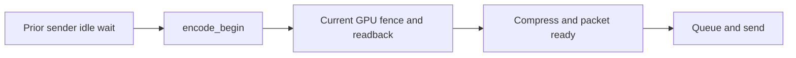

# Native ASTC producer sender-wait diagnostic

**Implemented, checked and built; default off. No measured latency saving.**
Source commit `a98d5ac` on `pyrowave-probe`; base `831aafed`. Only
`server/encoder/video_encoder.cpp` and `.h` changed. No install, restart,
profile activation, device work or live measurements occurred.

## Why this exists

The next ASTC frame waits for its preceding queued/in-flight send before the
existing `encode_begin` timestamp. The backend CPU fence/compression summary
and `send_begin - encode_end` therefore omit this producer wait. Root verified
this ordering in the actual source. The size of the missing component remains
unknown; source ordering alone does not establish a bottleneck.



The new diagnostic covers the first box only. It measures wall time around the
actual `shared_sender->wait_idle(this)` call, including mutex/condition-variable
wait, scheduling and measurement overhead. It is neither wire transfer duration
nor GPU, headset, photon or complete end-to-end latency.

## Opt-in and output

For an explicitly authorized future server test, set exact environment string
`WIVRN_ASTC_SENDER_WAIT_TIMING=1` before encoder construction. It is read only
for native ASTC. After 180 actual producer wait calls, each stream logs:

```text
ASTC stream <id> sender wait ms per frame, n=180 mean/max=<mean>/<max>
```

All calls count, including already-idle calls (which can still have clock/lock
overhead). Reset count/sum/max together after each window. There is no added
clock read or sample accumulation when disabled, non-ASTC, or without a sender.
Destructor draining is unchanged and unmeasured. Queue policy, packet ownership,
encode timestamps and wait placement remain unchanged.

## Verification

Root inspected both source files, checked their exact SHA-256 against the build
evidence, and independently ran the retained source-extracted check (exit0):

```sh
sh run-check.sh /path/to/wivrn-nx /tmp/nx-sender-wait-check
```

This uses RTK, Python3 and g++. It extracts the actual constructor gate and
producer wait block, then executes them with a fake monotonic clock, sender and
logger. It checks exact-1 gating; disabled/non-ASTC/no-sender zero new clock
calls; zero-duration calls in the denominator; no log at179 samples; mean/max
and reset over two180-call windows. These are simulated durations, not recorded
performance. It does not execute real CV waits, sockets or the full encoder.

Configured full server target passed; after replacing the initial standard
chrono clock with the existing native monotonic helper, the final rebuild
recompiled the encoder and linked the server successfully:

```sh
cmake --build build-server --target wivrn-server --parallel 4
```

`server-build.log`, `server-build-final.log`, source hashes and both check logs
are retained. The build happened before commit, so generated version metadata
still names base831aafed; the edited source hashes identify the tested code.
Source diff whitespace check passed. Raw compiler output is preserved verbatim.
A first root tool invocation selected the new report directory before creating
it and failed process creation; no test ran. Root created the directory and
reran successfully (`root-check.log`).

## Remaining gate

Collect actual per-stream wait windows alongside existing backend timing and
fresh stereo delivery in a concrete authorized live test. Do not enable an
async/latest-frame policy from source speculation. The
[owned-frame audit](../SENDER_OWNED_FRAME_AUDIT.md) explains the immutable metadata,
paired-eye supersession and serialized FEC/history prerequisites. Existing
sender-wait relocation remains rejected; this change only exposes missing data.

### Constructor compatibility follow-up

Commit dc012b1 adds a separate default-off base slot-wait flag. The retained
sender mock gained that constructor field and clears its environment in the
child test. Root independently reran the existing sender assertions against the
new source; `root-current-regression.log` passes. Original build/check logs
remain historical evidence for a98d5ac, not overwritten current results.
