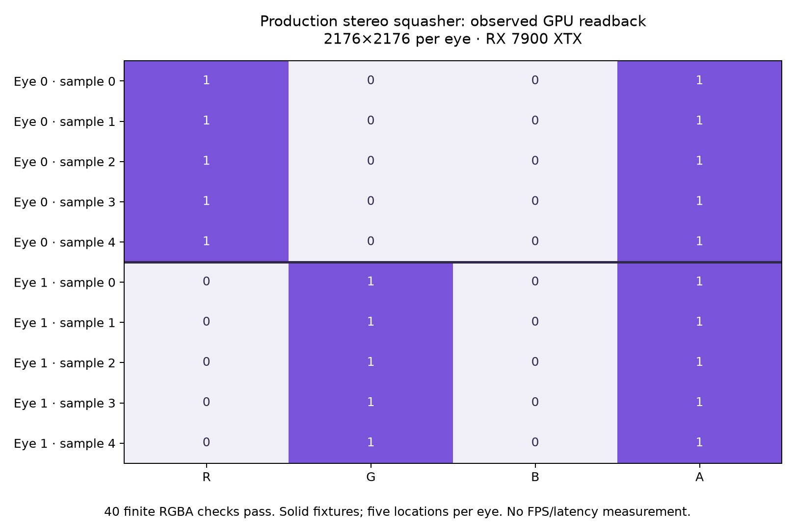

# Native stereo squasher: actual offscreen GPU path

The standalone fixture executes the **real production layer_squasher::do_layers** and its production layer shader on **2176×2176 per eye**, using actual Vulkan/VMA resources and a real constructed HMD. On the observed **AMD Radeon RX 7900 XTX (RADV NAVI31)**, five locations per eye return the expected red/green RGBA values: **40 finite component comparisons pass**. The Vulkan loader explicitly inserts Khronos validation at both instance and device level; the final run emits no VUID/validation error or warning. Loader messages about requested layers and disabled implicit layers remain in the raw log.



## Actual path and limits

A timestamp-matched stereo projection and no view-space layers allow the production pose path to use fixture poses without querying HMD tracking. The real HMD is constructed with a null session; the fixture guards that specific no-callback path. This is not a generally usable null-session HMD. Real comp_swapchain structs and source views have valid object lifetimes, but their acquire/release/producer callbacks are not exercised. Each source image is cleared to a constant colour and transitioned for sampling. Actual do_layers records the native stereo composition. A separate scratch compute shader samples the resulting sRGB views into a host-visible SSBO, with barriers, full submission fence, invalidate and finite-value checks. It does not assume unsupported TransferSrc usage on the production render target. Samples are read back after retirement; resources remain owned through that wait.

Five sampled locations and solid inputs do not prove every output pixel, motion quality, application layering, depth, timing fallback, view-space layers or swapchain integration. The test bypasses compositor::layer_commit, pacer, retirement-poll guard, encoder, compression, queues, network, Pico, decoder and display. No component latency or FPS is measured in this gate. Shader/SPIR-V/build success alone is not the evidence: the raw GPU readback is. No HEVC parity, fresh FPS or photon claim follows.

## Reproduce with the configured server cache

```sh
python3 build-reproduce.py /path/to/wivrn-nx /path/to/separate-scratch-output
cd /path/to/separate-scratch-output
env -u DISPLAY -u WAYLAND_DISPLAY \
  VK_LOADER_LAYERS_DISABLE='~implicit~' \
  VK_INSTANCE_LAYERS=VK_LAYER_KHRONOS_validation VK_LOADER_DEBUG=layer \
  timeout 30s ./squasher-fixture --run ./empty-config.json ./sample-output.spv > run.log 2>&1
```

The builder compiles the scratch entrypoint with the configured production flags, retains the entire recorded server link closure except main, and provides main's two unused IPC globals without starting a server. Cached production objects, libraries and shader assets are reused. Explicit linker object/library hashes, current source hashes, test binary hash and commands are retained in provenance.json. Four relevant cached object dependency lists are VALID with no newer declared inputs; the overall server dry run still requests CMake regeneration. This is not a newly rebuilt complete server target or a full-current-server runtime claim. The source checkout remains clean at6e2293d5; no source/CMake configuration was edited. The first complete-closure fixture linked, then root rebuilt the corrected sample checker and final device-labelled entrypoint before acceptance. Failed setup logs and their incomplete archive boundary are retained in iterations/.

Direct Vulkan requires no window or gamescope surface. DISPLAY/WAYLAND_DISPLAY removal and layer settings apply only to the owned subprocess; user focus, desktop, environment and configuration stay untouched. Default loader preflight encountered a skipped liblsfg layer; the isolated process disables unrelated implicit layers and retains both observations, without assigning driver fault or changing the system.

This closes the previously missing real squasher harness gate. Next useful work is bounded host-recording/GPU/full-fence attribution on this fixture, then actual compositor and fresh stereo delivery correlation before changing waits. No APK/device execution, signing/install, session restart, profile/option activation or public binary publication occurred.
