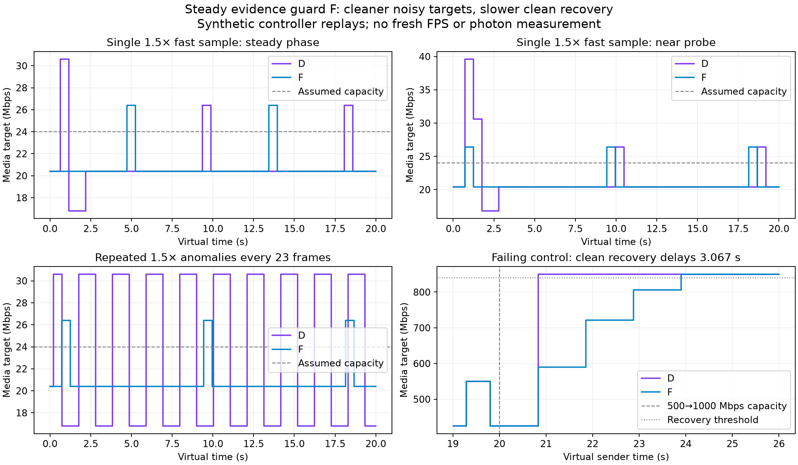

# Steady evidence guard: cleaner noisy targets, slower recovery

**Candidate F is held. Production remains source412a2bfe (D).** This is an offscreen controller experiment, not an installed Pico feature or latency measurement. No production source, build, install, option or live session changed.



## Result and decision

F prevents the selected1.5× timestamp anomalies from driving ordinary growth above the intended probe level. It removes the resulting false cuts in both new starting phases. However, it slows the clean20s capacity-recovery control by3.067 virtual seconds. The cleaner synthetic target is insufficient justification for that recovery regression.

| New phase360 case on an assumed24 Mbps link | D minimum / maximum | F minimum / maximum |
|---|---:|---:|
| One1.5× fast sample | 16.8 / 39.6 Mbps | 20.4 / 26.4 Mbps |
| Repeated1.5× fast samples every23 frames | 16.8 / 30.6 Mbps | 20.4 / 26.4 Mbps |

An ordinary deliberate probe still exceeds assumed capacity at26.4 Mbps. F does not eliminate every anomaly: repeated1.25× samples still cause a16.8 Mbps minimum, and the separate large-outlier probe-phase control retains its later14.28 Mbps cut. Callback-pause and repeated-record collapse fixtures remain synthetic, not actual reconnect/repair measurements.

| Clean500→1000 Mbps capacity rise | D first target≥840 Mbps | F first target≥840 Mbps |
|---|---:|---:|
| At3 virtual seconds | 3.447 s | 3.447 s |
| At5 virtual seconds | 5.236 s | 5.236 s |
| At10 virtual seconds | 10.344 s | 10.344 s |
| At20 virtual seconds | 20.833 s | **23.900 s** |

The [failed recovery gate](validation/recovery-gate.log) is retained. `check.py` verifies the observed improvement and regression; it does not approve F for production. Requested media targets and model timestamps are not actual throughput, headset smoothness or photon latency.

## Candidate and verification

F combines an unconfirmed steady-state upward hold with positive-growth caps from the confirmed post-peak p90. Probes and forced probe completion use the confirmed p90 or recent loaded-rate p90. Existing gains, ordinary current-target floor, forced drain, startup and direct-quality policy remain. It differs from the earlier blanket p90 cap by holding unconfirmed steady growth instead of raising from the older global cohort.

The source snapshot is frozen at cpp SHA256 `dba89eb7dfc3827f599275b674d1868b6967cbbaf383bc7e89c1352ba0130f94`, header `32c058ff5715fd4fb57ad394a13100e39bd3e9755edfb5f5a6a1425f146d493a`. Five existing suites pass normally and under halt-on-error ASan/UBSan: BBR92 checks, budget4346, NXdirect31, radio50 and AIMD-loss-only assertions. Root independently compiled the public legacy fixtures and reproduced all14 F gate CSVs byte-for-byte. Root separately generated the61,200-row noisy F trace, using the same17 scenarios and two starting phases as the [previous noisy report](../noisy-feedback/README.md). Those checks catch regressions that the general unit suites do not. No complete server build or live test is claimed for F.

## More useful next direction

[Actual timestamp provenance](AUDIT.md) shows receive endpoints come from client software processing, not hardware arrival stamps. The complete-frame endpoint follows a decoder input call; for native ASTC that call locks and appends packet bytes, not the complete GPU decode. Queue draining could make a software span look artificially short; its frequency and magnitude remain unmeasured.

[Existing sender metadata](SENDER_SPAN.md) offers a different experiment without new protocol fields: matching per-eye send and receive spans before producing a delivery-rate sample. [The scoped research note](RESEARCH.md) connects this to an IETF delivery-estimation draft, distinguishes that draft from NXVC, and defines missing/invalid metadata, serial/overlap, repair, clock-origin and app-limited gates. This is a candidate measurement correction, not another demonstrated performance win. Do not repeat unchanged F or choose an arbitrary jitter margin from these replays.

## Reproduce

```sh
bash run-noisy.sh /absolute/path/to/wivrn-nx /tmp/nx-steady-noisy
bash run-gates.sh /absolute/path/to/wivrn-nx /tmp/nx-steady-gates
python check.py
python plot.py
```

A configured checkout supplies generated headers/dependencies. The adjacent reports contain pinned imported fixtures. Fresh results go outside this report; compare with [raw](raw/), [legacy gates](gates-F/) and [hashes](EVIDENCE_SHA256.txt). [Validation](validation/) retains normal/SAN logs and independent reproduction. `validation/recovery-gate.py` intentionally fails on the retained regression. The four-panel figure was visually inspected.

The fixtures omit real encoders, CPU/GPU contention, capped queues, real packet timing, decoder and display. Nominal90 Hz iteration does not establish native90/240 fresh FPS, HEVC parity, motion quality or physical latency. Native ASTC reaches generic BBR only when selected; installed control law and current headset state remain unverified. Private photographs and unrelated branding are untouched.
