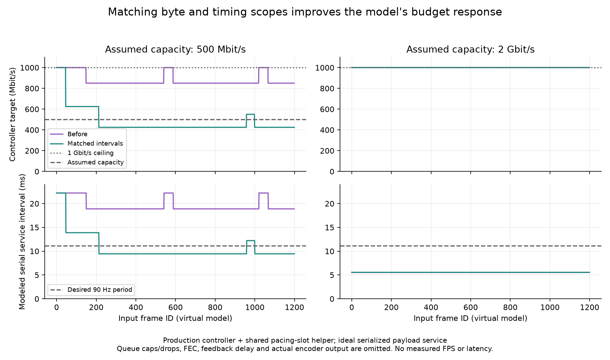

# Coupled stereo BBR replay

Deterministic CPU replay through the production bitrate controller and `pacing_slot`/`shard_pacer` arithmetic. It is not a network, headset, measured-FPS, power, or latency result.



Root independently compiled and reproduced all four traces byte-for-byte, using an output path containing spaces. Both programs exited0; all1200 rows/trace satisfy monotonic schedule and span/budget checks. The source correction is already built/pushed; this follow-up adds no production changes.

Source inspection at `6902940fcd1cb15cef2337e9d6ab85cc266ebbd4` found one shared ordinary UDP video sender queue and pacing slot across its streams; the control/TCP queue is separate. The queue drains a ready item with `queued = pending.size()`; `begin_frame()` splits the remaining slot by `queued + 1` (`server/encoder/video_encoder.cpp:100-116,153-166`; `server/encoder/shard_pacer.h:162-195`). The replay assumes a fully-ready paired eye queue: eye 0 starts with `queued=1`, then eye 1 with `queued=0`. Equal-sized same-codec streams receive equal bitrate shares under `split_bitrate` (`server/encoder/encoder_settings.cpp:80-148`). The replay assumes the source default0.4 pacing window, capped at0.5; the current live configuration was not verified.

Each nominal frame has aggregate payload `floor(current_target * 11.111111ms / 8)`, split equally between eyes. This assumes every frame fully uses its current media target as payload. Actual ASTC quality-rung choice, lossless compression ratio and scene-dependent payload size are omitted; it is not a prediction of real bitrate usage. For each eye, the modeled completion span is `max(active pacing budget, payload_bytes * 8 / assumed link capacity)`. Both eyes are serialized. The next frame starts at `max(desired 90Hz start, prior modeled end)`; controller time follows modeled end. In all four captured traces, modeled payload transmission time is at least the active pacing budget for every eye, so assumed link capacity determines these spans.

At 500 Mbit/s, after 1,200 modeled frames, baseline estimates 1 Gbit/s and requests 850 Mbit/s; the patched controller estimates 500 Mbit/s and requests 425 Mbit/s. The baseline's last modeled end is 23.48 s versus a final desired start of 13.32 s. Patched end is 13.33 s. On the 2 Gbit/s wide-link control, estimates are 4 Gbit/s baseline and 2 Gbit/s patched; both targets remain at the 1 Gbit/s ceiling. This checks the corrected rate accounting against these inputs, not live capacity. Periodic probes still temporarily exceed the narrow capacity and desired service period in the raw trace; the425Mbit/s endpoint is not a guarantee that every frame fits a deadline.

The 10.16 s baseline schedule overrun is only a signal that this idealized serial service model falls behind. The replay does **not** model the bounded sender queue, drops/supersession, producer waits, encoder/compositor timing, group-by-group pacing sleeps, decode/loss/feedback transport delay, packet framing, FEC, or compression behavior. It assumes both eyes are ready as a pair, and models an eye span as one maximum of a pacing deadline and transmission duration. Thus it cannot establish real server backlog, actual ASTC arrival spacing, fresh-frame rate, or headset latency. No production source/configuration was changed for this replay.

## Reproduce

From a shell, pass the source checkout, an output directory, and the retained baseline snapshot:

```sh
bash run.sh /path/to/configured/source /tmp/stereo-rate-output ../stereo-rate-scope/baseline
python3 plot.py
```

The script compiles baseline and patched controllers with `g++ -std=c++23 -O2`, then writes four 1,200-row traces. The final run, including an output path containing spaces, is recorded in `final-run.log` and the raw CSVs beside this document. `source-sha256.txt` records fixture, runner, controller, header, and baseline snapshot hashes; current source revision is also recorded there. The baseline controller snapshot is from `dc012b190db643c0349c7b7f016b6011d5170819`.
