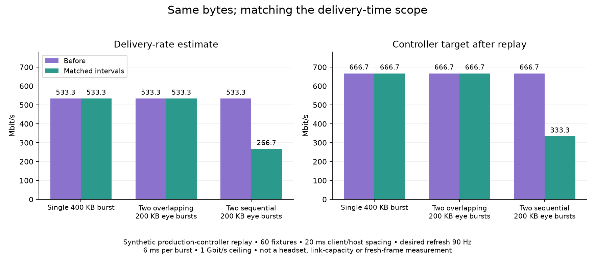

# Stereo delivery-rate accounting

The production controller paired the aggregate bytes from multiple streams with the longest individual receive interval. That is correct for fully overlapping, equal-span bursts, but overestimates this replay's serial stereo delivery rate by 2×. The correction uses counted bytes and valid receive intervals from the same streams, divided by the intervals' union. Existing per-eye congestion utilisation stays unchanged.

This is an actual-controller arithmetic regression, not a headset or network benchmark. It does not establish that a real Pico session has these arrival patterns, changes its quality or becomes smoother. No client, server session, profile or experimental setting was activated.

## Verified result

| Synthetic arrival pattern | Baseline estimate | Corrected estimate | Baseline / corrected target after60 fixtures |
|---|---:|---:|---:|
| Single400KB burst |533.333Mbps|533.333Mbps|666.667 /666.667Mbps|
| Two fully overlapping200KB eye bursts |533.333Mbps|533.333Mbps|666.667 /666.667Mbps|
| Two sequential200KB eye bursts |533.333Mbps|266.667Mbps|666.667 /333.333Mbps|



Source correction: [6902940f](https://github.com/nerdrx/wivrn-nx/commit/6902940f). The complete configured server target built successfully before commit with the final source hashes, so generated version metadata still identifies its dc012b19 base. No binary was installed or started. Normal and strict ASan/UBSan BBR checks each pass86 checks. Root independently reran five suites: BBR86, budget4346, NX-direct31, radio50 checks; loss-only AIMD exited0. Three additional actual-class cases exercise unsorted intervals, a nested interval and negative timestamps. All pass; raw logs and source hashes are retained.

## Why the scopes differ

Each stereo fixture contains 400,000 total payload bytes. Two 200,000-byte eyes each take 6 ms:

- Overlapping intervals occupy 6 ms together: 533.333 Mbit/s.
- Sequential intervals occupy 12 ms together: 266.667 Mbit/s.
- A gap between two intervals is excluded from their union. It must not be treated as packet-delivery work.

The old denominator remained 6 ms in all three cases. Missing timing also allowed bytes from an untimed eye to contribute to the rate. The correction excludes those bytes, rejects zero/reversed/non-positive receive intervals, and admits a capacity sample only when a stream contributing bytes meets the existing app-limited threshold. An unrelated long interval with zero counted bytes cannot admit a tiny matched burst.

The array holds at most four intervals, uses no heap allocation and is sorted before merging. Per-frame aggregate bytes remain available for NX quality-budget conversion. The widest individual receive span remains the congestion-utilisation denominator: unrelated NX direct per-eye wire IDs can drift, so restoring a merged first-to-last utilisation envelope would reintroduce an earlier congestion bug.

## Replay and controls

The runnable harness links the real production controller, with only logging stubbed. It uses 60 fixed-payload fixtures, a 1 Gbit/s ceiling, pacing window0.4 and desired display period11,111,111 ns. Client and controller clocks advance20 ms per fixture, leaving each 12 ms sequential stereo burst within its fixture. Desired90Hz is an input to the controller, not measured fresh90FPS. Fixed payloads do not model an encoder adapting to the returned bitrate.

The app-limited threshold is0.30 ×0.4 ×11,111,111 ns, approximately1.333 ms. The6 ms receive spans qualify. The existing BBR regression additionally checks partial overlap, unequal payloads/durations, gaps, untimed streams, invalid intervals, duplicate feedback, three-stream overlap and a short counted burst beside a zero-byte long interval. Existing NX-direct, quality-budget, AIMD and radio tests protect the other control paths.

The initial exploratory replay used different fixture spacing; its raw rows and code are retained separately. The before/after comparison uses identical20 ms spacing. A nominal display period never establishes actual cadence.

## Limits and live gate

This denominator is a union of reported receive intervals, not a complete wall-time envelope, physical Wi-Fi rate or media presentation latency. The ordinary receiver marks its final receive timestamp after copying the final payload parts into the ASTC packet buffer. Original sent-byte accounting includes parity payload, omits outer framing and requested repairs, and is not a direct counter of every byte actually received. Those pre-existing measurement limits remain.

A live gate needs paired stream byte counts and actual first/last timestamps, original/repair traffic, target changes and fresh stereo delivery under motion. GPU/CPU component timings and viewer loops cannot prove fresh FPS, HEVC parity or photon latency. The source fix alone does not prove reduced overshoot on the user's WLAN. It leaves the representation and fitter unchanged, but lower adaptive targets can select lower-detail quality rungs; this is not an equal-quality compression gain.

## Reproduce

With an already configured source checkout (including its generated common headers and dependencies):

```sh
sh run.sh /path/to/configured/source /tmp/nxvc-rate-patched
sh run-baseline.sh /path/to/configured/source /tmp/nxvc-rate-baseline
bash root-run.sh /path/to/configured/source /tmp/nxvc-rate-regression
python3 plot.py
```

The baseline source snapshot is retained under `baseline/server/driver`. `baseline-20ms-spacing.csv` and `patched-20ms-spacing.csv` use identical final fixture code. Root independently compiled and checked both paths. `baseline-initial-spacing.cpp/.csv` retain the first exploratory fixture separately. `root-run.sh` runs the existing five production tests and supplemental source-linked ordering/boundary checks. See source hashes, commands and root regression/build logs in this directory. No supplied private image is used or published.
