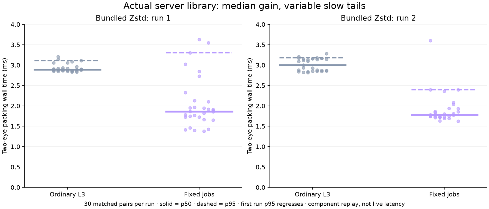
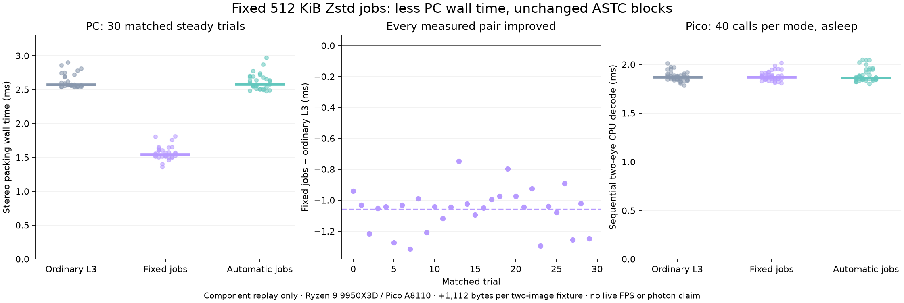

# Fixed Zstd jobs: less PC packing time, same encoded detail

**Promising component gain:** with the actual server's bundled library, fixed 512 KiB Zstd jobs saved **0.864 / 1.025 ms paired mean** in two short packing runs. The resulting packets reproduce exactly the same ASTC blocks. A short Pico CPU replay saw essentially unchanged decode times. **Slow-tail timings regressed in one host run:** this remains default off, not a proven live latency improvement.



## Actual server-library gate

The first exploration used system Zstd. Root review caught the project's bundled Zstd built with worker support disabled: the new option would have fallen back. Source now builds worker support **only for the server**, keeping no-server/Android builds without workers. The actual rebuilt server static library passed normal and ASan/UBSan test harnesses, including retained parameters, repeated frames, byte-identical disabled L1/L3 calls and packet/raw-fallback checks. A separate no-MT build rejected worker configuration and retained working legacy compression/decode. The full server target built successfully; sanitizer coverage here instruments the test/helper/decoder header, not all static-library internals.

| Bundled-library run, 30 matched pairs each | Ordinary L3 p50 / p95 | Fixed jobs p50 / p95 | Paired mean reduction | Improved pairs |
|---|---:|---:|---:|---:|
| Run 1 | 2.893 / 3.111 ms | 1.861 / **3.300 ms** | 0.864 ms | 26/30 |
| Run 2, repeat to investigate the tail | 3.004 / 3.180 ms | 1.784 / 2.397 ms | 1.025 ms | 28/30 |

Run 1 fixed-job p95 worsened by 0.188 ms despite the median/mean improvement. Both runs are retained; they cannot establish a stable deadline benefit. The bundled encoder emitted **all six packet files byte-identically** to those checked by the earlier Pico replay, so that decode compatibility result applies. Source implementation: [ca777722](https://github.com/nerdrx/wivrn-nx/commit/ca777722).

## Initial system-library exploration and Pico gate



The initial run below is separate from the actual bundled-library gate. Do not pool its timings with the two later runs.

| Configuration | PC packing p50 / p95 | PC process CPU p50 | Bytes for both images | Pico CPU decode p50 / p95 |
|---|---:|---:|---:|---:|
| Ordinary L3, parallel eyes | 2.570 / 2.811 ms | 4.438 ms | 672,903 | 1.870 / 1.971 ms |
| L3, two workers, 512 KiB jobs, no overlap | **1.546 / 1.757 ms** | 4.710 ms | 674,015 | 1.873 / 1.956 ms |
| L3, two workers, automatic jobs | 2.576 / 2.773 ms | 4.500 ms | 672,903 | 1.863 / 2.044 ms |

Fixed jobs traded **+0.272 ms process CPU p50** and **+1,112 bytes (+0.165%)** for less elapsed packing time. This is a latency-component optimization, not a compression-ratio win. Pico p50 changed by +2.4 microseconds and mean by +5.1 microseconds; these short samples cannot establish statistical equivalence or a decoder speedup.

## What changed

Keep ordinary level-3 Zstd and the existing NAST v2 packet/ASTC decoder. Give each eye's persistent compression context two workers and explicit 512 KiB jobs, with `ZSTD_c_overlapLog=1` (no overlap). Call `ZSTD_compress2`, which retains those parameters; the legacy `ZSTD_compressCCtx` call resets advanced parameters.

The source option `_wivrn_astc_zstd_jobs="1"` is **default off**. It applies only to ordinary independent L3 packing. Compact packing, motion-delta packing and fast level 1 ignore it with a log message. An unsupported worker configuration falls back to the legacy call. The LZ4/raw selection, bitrate controller and wire format stay unchanged. Nothing was installed, enabled or launched for this check.

## Method and boundaries

- Host: Ryzen 9 9950X3D, 32 logical CPUs, Linux 7.2.8 CachyOS, GCC 16.2.1, system Zstd 1.5.7. Normal desktop applications remained active; no clocks, affinity or priorities were changed for PC timing. The retained process monitor showed no owned compiler during the authoritative packing run.
- Input: two retained, unrelated photographic fixtures, each already encoded to native 2176×2176 ASTC8×8 (1,183,744 raw block bytes). They are **not binocular captures or a moving VR sequence**. Images and derived payloads remain private. Published source and hashes permit local reproduction with supplied fixtures.
- Packing harness mirrors the production q6 selection policy, persistent Zstd/LZ4 buffers, fresh shared packet allocation/copies and concurrent eyes. It excludes GPU encoding, fence waits, networking and presentation. It does not instantiate the full Vulkan encoder.
- Three configurations, five warm-up stereo calls each, 30 measured stereo calls per mode. Mode order alternates across trials. First calls and parameter setup are recorded separately in `pc.csv` / `pc-checks.log`; they are excluded from steady percentiles. The setup timer is not total cold startup.
- Every packed result is decoded by the production packet decoder and compared byte-for-byte outside the packing timer: 216 eye checks across cold, warm-up and measured calls. A separate synthetic 256 KiB high-entropy case exercises the existing raw fallback; it is a framing check, not a valid rendered-scene quality test.
- Device: USB Pico A8110; asleep, display off, VR mode false and thermal status 0 before/after. A short `nice -n10` CPU executable ran without installing or starting an app. It sequentially decoded both images with preallocated output, using ABCCBA order, 10 warm-up and 40 measured calls per mode. All 240 measured eye results matched the retained raw ASTC bytes. Owned `/data/local/tmp` files were removed and their absence checked.
- Percentiles use sorted index `floor((n−1)×p)`. `figures.py` verifies the retained summaries and matched improvements before plotting.

There is **no proof here of fresh 90/240 FPS, full-scene quality, HEVC parity, motion quality, power consumption, or physical photon latency**. The active headset profile remains untouched. More host CPU work may matter during a busy game; an explicit live A/B gate is still required before enabling this option.

## Reproduce locally

Requires g++, pthreads and development libraries for Zstd/LZ4, with Zstd worker support. Use two headerless native ASTC8×8 fixtures of exactly 1,183,744 bytes and a matching WiVRn NX source checkout:

```sh
bash run-local.sh /path/to/wivrn-nx left.raw.astc right.raw.astc /new/output/directory
# Or select the actual built server libraries (server MT support must be enabled):
bash run-local.sh /path/to/wivrn-nx left.raw.astc right.raw.astc /another/output/directory bundled
python3 figures.py
```

The first command writes **new** measurements and private packet files into the requested new directory; it never publishes them. The second regenerates this report's figure from the retained CSV files, not the new local run. `decode.cpp` can also be cross-compiled against the Android NDK and the project's static Zstd/LZ4 libraries for a CPU-only device replay. Host decode timings are not Pico timings.

## Remaining gates

1. Completed: reviewed default-off option, compatibility/fallback checks with ASan/UBSan, actual bundled-library tests and server build. Two bundled-library packing runs retained, including the p95 regression.
2. Verify explicit opt-in on an unused live headset, with ordinary independent L3 and the separately optional parallel-eye path.
3. Compare fresh stereo delivery, PC GPU/fence/packing stages, network loss/recovery and Pico pacing under game load. Reject the option if the extra host workers create worse tails.

See [continuous work queue](../QUEUE.md) for source revision and validation status.
