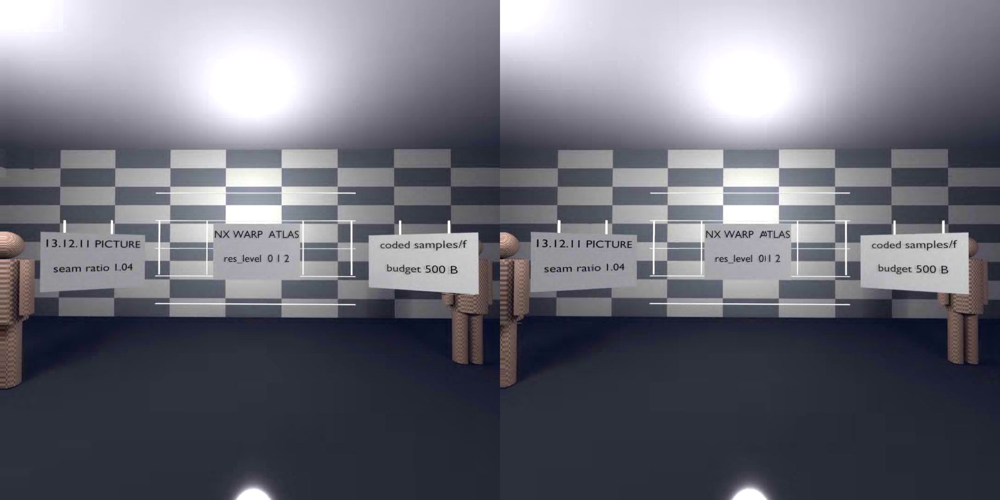
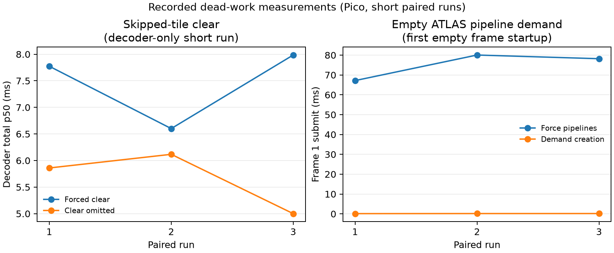

# 240 Hz direction and first device measurements

2026-09-07. Stretch target: 240 Hz presentation, 4.167 ms per presentation.
Checkpoints: 90 / 120 / 144 / 180 / 240 Hz (11.111 / 8.333 / 6.944 /
5.556 / 4.167 ms). These are whole-presentation budgets, not decoder budgets.
Removing work takes priority over making every existing stage faster.

## Product priorities and evidence

User direction, 2026-09-07: on Pico, prioritize speed and a clean visual result
over faithful reproduction, especially at low bitrate. Intentional loss of
detail or simplified imagery is acceptable. More capable hardware may spend
additional compute and bitrate on fidelity; Pico performance is the primary
constraint. Evaluate temporal stability and distracting artifacts alongside
latency rather than treating pixel similarity as the sole quality objective.
Intentional visual loss does not waive the decoder's normative correctness
contract: a representation change must be specified and tested explicitly.

Keep the repository readable as a scientific paper. Capture actual rendered
screenshots for experiment figures, preferably matched source/baseline/candidate
views and identical crops. Caption each with scene/frame, device, resolution,
bitrate, codec settings, commit and accompanying timing measurements. Label
illustrations separately from captured evidence. Still images document spatial
appearance; motion and latency claims require sequences and measurements.
The initial decoder-only run produced no headset screenshots. The later atlas
experiment includes the reference-decoded frame capture below, clearly separate
from a live headset capture.



Figure 1. Frame 15 (zero-based) of local `vr-rest-on-atlas.nxv`, decoded by
the CPU reference at `c274df1`, 2176x1088 YUV420, then converted to PNG with
FFmpeg. This is the display output of the reference decoder, not a Pico
compositor screenshot or a candidate-vs-baseline quality result. Original
encoder settings and capture cadence have not been independently recovered;
no bitrate is inferred from labels embedded in the scene. The same encoded
fixture is used for both display-view variants in the device experiment.



Figure 2. Left: decoder-call p50 for skipped-tile clear removal, 14 timed
observations per run. Right: first all-skipped frame's command preparation and
submission interval, including lazy shader creation; demand creation measured
0.123–0.162 ms. The panels use different workloads and scales. No sustained
presentation rate is inferred. [Raw results and plotting script](../bench/results/240fps-2026-09-07/plot-dead-work.py).

## Inspected state

Main at `c274df1`, clean tracked tree before this investigation. The untracked
`bisect/` worktree was left alone. The roadmap predates substantial implementation:
atlas decoding, coded-tile lists, sampled atlas views, and specialized skip/copy
shaders already exist. Do not build duplicates of these mechanisms.

`vk/decoder/nxvc_vkdec.cpp` builds `acoded` from the existing skip partition;
ATLAS frames omit skipped tiles from reconstruction. PICTURE frames deliberately
restore full reconstruction. The ordinary inter path still reconstructs skipped
pixels. This distinction is central to the next experiment.

## Preliminary Pico run, not an FPS baseline

Pico A8110, Adreno 650, ADB serial PA8150MGGB110166G. Rebuilt the existing
Release Android configuration, target `nxvc-vkdec`, from main. Binary SHA256:
`c6af8251a0826336780eae25ebc8ccb7bf44a95b14e461fb6c9b3ad60dde8902`.
Existing device `ht.nxv` SHA256:
`bd7324362c2eac1b5137afbb1ce8a3e597d4c2763b9ed7e74546b15a9199ba5b`.
The stream has only 16 frames, 1088x1088, YUV420. It is not a stereo live-session
baseline, and cannot substantiate the reported PC 60 FPS or any presentation rate.

WiVRn was waiting for discovery; it was closed before measurement. No clocks
were forced. GPU thermal readings changed during runs; clocks were not sampled
continuously. Every invocation had a 45-second device timeout and exited 0.
An initial cold run incurred seconds of startup; the following table excludes
the first two frames of each subsequent process (14 observations each).

| Run order | Pass A p50 ms | Pass B p50 ms | GPU p50 ms | Decoder call p50 ms |
|---|---:|---:|---:|---:|
| Default | 18.072 | 8.974 | 27.331 | 31.261 |
| `--tile-sort` | 18.111 | 9.117 | 27.419 | 31.189 |
| Default again | 18.450 | 8.976 | 27.374 | 32.443 |

Pass B includes Pass W; never sum both. Pass W p50 was about 0.4 ms.
Typical inter frames had about 250/289 warp-skip tiles, whose reconstruction
segment alone cost roughly 7 ms. `tskip` in the ordinary stats line means
transform skip, not the warp-skip mode distribution; use `[segms]` tile counts.

**Decision: no tile-sort default change.** Its GPU time did not improve, and
the CPU wall variation prevents a useful claim. The short sequence and changing
thermal state also make p95/p99 unsuitable as acceptance evidence. No quality,
bitrate improvement, power, occupancy, memory traffic, network latency, encoder
latency, or compositor latency was measured. `--no-out` excludes readback.

Raw local logs are in sibling `nx-scratch/240fps-20260907/`:
`baseline-ht-warm.log`, `sorted-ht.log`, `baseline-ht-return.log`.
These are local evidence, not portable corpus assets. The initial
`baseline-ht.log` lacks stderr timings and must not be used for statistics.

The stdlib-only `scripts/summarize-vkdec.py` emits JSON stage percentiles and
decoder-only deadline miss fractions. For example, from the repository root:

```sh
python3 scripts/summarize-vkdec.py --warmup 2 \
  ../nx-scratch/240fps-20260907/baseline-ht-warm.log
```

Percentiles describe the supplied observations; a JSON p99 from 14 frames is
not evidence of sustained p99 performance. Preserve process exit status beside
the log: a partial stats log by itself cannot prove successful completion.

## Next experiments, in order

The first implemented experiment now has [raw logs, a portable fixture and
paired results](../bench/results/240fps-2026-09-07/README.md): dirty atlas-view
updates. The [single-dispatch follow-up](../bench/results/240fps-2026-09-07/single-dispatch/README.md)
reduces dispatch overhead but has mixed timings. It remains opt-in; see the
report's unresolved directional Pico conformance result.
The live custom WiVRn NX configuration already uses the Vulkan encoder's
non-directional path. The direct sampled-atlas consumer exists in local
worktree `nx-scratch/wt-atlas-wiring` (`f9efb6a9`) and is a different wiring
path from live `wivrn-nx-e2e`; these must not be conflated. No live client
speedup has been established by this experiment.
The [skip-clear comparison](../bench/results/240fps-2026-09-07/skip-clears/README.md)
retains clear omission for absent ATLAS tiles by default; dirty view updates
remain opt-in. Its R8/R16 comparisons cover static, changing, and stereo
fixtures, including view recreation.
The [pipeline-demand measurement](../bench/results/240fps-2026-09-07/pipeline-demand/README.md)
shows the first all-skipped frame falling from 67–80 ms forced pipeline setup
to 2.9–5.3 ms with demand creation; this is startup latency evidence, not a
sustained-FPS result. The clear omission and demand-created pipelines are
default dead-work removal; dirty views remain optional.
For live source measurement, local edits to the custom WiVRn NX `stream.cpp/h`
count new-source projection submissions by frame-ID high-water across windows.
The desktop client build passed, is not installed on Pico, and has no
live measurement yet.
The [live new-source evidence](../bench/results/240fps-2026-09-07/live-source/README.md)
records stable 84.6–88.3 render/s and 61.5–68.0 new-source/s windows after
startup. Its source-ID counter is a projection-addition high-water count, not
physical FPS; the session used atlas-mode 0 and therefore gives no atlas gain
claim. The helper retry and finalizer SIGSEGV leave no conformance claim.

1. Establish a long, matched ordinary/ATLAS capture from the same source and
   poses. Measure reference/atlas byte identity before timing. Preserve cold
   startup separately; use at least 120 warm-up and 600 measured frames and
   interleaved repetitions with continuous GPU clock and temperature sampling.
2. Measure how much ordinary skip reconstruction disappears under ATLAS,
   including atlas view generation and the consumer's display pass. Entropy
   is the largest observed stage here: verify how its dispatched work scales
   with coded-tile count. Do not infer total gain by subtracting one segment.
3. Separate correction cadence (60–120 Hz) from pose-aware presentation
   (up to 240 Hz). Presentation must read stable correction state; display
   warps must not recursively become codec references. Measure disocclusion,
   image age, foveal error and deadline misses, not just mean throughput.
4. Apply renderer depth/motion/visibility and foveation to the decision to do
   work. Price specialized sparse queues, stage fusion and output layout only
   after measuring remaining dispatch, barrier and memory costs.

Every experiment records quality, bytes, CPU/GPU percentiles, deadline misses,
tile modes and thermal behavior against the same baseline. Unknown metrics
remain unknown. Retain a feature only when its measured tradeoff justifies its
complexity. Decode-cost/deadline-aware RDO comes after trustworthy cost data.
