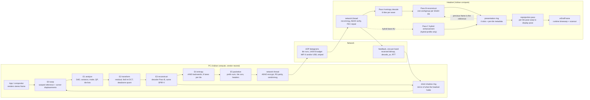
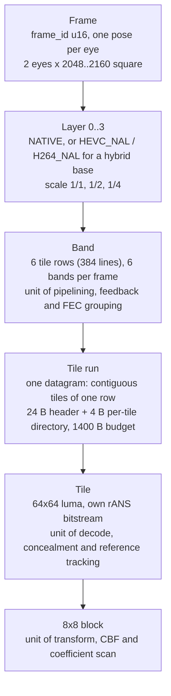
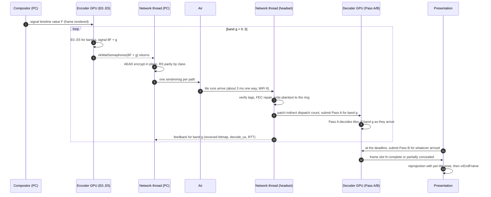
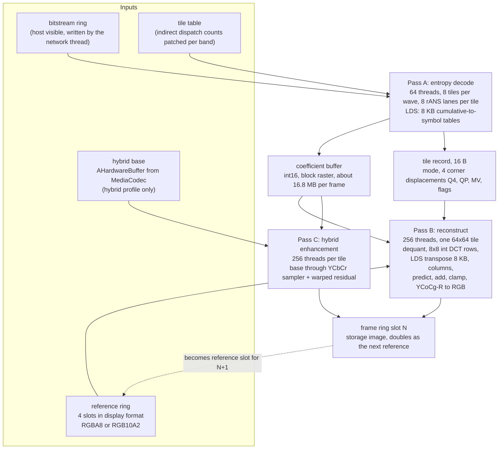
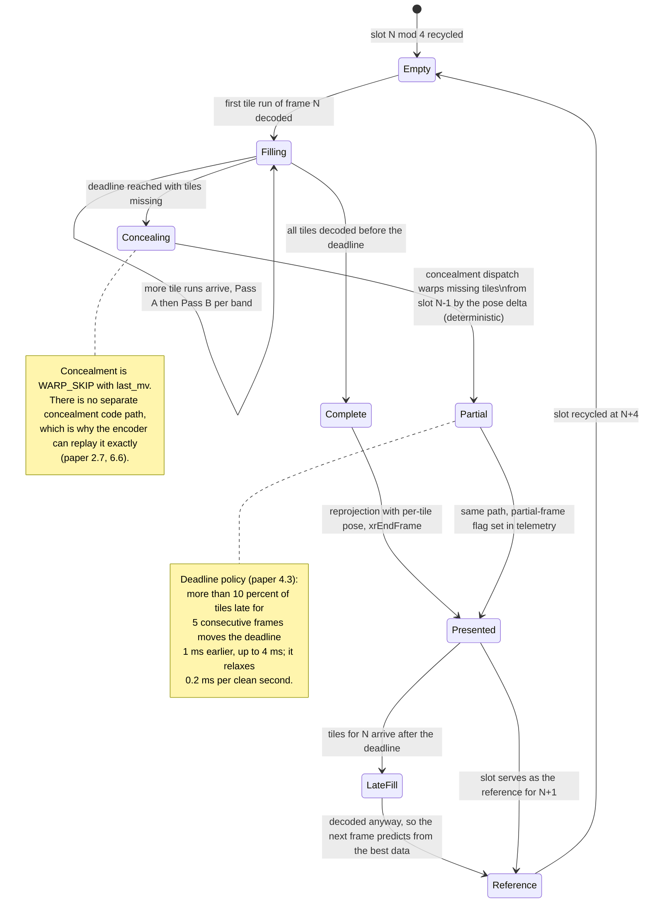
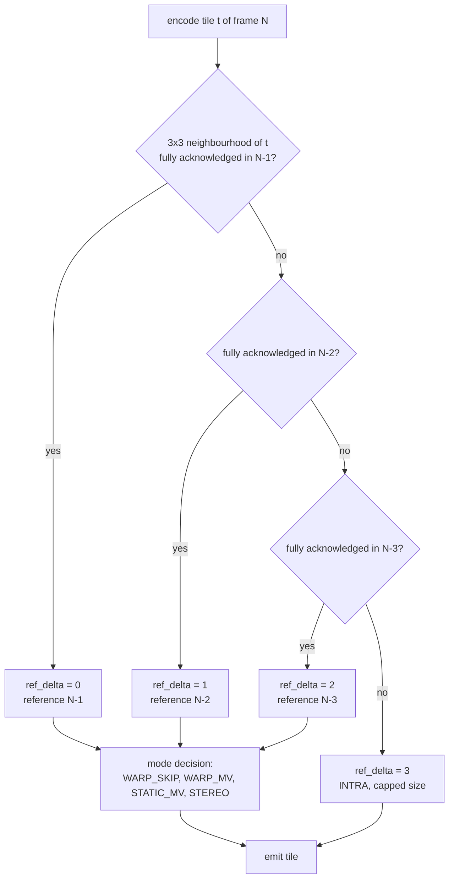
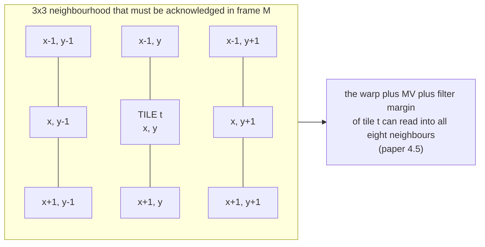
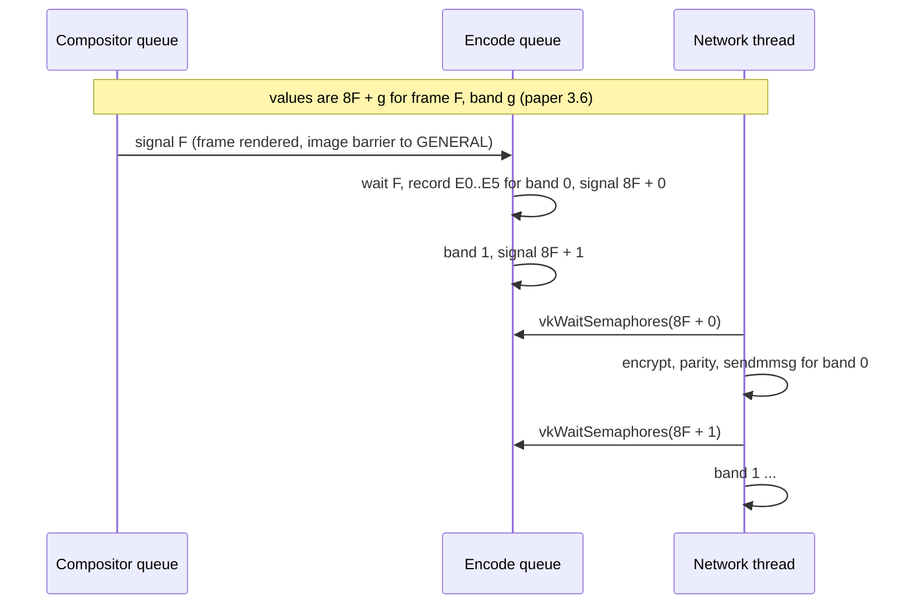
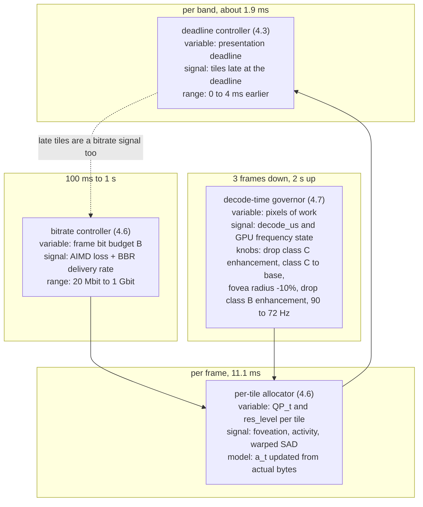

# NX Warp architecture

This document describes the whole system in one place: what runs on the PC, what crosses the network,
what runs on the headset, and how the pieces are synchronised. It is a map, not a specification.
The normative documents are:

- [docs/PAPER.md](PAPER.md), the design source of truth. Every claim here cites a section of it.
- [docs/SYNTAX.md](SYNTAX.md), the normative bitstream syntax.
- The CPU reference codec in `ref/`, which is the specification of decoded output (paper 3.7, 3.9).

Numbers in this document are design estimates from the paper unless a section says otherwise.
No part of the system has been measured yet; the Phase 0 gate (paper 3.4) exists to replace the
estimates with measurements, and `bench/` is where those measurements will land.

## Contents

- [1. The shape of the system](#1-the-shape-of-the-system)
- [2. Data model](#2-data-model)
- [3. PC encoder: E0 to E5](#3-pc-encoder-e0-to-e5)
- [4. Network](#4-network)
- [5. Headset decoder: Pass A, B and C](#5-headset-decoder-pass-a-b-and-c)
- [6. Presentation ring](#6-presentation-ring)
- [7. Reference model and eligibility](#7-reference-model-and-eligibility)
- [8. Threading and synchronisation](#8-threading-and-synchronisation)
- [9. Profiles and capability negotiation](#9-profiles-and-capability-negotiation)
- [10. Control loops](#10-control-loops)
- [11. Where the code lives](#11-where-the-code-lives)

## 1. The shape of the system

Two sides, one bitstream. The PC renders a stereo frame in a Vulkan image, encodes it entirely in
compute, and hands tile runs to a network thread. The headset receives datagrams, decrypts them on
the CPU, and decodes entirely in compute into a ring of full-frame images that the client's own
reprojection pass reads at a deadline.

The two properties that define the architecture:

1. **No cross-tile state.** Every stage is one workgroup per tile. A tool that needs serial state
   across tiles does not exist in this codec (paper, design principle 2).
2. **No CPU on the hot path.** The only CPU work per frame is one queue submit, semaphore waits,
   AEAD, Reed-Solomon parity and `sendmmsg`/`recvmmsg`. The CPU never parses the bitstream
   (paper 3.6, 4.1).

## 2. Data model

Five nested objects. Everything in the system is one of them.

| Object | Defined in | What it is the unit of |
|---|---|---|
| Frame | paper 1.2 frame header | pose, base QP, quantisation tables, reference slot |
| Layer | paper 1.7 | base versus enhancement, hybrid hardware base |
| Band | paper 4.2 | pipelining, feedback, FEC group boundary, deadline |
| Tile run | paper 4.1, 6.1 | loss, encryption, sequencing, path assignment |
| Tile | paper 1.1, 1.2 | independent decode, concealment, mode, MV, QP, reference choice |
| 8x8 block | paper 1.4 | transform, coded-block flag, coefficient context |

Sizes at the first target (paper 3.1, 4.0 preamble): a stereo frame is 8.39 Mpixel; a 64x64 grid over
2160x2160 per eye is 34 rows of 68 tiles, 2312 tiles per stereo frame; at 150 Mbit and 90 Hz a frame
is 208 KB, an average tile about 90 bytes, and a full 1400-byte run carries roughly 12 tiles.

### 2.1 Tile-run datagram layout

The datagram is a tile run, never a single tile (paper 4.1, reconciled in 6.1). The header is 24
bytes, little endian, sent in the clear and used as AEAD associated data.

| Offset (bits) | Field | Bits | Notes |
|---|---|---|---|
| 0 | `version` / `flags` | 8 | 4 bits version; 4 flag bits: keyframe-run, partial-frame, lossless, last-run-of-frame |
| 8 | `stream_id` | 8 | WiVRn stream (per quad layer or eye-pair geometry) |
| 16 | `frame_id` | 16 | wraps every 12 min at 90 Hz |
| 32 | `tile_first` | 16 | linear tile index in the lens-space grid |
| 48 | `tile_count` | 8 | tiles carried in this run, 1 to 255 |
| 56 | `layer_id` | 4 | 0 = base, 1 to 3 = enhancement |
| 60 | `ref_delta` | 2 | reference frame = `frame_id - 1 - ref_delta`; 3 means intra |
| 62 | `frag_idx` / `frag_count` | 2 + 2 | fragments of an oversize lossless tile, Pro profile only |
| 66 | `pose_seq` | 16 | index into the client's own pose ring: the render pose the server used |
| 82 | `path_id` / `path_seq` | 2 + 14 | per-path sequence for loss detection and reordering |
| 96 | `fec_group` / `fec_idx` / `fec_k` | 8 + 4 + 4 | `fec_idx >= fec_k` marks a parity datagram |
| 112 | `tx_ts` | 32 | server clock in microseconds, wraps at 71 min |
| 144 | `payload_len` | 16 | bytes of encrypted payload |
| 160 | `enc_us` | 16 | encode finish minus render finish for this band, telemetry |
| 176 | (total) | 192 bits = 24 bytes | |

The payload begins with a tile directory of 4 bytes per tile (QP, mode, byte length), then the tile
bitstreams back to back. A run of 20 average tiles costs about 104 header bytes against 1800 payload
bytes, roughly 5.5 percent overhead, against 30 to 50 percent for tile-as-packet (paper 4.1).

The pose itself is not sent per datagram. The headset generated the render pose; the server echoes
`pose_seq` and both ends look the pose up in the client's own 2 second ring. The frame header, which
does carry the pose in 26 bytes, is replicated in the first datagram of every band so a client with a
gap in its ring still decodes (paper 6.7).

The wire format is normative in [docs/TRANSPORT.md](TRANSPORT.md); this table is a summary.

## 3. PC encoder: E0 to E5

Six compute passes per frame, all indirect where the tile count varies, with no CPU between them
(paper 3.6).

| Pass | Dispatch shape | Work |
|---|---|---|
| E0 warp | fullscreen, 8x8 threads | build the warped reference from the previous reconstruction and the pose delta; write the warped image and the per-tile corner displacements |
| E1 analyze | one workgroup per tile | SAD of source against the warped reference at 0 and 8 integer offsets, variance, skip test, structure tensor for the degradation ladder; picks mode and MV; assigns QP = base + foveation + activity + rate feedback; appends the tile index to the inter/intra/skip lists with atomics |
| E2 transform | one workgroup per listed tile | residual, forward 8x8 integer DCT, deadzone quantisation, RDO-lite coefficient zeroing; writes int16 coefficients and an exact symbol count |
| E3 reconstruct | one workgroup per tile | the decoder's Pass B, byte-identical SPIR-V; writes the new reference |
| E4 entropy | 8 lanes per tile, 8 tiles per group | rANS encoding runs backwards over the symbol list into a per-tile slot of bounded size; writes the actual byte count |
| E5 packetize | one workgroup of 1024 threads per view | prefix sum of tile sizes, compaction into tile runs, headers written by the shader, segment descriptor table for the network thread; feeds actual bytes versus budget back into the rate-control state buffer |

**E3 is the load-bearing rule of the project.** The encoder's reconstruction pass is the same shader
as the decoder's Pass B, so the encoder can never hold a reference the decoder cannot reproduce
(paper 3.6). The encoder runs the real decoder; see [ADR-0010](adr/0010-integer-only-normative-path-cpu-reference-is-the-spec.md).

Estimated encoder time (paper 3.6, design estimate): about 2.5 to 4 ms per frame for both views on an
RX 580, under 1 ms on a 7900 XTX. On the RX 580 the E0 and E3 fullscreen passes dominate by
bandwidth, about 250 MB per frame.

## 4. Network

The network thread wakes once per band on a timeline semaphore value, encrypts the band's runs in
place with AES-256-GCM (header as associated data, nonce derived from `stream_id`, `path_id`,
`path_seq` and an epoch counter, so no nonce goes on the wire), computes Reed-Solomon parity by tile
class, and issues one `sendmmsg` per band per path (paper 4.1, 4.4).

FEC strength follows the foveation map rather than being uniform (paper 4.4, design estimate):

| Class | Content | Share of bits | Parity per 10 | Overhead |
|---|---|---|---|---|
| A | fovea, and base-layer tiles of quad layers (UI) | about 35 percent | 3 | 30 percent |
| B | mid eccentricity | about 40 percent | 1 | 10 percent |
| C | periphery and enhancement layers | about 25 percent | 0 | 0 percent |

Multipath: class A runs may be duplicated across USB and WiFi when the combined bandwidth allows;
class B and C are split by weighted round robin on each path's measured delivery rate. Tiles are
position-addressed, so there is no reorder buffer anywhere in the decode path (paper 4.8).

Threat model, key handling and what is deliberately out of scope are in
[docs/THREAT_MODEL.md](THREAT_MODEL.md).

### 4.1 Per-frame timeline: row-band pipelining

Encode, send, decode and present overlap per band of 6 tile rows. Bands rather than single rows
because each Vulkan submit on Adreno costs an estimated 50 to 100 us and each `sendmmsg` has a floor;
34 dispatches per frame would waste more than they save (paper 4.2).

The timeline below uses the paper's 4.2 assumptions: a 7900 XTX encoding the frame in 3.0 ms
(0.5 ms per band), an XR2 compute decode budget of 4.0 ms per frame (0.67 ms per band), and a 3 ms
one-way WiFi 6 delay on a quiet channel. Every number is a design estimate.

```mermaid
gantt
  title Row-band pipelining, one frame, WiFi 6 estimates (paper 4.2)
  dateFormat X
  axisFormat %L ms
  todayMarker off

  section Band 0
  encode        :b0e, 0, 500
  air           :b0a, after b0e, 3100
  decode        :b0d, after b0a, 700

  section Band 1
  encode        :b1e, after b0e, 500
  air           :b1a, after b1e, 3100
  decode        :b1d, after b1a, 700

  section Band 2
  encode        :b2e, after b1e, 500
  air           :b2a, after b2e, 3100
  decode        :b2d, after b2a, 700

  section Band 3
  encode        :b3e, after b2e, 500
  air           :b3a, after b3e, 3100
  decode        :b3d, after b3a, 700

  section Band 4
  encode        :b4e, after b3e, 500
  air           :b4a, after b4e, 3100
  decode        :b4d, after b4a, 700

  section Band 5
  encode        :b5e, after b4e, 500
  air           :b5a, after b5e, 3100
  decode        :b5d, after b5a, 700
  frame complete:milestone, after b5d, 0
```

The same thing as a message sequence, showing who waits on whom:

Pass A runs incrementally as packets arrive, so at the presentation deadline only Pass B remains
(paper 3.2.1). Estimated frame-complete time is 6.8 ms after render finish on WiFi and 4.8 ms on USB,
against 17 to 25 ms for the serial encode-transfer-hardware-decode path (paper 4.2).

## 5. Headset decoder: Pass A, B and C

Two dispatches, plus a third only in hybrid mode. Fusing them was considered and rejected: entropy
decoding is serial per rANS state and wants few lanes per tile with many tiles in flight, while the
transform and predictor want many lanes per tile (paper 3.2.1).

Pass B, per 64x64 tile, 256 threads, 4 threads per 8x8 block, 16 coefficients each (paper 3.2.3):

1. Load 16 int16 coefficients coalesced, dequantise in int32.
2. Row transform: 8-point integer DCT, Loeffler-derived, about 44 adds and shifts.
3. Write transposed into 8 KB of LDS. Barrier.
4. Column transform, clamp to the normative residual range.
5. Predict. Inter: bilinear interpolation of the four transmitted corner displacements (Q4), then a
   bit-exact four-load bilinear or Catmull-Rom fetch from the reference image. Intra: DC-plane
   prediction. Skip: prediction only, no coefficients.
6. `clamp(pred + res)`, YCoCg-R to RGB, one `imageStore`.

The hardware sampler is deliberately not used for the normative predictor: sampler weight precision
is vendor specific and the encoder always runs on a different vendor than the decoder, so a
sampler-based predictor would drift by plus or minus 1 LSB per frame (paper 3.2.3). See
[ADR-0010](adr/0010-integer-only-normative-path-cpu-reference-is-the-spec.md).

Intra has no wavefront: the 64 block DCs of a tile form an 8x8 low-resolution image coded with a
second-level DCT, and each pixel is predicted by bilinear interpolation between the four nearest
block DCs (paper 3.2.4, 6.4). See [ADR-0004](adr/0004-dc-plane-intra-no-directional-modes.md).

Estimated decode time on Adreno 650 for two eyes at 2048 squared (paper 3.2.5, design estimate):
Pass A 0.5 to 1.0 ms, Pass B 3.5 to 5.0 ms, total 4 to 6 ms p50 and 7 ms p99, against a defensible
budget of 5 ms p50. The full budget table, with an empty measured column, is in
[docs/PERFORMANCE.md](PERFORMANCE.md).

## 6. Presentation ring

The decoder never blocks on a complete frame. It writes into a ring of 4 full-size images per stream
with per-tile metadata, and the client presents whatever the ring holds at its deadline
(paper 4.3).

Per tile position, per slot: `pose_seq`, `age` (frames since this position was last decoded, 0 means
fresh) and `state` (decoded, concealed, undecodable), 4 bytes.

Concealed pixels are legal references, because the server replays the same deterministic fill on its
mirror ring once feedback says which tiles were lost (paper 4.3 step 3, 2.6). That is what removes
the IDR from the system entirely.

The client's frame loop wakes at `predicted_display_time - reproject_budget - runtime_margin`
(about 3 ms on Pico), runs the reprojection shader with a per-tile pose lookup so each output tile
warps from its own `pose_seq` to the requested display pose, and submits. The runtime's own timewarp
then has almost nothing left to correct (paper 4.3 step 4).

What this design does not reach: true per-row scanout ordering. No Android runtime accepts per-row
poses, so the design stops at per-tile poses inside the client's own warp (paper 4.3).

## 7. Reference model and eligibility

Pose-warped prediction for tile `t` reads reference pixels from a window that crosses into
neighbouring tiles. If the encoder assumes those neighbours hold frame N-1 and the client actually
lost them, prediction diverges silently. The rule that prevents this (paper 4.5, reconciled in 6.6):

> For tile `t` of frame N, the reference is the newest frame M in {N-1, N-2, N-3} whose 3x3 tile
> neighbourhood around `t` is fully acknowledged. `ref_delta = N - 1 - M`. If no such M exists, the
> tile is coded intra and `ref_delta = 3`.

"Acknowledged" means received, or lost and therefore filled by the deterministic concealment warp
that the encoder replays on its mirror ring.

The neighbourhood itself, for a tile at grid position (x, y): all nine of (x-1..x+1, y-1..y+1),
clamped at the frame border, must be acknowledged in the candidate frame.

Consequences (paper 4.5, 6.6, all design estimates):

- On USB, with a feedback RTT of about 2 ms, nearly all tiles reference N-1.
- On WiFi, at 5 to 8 ms, the top bands reference N-1 and the bottom bands often N-2, because feedback
  for the bottom of N-1 has not arrived when the bottom of N is encoded.
- Referencing N-2 is estimated to cost 5 to 10 percent more bits at equal PSNR. It is unmeasured and
  is a Phase 3 number to collect.
- With no feedback for 4 frames every tile goes intra at the capped size: a QP jump, not a stall.
- Rolling intra refresh of 1/180 of the tiles per frame stays as a safety net, selected by a fixed
  pseudo-random permutation so there is no visible refresh wave (paper 2.6).

Five tile modes exist (paper 6.5): `WARP_SKIP`, `WARP_MV`, `STATIC_MV`, `STEREO`, `INTRA`. One
quarter-pel motion vector per tile, coded as a delta from the same tile's previous vector. Depth
never reaches the decoder. See [ADR-0005](adr/0005-one-mv-per-tile-five-modes.md) and
[ADR-0006](adr/0006-acknowledged-neighbourhood-references-no-idr.md).

## 8. Threading and synchronisation

### 8.1 Threads

| Side | Thread | Work per frame | Budget |
|---|---|---|---|
| PC | render/compositor | signals a timeline value when frame F is rendered | not ours |
| PC | encode submit | one `vkQueueSubmit` of pre-recorded command buffers, per-frame data through push constants and a uniform ring, no descriptor updates | part of the under 300 us target (paper 3.6) |
| PC | network | 8 `vkWaitSemaphores`, AEAD, RS parity, 8 `sendmmsg` | part of the same under 300 us target |
| Headset | network | `recvmmsg`, tag verify, FEC repair, plaintext into the host-visible ring, patch indirect dispatch counts | proportional to bits, not pixels |
| Headset | frame loop | wakes at the deadline, submits Pass B and reprojection, `xrEndFrame` | paced by the runtime |

The single deliberate exception to "no CPU on the hot path" is datagram decryption: the CPU moves
bytes and checks tags, it never parses the bitstream (paper 4.1). ARMv8 crypto extensions run at an
estimated 2 to 4 GB/s per core against 125 MB/s at 1 Gbit/s.

### 8.2 Timeline semaphores

Everything is a timeline semaphore value. There are no fences in the steady state and no CPU
round trips between passes.

On the headset the network thread patches an indirect dispatch count and submits Pass A per band as
packets arrive; Pass B is submitted once at the deadline (paper 3.2.1, 4.3). Where the encoder uses a
dedicated compute queue, the handoff from the compositor also carries a queue family ownership
transfer (paper 3.6).

On Windows the SteamVR `ID3D11Texture2D` is copied into a shared texture and imported through
`VK_KHR_external_memory_win32`, with a D3D11.4 shared fence imported as a timeline semaphore so the
D3D11 copy and the Vulkan encode sit on one timeline; `VK_KHR_win32_keyed_mutex` is the fallback
where the driver lacks it (paper 3.8).

### 8.3 Subgroup portability rules

These are constraints on every normative shader (paper 3.2.6):

- Workgroups are 64 threads (Pass A) and 256 (Pass B). Never assume a workgroup is one subgroup.
- Every cross-lane exchange beyond an 8-lane cluster goes through LDS with a barrier.
- Use `VK_EXT_subgroup_size_control` with `REQUIRE_FULL_SUBGROUPS` where offered; refuse subgroups
  smaller than 8.
- Cluster operations use `subgroupBallot` with masks derived from `gl_SubgroupInvocationID & ~7`,
  never `subgroupClustered*`.
- One SPIR-V binary everywhere; specialisation constants for subgroup size and 10-bit mode, no vendor
  ifdefs in normative code.

The cluster size of 8 is why lavapipe, whose subgroup size is 8, is a first-class CI target
(paper 3.9).

## 9. Profiles and capability negotiation

Three profiles plus a hybrid decode path. The profile is a byte in the stream header; the tool
bitmask is the real contract (paper 1.2, 1.9).

| | Lite | Full | Pro |
|---|---|---|---|
| Tile size | 64x64 (32x32 reserved by a header bit) | 64x64 | 64x64 |
| Prediction filter | bilinear | Catmull-Rom, 4 tap integer | Catmull-Rom |
| Entropy coder | rANS, or bit-plane fallback under `ENT_BITPLANE` | rANS, 8 lanes | rANS, 8 lanes |
| Chroma | 4:2:0 | 4:2:0, 4:4:4 per tile | 4:4:4 fovea, 4:2:0 elsewhere |
| Stereo inter-view | off | Phase 4 | Phase 4 |
| Lossless tiles | no | no | yes, fragmenting to at most 4 datagrams |
| Bit depth | 8 wire, 10 internal | 8 or 10 | 10 |

Hybrid is not a fourth profile; it is a layer-0 type. `layer_desc[0].type` is `NATIVE` for the pure
compute path and `HEVC_NAL` or `H264_NAL` for the hybrid path, and everything above the base is the
identical tile format either way (paper 1.7, 2.9). A weak headset gets pose-warped enhancement over a
half-resolution hardware HEVC base; a strong headset drops MediaCodec entirely.

Negotiation is an intersection, not a version number: the client sends its own `tools` mask, profile
and level at connect, and the server may only set bits the client offered. A decoder that sees an
unknown mandatory bit refuses the stream instead of guessing (paper 1.2). This is the Vulkan feature
bit model and needs no version arithmetic.

### 9.1 Colour space

The stream header also carries a `color_space` field, negotiated at connect like every other
capability (see [ADR-0021](adr/0021-stream-level-color-space-ycbcr-passthrough.md)):

| Value | Source | References | Lossless |
|---|---|---|---|
| `YCOCG_R` | RGB render targets | display format, RGBA8 or RGB10A2 (paper 1.3) | yes, integer-reversible |
| `YCBCR_PASSTHROUGH` | sources that are already YCbCr 4:2:0 | the source's own 4:2:0 layout | no, near-lossless only |

This exists because the first integration target does not hand the codec RGB. WiVRn's encoder input on
Linux is already YCbCr 4:2:0 and already foveated by the compositor, and the client already consumes
4:2:0 from its decoder, so the Android decoder outputs 2-plane 4:2:0 on that path. Converting through
RGB and back would add two conversions to the normative path and inflate reference traffic to preserve
chroma resolution the source has already discarded. The coding tools are identical in both cases: the
same transform, the same entropy coder and the same tile syntax operate on Y, Cb, Cr exactly as they
do on Y, Co, Cg.

Which device is expected to land in which profile is in [docs/COMPATIBILITY.md](COMPATIBILITY.md).
The paper's own verdict (6.10) is that the Pico 4 is expected to land in hybrid mode and that Phase 0
decides it with numbers.

## 10. Control loops

Four loops run at four different timescales, on four different variables, so they do not fight.

The governor never touches bits, only pixels of work; the bits it frees are redistributed by the
allocator (paper 4.7). The asymmetry of the governor (3 frames down, 2 s up) is deliberate: XR2
thermal throttling arrives in seconds and leaves in minutes, and a governor that hunts every 100 ms
makes the periphery shimmer.

### 10.1 The degradation ladder

The rate controller has a normative requirement about how it spends its shortfall, not just how much
(paper 4.6.1): **when the budget is short the picture must lose texture before it loses structure.**
Tiles are classified once per frame as text, edge, texture or flat from the log-variance activity
term and a gradient-coherence measure, and the classes descend different ladders.

| Step | Texture tiles | Flat tiles | Edge tiles | Text tiles |
|---|---|---|---|---|
| 1 | low-pass weighting matrix drops high-frequency AC first | same | QP +2 only | untouched |
| 2 | `res_level` 1/2, bilinear upsample | `res_level` 1/2 | untouched | untouched |
| 3 | `res_level` 1/4 | `res_level` 1/4 | low-pass weighting, QP +4 | untouched |
| 4 | DC-plane only, planar interpolation | DC-plane only | `res_level` 1/2 | QP +4 within the lossless-or-near class floor |

No new syntax: every rung uses a v1 tool. The only new thing is the encoder's ordering. See
[ADR-0013](adr/0013-degradation-ladder-blur-never-block.md).

## 11. Where the code lives

| Directory | Component | Normative doc |
|---|---|---|
| `ref/` | bit-exact CPU reference encoder and decoder, the specification | [SYNTAX.md](SYNTAX.md) |
| `warp/` | pose warp: homography quantisation, integer warp kernel, oracle | WARP.md (in progress) |
| `transport/` | tile runs, AEAD, FEC, multipath, shadow model, receiver | [TRANSPORT.md](TRANSPORT.md) |
| `rc/` | rate control: classify, allocate, governor, synthesis harness | [RATECONTROL.md](RATECONTROL.md) |
| `vk/` | Vulkan context, capability probe, decoder Pass A/B, encoder E0 to E5 | derived from SYNTAX.md |
| `bench/` | Phase 0 gate app, kernels K1 to K6 | `bench/README.md` |
| `android/` | headset client: receive path, frame ring, transport glue | [INTEGRATION.md](INTEGRATION.md) |
| `stereo/` | stereo inter-view prediction study | STEREO.md (in progress) |
| `hybrid/` | hybrid base-plus-enhancement simulator | HYBRID.md (in progress) |
| `platform/` | Windows and cross-compilation support | [INTEGRATION.md](INTEGRATION.md) |
| `fov/` | foveation map generation | [RATECONTROL.md](RATECONTROL.md) |
| `tools/` | quality harness, conformance and report tooling | `tools/quality/README.md` |
| `tests/` | conformance vectors and unit tests | [SYNTAX.md](SYNTAX.md) |

The OpenXR extension that carries velocity, depth and stencil from the engine is specified in
XR_EXT_NXWARP.md (in progress); it changes no bitstream syntax (paper 2.3).

## See also

- [ROADMAP.md](../ROADMAP.md) for phases, exit criteria and current status
- [docs/adr/](adr/) for why each of these decisions was made and what was rejected
- [docs/GLOSSARY.md](GLOSSARY.md) for every term used above
- [docs/PERFORMANCE.md](PERFORMANCE.md) for the budget tables and the empty measured column
