# Gallery

Every visual result in this repository, as a picture, with the command that
regenerates it.

**House rules.** One entry per figure. Each entry carries the date, the fixture,
the settings, *the number it illustrates*, and an exact regenerating command.
PNGs live in `docs/assets/<topic>-<what>.png`, cropped at 2-3x and kept under
about 500 kB; anything larger stays in `nx-scratch/` with a pointer from here.
These are the figures of a later paper, so they are captioned as figures and
numbered, and a figure that illustrates no number does not belong here.

Append; do not renumber. If a measurement is superseded, add the new figure and
leave the old one with a note saying what replaced it.

---

## Figure 1 — Rate-distortion on the vrroom corpus

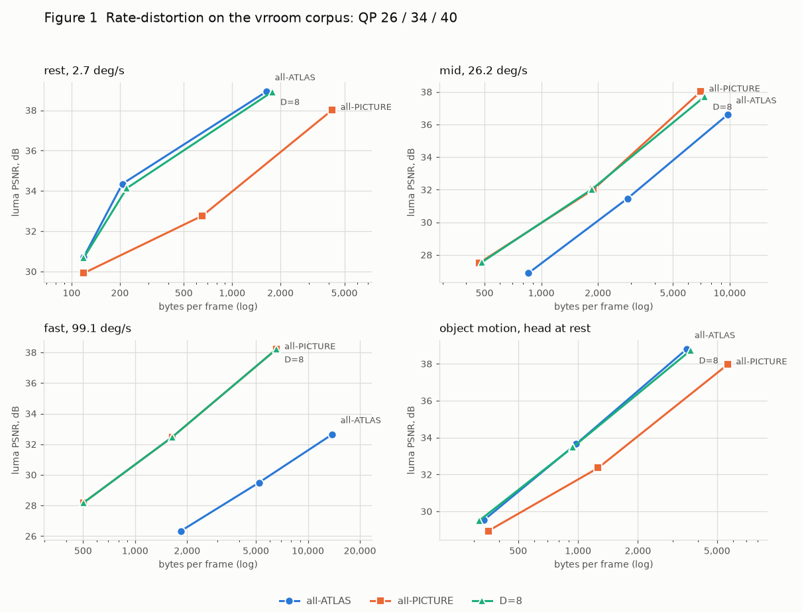

**Date** 2026-09-06 · **Fixture** `nx-scratch/fixtures/vrroom` (all four
trajectories) · **Settings** `--atlas on --row-present on`, `--eyes 2`, QP 26 /
34 / 40, effort 0, planar rd; modes `all-ATLAS` (`--atlas-picture-disp 0`),
`all-PICTURE` (`--atlas-picture-period 1`), `D=8`
(`--atlas-picture-disp 8`).

**The number it illustrates.** The dominance results of ADR-0029's "Re-run on
rendered content" table: at QP 26 the atlas wins at rest (38.94 dB / 1643 B/f
against 38.02 / 4208) and under object motion (38.79 / 3510 against 37.97 /
5668), and loses at mid (36.62 / 9780 against 38.03 / 7031) and fast (32.65 /
13843 against 38.21 / 6566). The `D=8` curve sits on whichever of the two wins
at each velocity without being told which, and at fast turn it lies exactly on
`all-PICTURE` because it spends 100 % of frames there.

```
python3 tools/quality/capture/gen_vrroom.py --out nx-scratch/fixtures/vrroom
python3 nx-scratch/atlasprice/vrtable.py rest      # and mid, fast, objmotion
python3 tools/quality/plot_vrroom.py --in nx-scratch/atlasprice/work5 --out docs/assets
```

---

## Figure 2 — The effort ladder and the planar mode do not pay

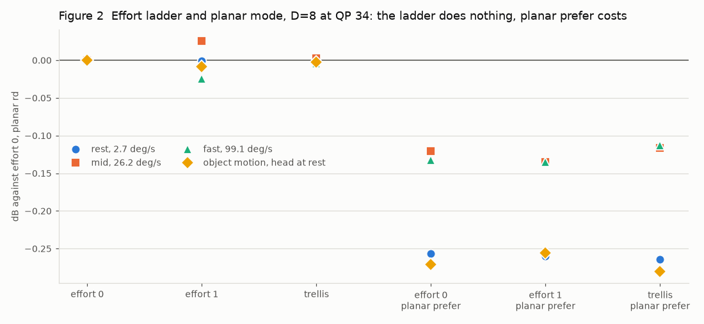

**Date** 2026-09-06 · **Fixture** vrroom, all four · **Settings** `D=8`, QP 34,
`--int-rdoq 0|1`, `--rdoq-effort 3`, `--intra-dir on|layer`.

**The number it illustrates.** `int_rdoq` 0, `int_rdoq` 1 and the full trellis
land within **0.03 dB** of each other on all four fixtures — the three
left-hand columns sit on the zero line. `--intra-dir layer` ("planar prefer")
costs **0.12 to 0.27 dB** *and* more bytes on every fixture, which is a
dominance result in the wrong direction. Plotted as a delta from effort 0 /
planar rd because absolute bars would hide a 0.03 dB spread inside the axis.

```
python3 tools/quality/plot_vrroom.py --in nx-scratch/atlasprice/work5 --out docs/assets
```

> **Superseded in part, 2026-09-06, by Figure 12.** The effort columns of this
> figure are measured with `nxv-enc`'s full RD mode decision left on (no
> `--no-rdo`), which already drops the coefficients `int_rdoq` would drop; the
> 0.03 dB is a property of that configuration and not of the content. The GPU
> encoder has no such search, and measured against it the tool moves 7–12 % of
> the bytes. The planar columns are unaffected and still stand.

---

## Figures 3-6 — The vrroom corpus, one frame per trajectory

| | |
|---|---|
| 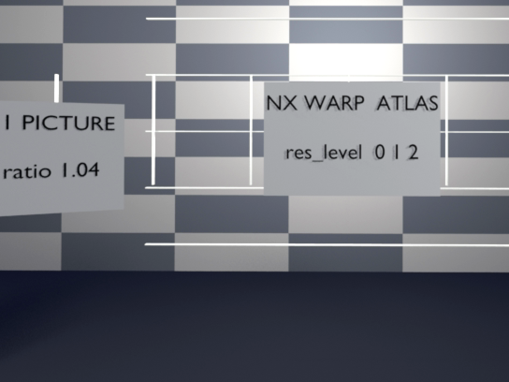 **Fig 3** rest, 2.7 deg/s |  **Fig 4** mid, 26.2 deg/s |
| 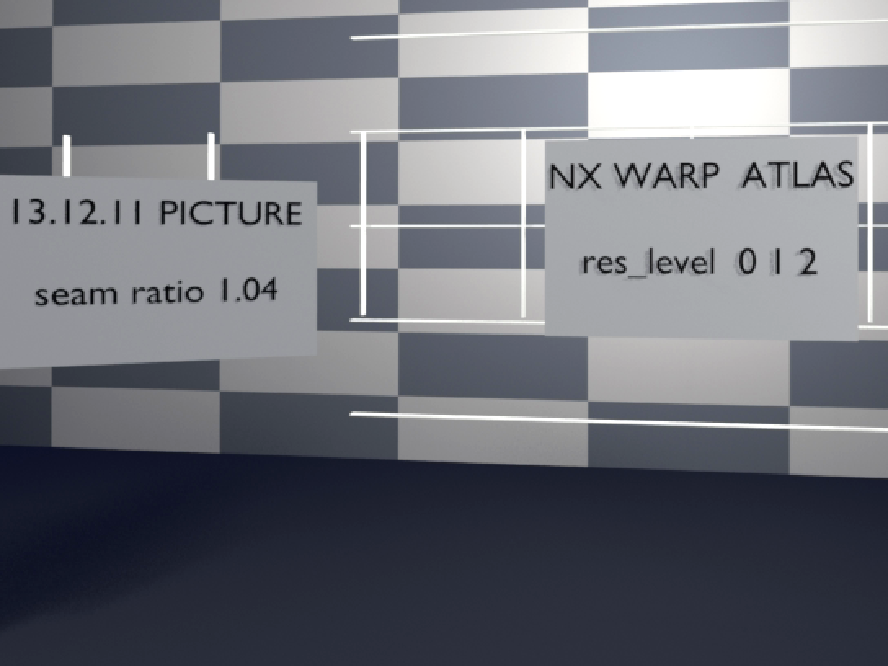 **Fig 5** fast, 99.1 deg/s | 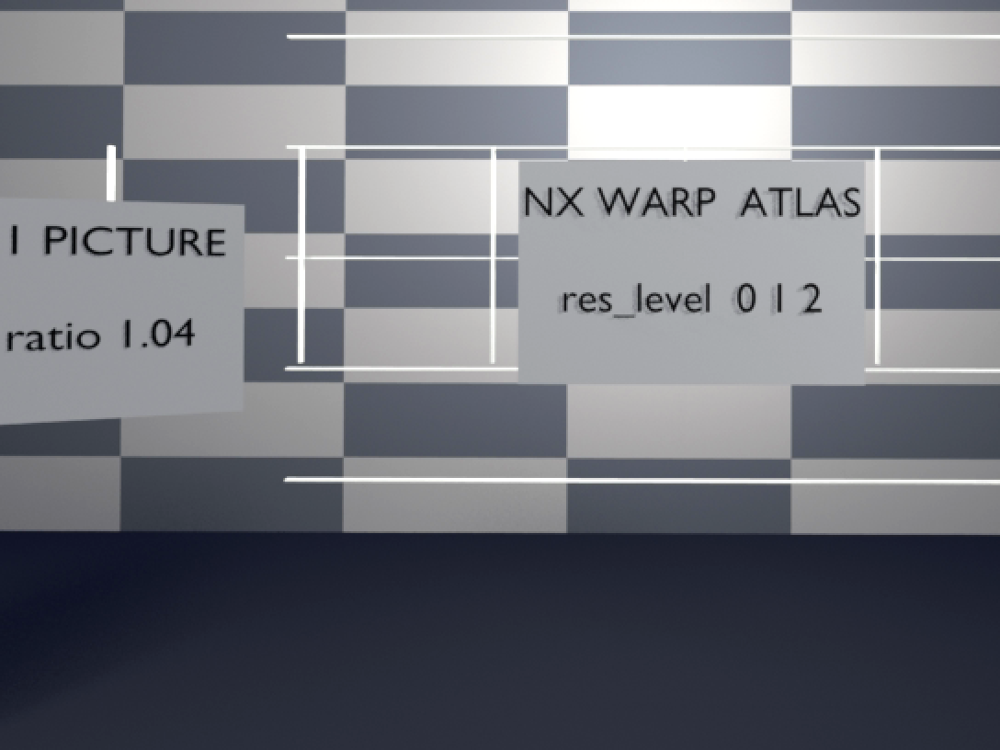 **Fig 6** object motion, head at rest |

**Date** 2026-09-06 · **Fixture** `nx-scratch/fixtures/vrroom`, frame 8, left
eye, 544x408 crop at 2x · **Settings** Blender 5.2 EEVEE, `Standard` view
transform, stereo 63 mm, 1088x1088 an eye, 100 degrees, 90 Hz, 32 frames.

**The number it illustrates.** Not a number — the *content*, which is the
premise of every measurement above it. `gen_synthetic.py` produced a
band-limited procedural panorama with no specular, no thin geometry, no text
and no independently moving objects, and docs/LOWPOLY-MODE.md called it
"unusually kind". These four frames are what replaced it: text at reading
distance, a mirror-like specular floor, thin high-contrast bars, checkerboard
walls, two textured humanoid meshes that move on their own. The measured
angular velocities are 2.7 / 26.2 / 99.1 deg/s, the fast clip peaking at
796 deg/s across its one-frame 8-degree step.

Full-resolution frames (627-646 kB each) are at
`nx-scratch/fixtures/vrroom/<track>-frame8.png`.

```
python3 tools/quality/capture/gen_vrroom.py --out nx-scratch/fixtures/vrroom
ffmpeg -f rawvideo -pix_fmt yuv420p -s 2176x1088 -i nx-scratch/fixtures/vrroom/mid.yuv420p.yuv \
  -vf "select=eq(n\,8),crop=544:408:180:400,scale=1088:816:flags=neighbor" \
  -frames:v 1 docs/assets/vrroom-mid.png -y
```

---

## Figures 7-9 — Coarse landings are blocky, not soft

| | | |
|---|---|---|
| 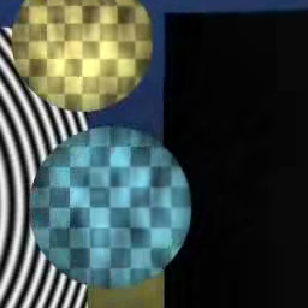 **Fig 7** baseline, seam 1.14 | 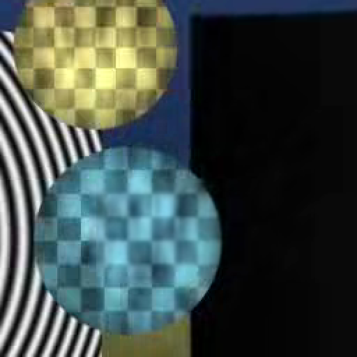 **Fig 8** T=8, seam **1.53** | 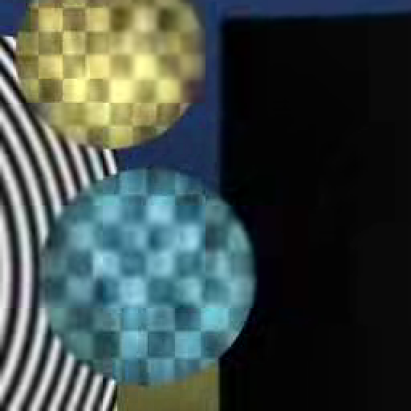 **Fig 9** T=2, seam **1.81** |

**Date** 2026-09-06 · **Fixture** `nx-scratch/atlasenc/turn` (fast turn), frame
12, 256x256 crop at 2x, nearest-neighbour · **Settings** `--atlas on
--atlas-picture-disp 8`, QP 26, `--atlas-coarse-disp 0 | 8 | 2`.

**The number it illustrates.** The seam ratio of ADR-0029's single-level coarse
refresh section: **1.14 → 1.53 → 1.81** against a source of 0.93, while
high-frequency energy *falls* 3.04 → 2.76 → 2.61. Both moving at once is the
failure mode: the tiles get softer inside while the 64-sample grid becomes
visible, which is blocking rather than the low-poly degradation the project
asks for. Visible in the figures as sphere silhouettes that are round at
baseline and acquire straight, tile-aligned cuts by T=2.

```
B=build/bin; T=nx-scratch/atlasenc/turn/turn
$B/nxv-enc --in $T.yuv420p.yuv --w 1088 --h 1088 --pix yuv420p --qp 26 \
  --poses $T.poses.json --inter on --threads 1 --atlas on \
  --atlas-picture-disp 8 --atlas-coarse-disp 8 --out T8.nxv
$B/nxv-dec --in T8.nxv --out T8.yuv
ffmpeg -f rawvideo -pix_fmt yuv420p -s 1088x1088 -i T8.yuv \
  -vf "select=eq(n\,12),crop=256:256:384:384,scale=512:512:flags=neighbor" \
  -frames:v 1 docs/assets/coarse-seam-T8.png -y
python3 nx-scratch/atlasprice/seams.py 12 source=$T.yuv420p.yuv baseline=T0.yuv coarse=T8.yuv
```

---

## Figure 10 — The atlas rarely holds one pose, except at rest

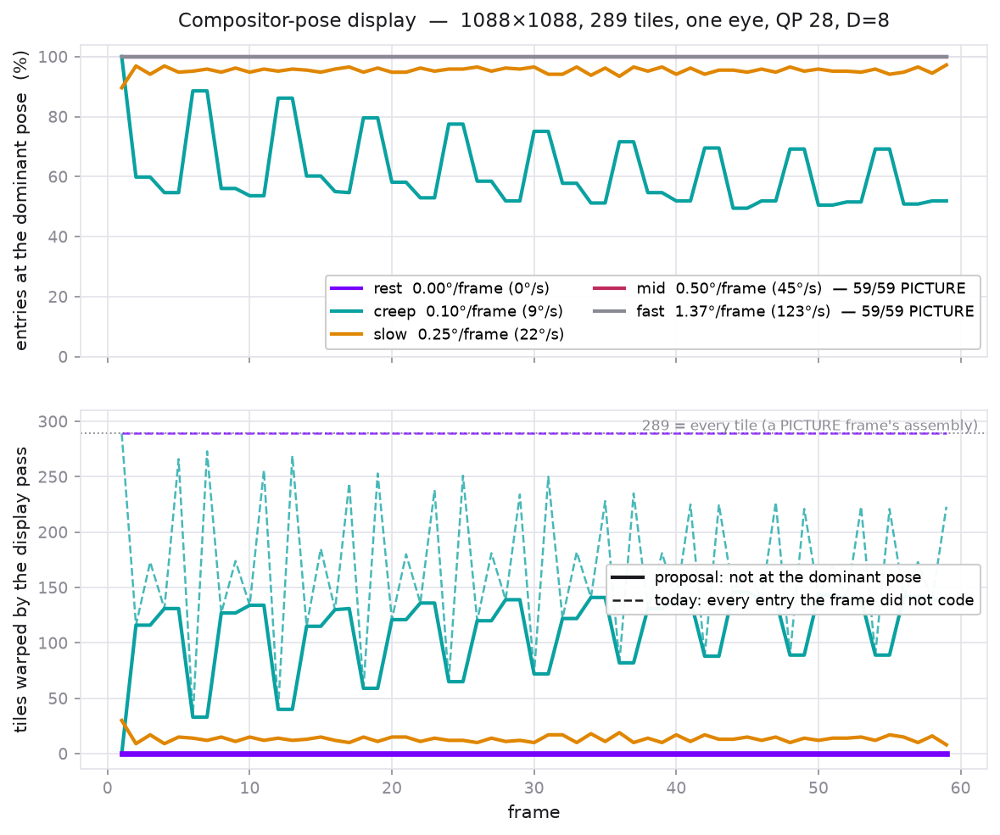

**Date** 2026-09-06 · **Fixture** synthetic pose-consistent pan, a fixed
multi-frequency scene sampled through the yaw (`nxv-posestats`) · **Settings**
1088x1088, 289 tiles, one eye, 4:2:0, QP 28, inter + atlas, `D=8`
(`atlas_picture_disp`), 60 frames, five rotation rates.

**The number it illustrates.** The dominant-pose share of
`docs/COMPOSITOR-POSE-DISPLAY.md`, and with it the whole case for the proposal.
**At rest the display pass warps 0 tiles against today's 289** — one pose, 100 %
dominant, the flat purple pair in the lower panel. At `creep` (0.10 deg/frame,
9 deg/s) the share **oscillates between 49 % and 89 %** on the encoder's refresh
cycle rather than decaying smoothly, averaging 61.7 %, and the warped count
falls from 167.5 to 110.8 — 34 %. At `slow` and above the two schemes coincide
(13.4 against 13.4), and at `mid` and `fast` the `D=8` trigger makes every frame
a PICTURE frame, which puts every entry at one pose by construction and leaves
nothing to skip. The upper panel's flat 100 % lines for `mid`/`fast` are the
mode switch doing the proposal's job already.

```
cmake --build build --target nxv-posestats
./build/bin/nxv-posestats --size 1088 1088 --frames 60 --disp 8 --csv > pose_d8.csv
python3 tools/quality/plot_pose.py --csv pose_d8.csv --out docs/assets --disp 8
```

---

## Figure 11 — The compositor's warp is not avoided, it is used

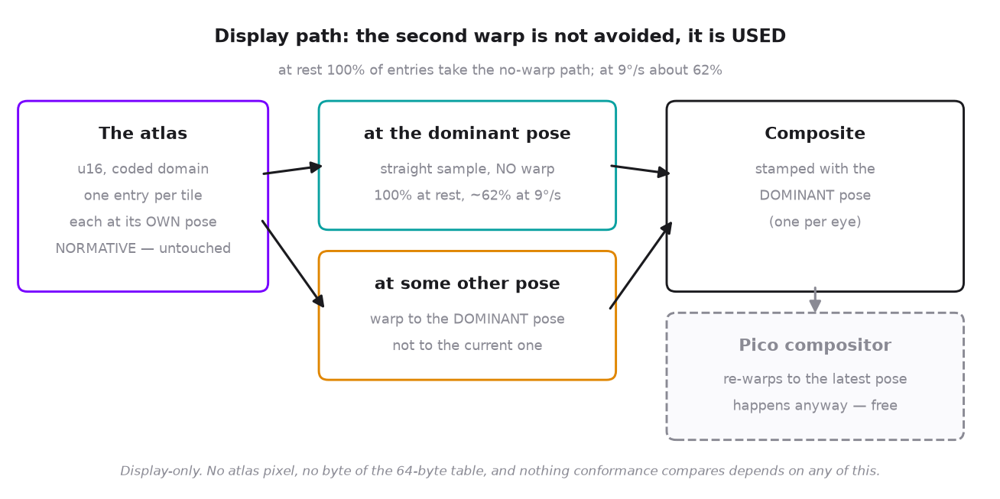

**Date** 2026-09-06 · **Fixture** none — a diagram of the proposed display path
· **Settings** n/a.

**The number it illustrates.** The two paths Figure 10 counts, and which entry
takes which: entries at the dominant pose are sampled with **no warp at all**
(100 % of them at rest, about 62 % at 9 deg/s), the rest are warped to the
*dominant* pose rather than the current one, and the Pico compositor's own
re-warp — which happens whether or not anyone wants it — carries the composite
the remaining distance. It also carries the exactness claim the document makes:
the atlas, the 64-byte table and everything conformance compares are untouched,
because 13.12.5's display warp is not normative.

```
python3 tools/quality/plot_pose.py --csv pose_d8.csv --out docs/assets --disp 8
## Figures 10-11 — The seated trajectories, and the true rest floor

| | |
|---|---|
| 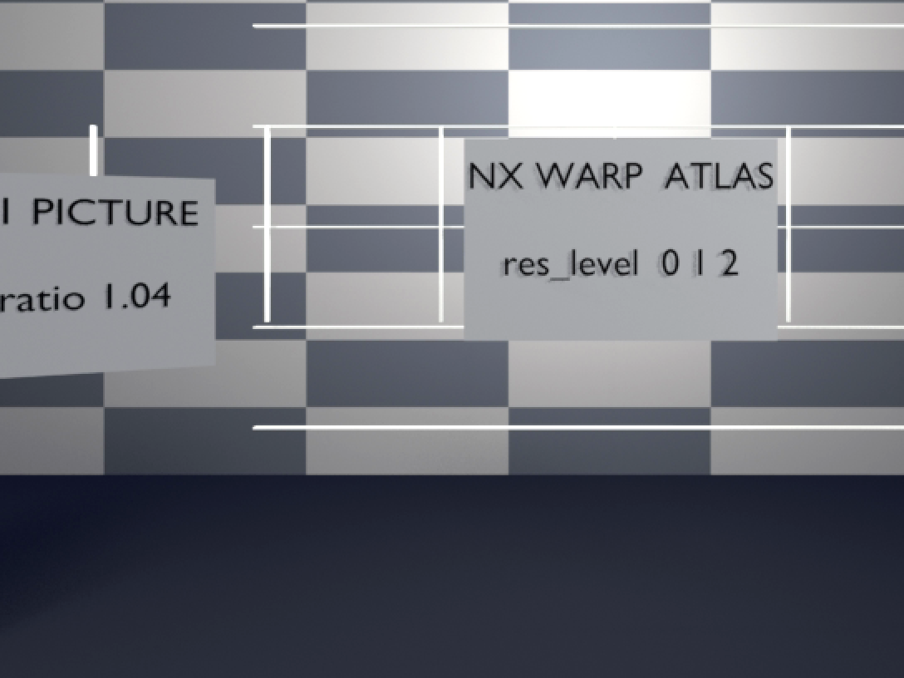 **Fig 10** still, 0.043 deg/s |  **Fig 11** objmotion-still |

**Date** 2026-09-06 · **Fixture** `nx-scratch/fixtures/vrroom`, frame 8, left
eye, 544x408 crop at 2x · **Settings** as Figures 3-6.

**The number it illustrates.** `rest` was named for a head at rest and is not
one: it moves the atlas's tile corners **0.97 samples in one frame and 3.83
over four**, so a whole-sample identity is never available in it. `still` is a
seated head — 0.030 deg of postural drift at 0.11 Hz plus 0.001 deg of tremor
at 8 Hz — and measures **0.043 deg/s** with corner displacement of **0.016
samples** after a frame and 0.016 after thirty, sixty times smaller.

On it the atlas does exactly what it is for: **100 % skip, zero decoder warps,
150 B/frame at 41.28 dB** for a stereo 1088x1088 pair. At QP 34 and 40 it
converges to the structural floor of **119 B/frame** — 85.7 kbit/s at 90 Hz —
which is frame header plus `warp_ext()` plus the `row_present` bitmap and
nothing else. `objmotion-still` holds the head there and walks the meshes:
2800 B/f, which prices independent object motion at about **2650 B/frame** on
its own.

The high seam ratios in this row (3.27 at QP 26, 6.88 at QP 40 — the **QP**
axis, not the time axis) are inherited from the single intra frame: at
119 B/frame nothing is ever re-coded, so what is displayed is frame 0's
quantisation warped forward, and at QP 40 that frame is blocky. It is a real
artefact, and it is the cost of a floor this low. Figures 12-13 measure it per
frame and show it is flat, that the atlas is not the mechanism, and that
re-coding to remove it costs up to 7x the bytes and makes it worse.

On the ADR-0028 integer decision the same clip is **125 B/frame at the same
41.28 dB** — 25 bytes cheaper, because that path has no `NEAR_SKIP` to spend
and so lands six bytes above the structural floor rather than thirty. The full
per-trajectory mode histogram both decisions produce is in
[ENCODER-DECISION.md](ENCODER-DECISION.md) section 7.

```
python3 tools/quality/capture/gen_vrroom.py --out nx-scratch/fixtures/vrroom   --tracks still,objmotion-still
python3 nx-scratch/atlasprice/vrtable.py still
python3 nx-scratch/atlasprice/encdec_still.py       # float decision
python3 nx-scratch/atlasprice/encdec_still_int.py   # integer decision
```

---

## Figures 12-13 — The still clip's seams are frame 0's, and nothing adds to them

| | |
|---|---|
|  **Fig 12** frame 1, seam **6.925** | 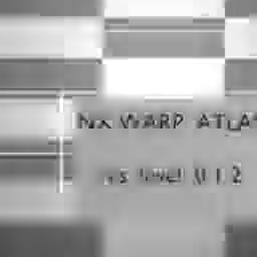 **Fig 13** frame 31, seam **6.820** |

**Date** 2026-09-06 · **Fixture** `nx-scratch/fixtures/vrroom`, `still`, left
eye, 256x256 crop at 384,384 (tile-aligned) at 2x, nearest-neighbour ·
**Settings** `--atlas on --row-present on --atlas-picture-disp 8`, QP 40.

**The number it illustrates.** Whether the `still` row's high seam ratio is
something the atlas *does* over the clip. It is not. Measured per frame, on a
clip that codes 119 B/frame and re-codes nothing:

| | frame 0 | frame 1 | frame 31 | min | max |
|---|---|---|---|---|---|
| QP 26 | 3.262 | 3.262 | 3.270 | 3.262 | 3.277 |
| QP 40 | 6.925 | 6.925 | **6.820** | 6.820 | 6.925 |

It is **flat, and at QP 40 it falls**. The `3.27 -> 6.88` quoted in Figures
10-11 is the QP axis — QP 26 against QP 40 — not the time axis. The whole
value is present at **frame 0**, which is the all-intra frame: before any warp,
before an atlas entry exists. Frames 1 and 31 differ in 2.1 % of their samples
by a mean of 0.035 and a maximum of 11 (5.4 % and 0.089 inside this crop),
which is why the two figures look identical, because they nearly are.

**The atlas is not the mechanism.** With `--atlas off` — the plain picture
codec, no atlas at any point — the trace is 3.262 flat and 6.925 flat, the same
numbers. On a synthetic exactly-zero-motion clip (`still` frame 0 repeated 32
times at one fixed pose) the atlas reproduces **3.262 for all 32 frames**,
identical to the picture model: the per-tile advance of 13.12.3 is exact, and
neighbouring entries do not drift apart. The atlas's entire contribution is the
+0.5 % wobble visible in the min/max above, from sub-sample corner rounding.

**It is the format, and deliberately.** `docs/SYNTAX.md` states there is no
deblocking filter and no loop filter; a tile-boundary step from intra
quantisation is therefore structural. What removes it is re-coding under
motion: on `rest` the boundary gradient collapses **3.452 -> 1.756** across the
clip while the interior gradient barely moves (1.166 -> 1.044), and the atlas
erases seams *harder* than the picture model does (seam 1.682 against 2.508 at
frame 31). The still clip is not growing seams; the moving clips are erasing
theirs.

```
python3 nx-scratch/atlasprice/seamframe.py still 26 40   # seam ratio per frame
python3 nx-scratch/atlasprice/seamdiag.py                # split by config, + the zero clip
B=build/bin; W=nx-scratch/atlasprice/work9
ffmpeg -f rawvideo -pix_fmt yuv420p -s 2176x1088 -i $W/still.q40.yuv \
  -vf "select=eq(n\,31),crop=256:256:384:384,scale=512:512:flags=neighbor" \
  -frames:v 1 docs/assets/still-seam-f31.png -y
```

---

## The seam ratio, since every entry above quotes it

Mean `|x[i] - x[i-1]|` over sample pairs that straddle the 64-sample tile grid,
divided by the same over pairs inside tiles, on the decoded luma. **1.0 means a
tile edge looks like any other pair; above 1 the grid is visible.** It is
scale-free, so configurations at different bitrates can be compared directly,
and it is reported for every visual result from now on. `nx-scratch/atlasprice/seams.py`.
Every measured result gets a picture and an entry here: what device, what
fixture, what settings, the number, and the command that produced it. An entry
without a reproducible command is not an entry.

Appends only. Two agents writing here at once conflict trivially.

---

## Adreno 650 clock under load vs idle


* **Date** 2026-09-06
* **Device** Pico 4, Adreno 650, non-root `adb shell`, headset awake (SLAM and
  passthrough running), gpuss 76.3 -> 76.8 C across the load sample
* **Fixture** `ht.nxv` (289 tiles, 251 skip / 38 coded) for the load pass;
  nothing streaming for the idle pass
* **Settings** stock; no performance level requested by the client
* **The number** **490 MHz idle, 490 MHz under decode load** — 65/65 and 52/52
  samples respectively, one frequency, zero variance. The GPU does not boost
  for a decode. The A650's published top bin is 587 MHz, so this is roughly
  20 % of clock left on the table — but `max_gpuclk` is **UNREADABLE** without
  root, so the top bin is quoted from the part's spec and is not a device
  reading.
* **Also measured** of the kgsl attributes, only `gpuclk` is readable without
  root. `devfreq/cur_freq`, `devfreq/available_frequencies`, `devfreq/governor`,
  `max_gpuclk`, `thermal_pwrlevel`, `num_pwrlevels`, `gpu_busy_percentage` all
  come back empty. This confirms the note in `scripts/passb-device-rows.sh`.
* **Command**

  ```sh
  ./scripts/adreno-clock-probe.sh idle 20
  # load pass: sample gpuclk while a decode runs
  adb shell "cd /data/local/tmp/nxwarp-vkds && \
    (./nxvc-vkdec --in ht.nxv --out /dev/null --stats > seg.txt 2>&1 &) ; \
    end=\$((\$(date +%s)+12)); : > clkload.txt; \
    while [ \$(date +%s) -lt \$end ]; do cat /sys/class/kgsl/kgsl-3d0/gpuclk >> clkload.txt; sleep 0.2; done; \
    sort -n clkload.txt | uniq -c"
  ```
* **What it means** the client can ask for a performance level
  (`XR_EXT_performance_settings`, or Pico's own level API). That is the WiVRn
  integrator's change, not this repo's. Note the nearest prior in this tree:
  `VK_EXT_global_priority` HIGH was a **10x regression** on a headset because
  priority is per process and the compositor loses. Different mechanism, but
  this class of knob has bitten here before.

---

## Pass B device rows: the segment split, and two variants that both lose


* **Date** 2026-09-06
* **Device** Pico 4, Adreno 650, gpuclk pinned 490 MHz, gpuss 65.4 -> 71.3 C
  across the rows (the ~76 C plateau of the awake device drifted down while the
  cross-builds ran; every row reports its own temperatures)
* **Fixture** `ht.nxv`, 289 tiles, 251 skip / 38 coded, 16 frames, mean of the
  last 12
* **Binaries** built from `passb-adreno` for arm64-v8a, NDK 29.0.14206865,
  android-29, sha256 verified either side of every push
* **Rows are interleaved** control/V2/identity within each round, three rounds,
  and the whole thing run twice independently. The ratio is the measurement.
* **Contamination, marked rather than hidden.** The integrator ran `connect.sh`
  against this device from **15:43:32 to ~15:45:35** during the slot — logcat
  cleared at least twice, a VIEW intent, possibly a wake and a client relaunch.
  Reconstructed from build artifact mtimes, the arm64 binaries finished at
  15:43:42 / 15:44:18 / 15:44:41, so everything device-side between 15:44:41 and
  15:45:35 sits inside that window:
  * the **segment split** below, and
  * **the first of the two interleaved run-throughs** (or its opening rounds).
  The second run-through and the 578-tile probe are after 15:45:35 and are
  clean. Both are re-taken on the next device slot; until then read them as
  described here.

### The split

| segment | tiles | ms/frame | share of Pass B |
|---|---|---|---|
| skip (`reconstruct_skip_store`) | 251 | **15.079** | **95 %** |
| coded | 38 | 0.781 | 5 % |
| intra_dir | 0 | 0.0004 | 0 % |

Confirms the Phase 1 attribution on the device: the warp of the skipped tiles
is the term. `intra_dir` is not merely small, it is **zero tiles** — the
directional wavefront never runs on this stream.

**This row is inside the contaminated window** and the milliseconds are to be
re-taken. Two parts of it survive anyway and are worth separating: the **tile
counts** are a property of the fixture and cannot be perturbed by anything the
integrator did, and the **95 % share** is a ratio between two segments of the
same run, so contention that slows the device slows both terms together. What
is not trustworthy is the absolute 15.079 ms.

### The variants

| variant | mean | vs control | rows |
|---|---|---|---|
| control | **8.61 ms** | — | 8.344 8.720 8.650 8.644 8.846 8.560 |
| V2, chroma pair | **10.26 ms** | **+19.2 %** | 10.114 9.989 10.390 10.279 10.334 10.438 |
| identity predicate | **9.01 ms** | **+3.7 %** | 9.320 8.796 8.902 |

**V2 is a regression, and not a marginal one.** Ranges do not overlap the
control in either independent interleave (+18.6 % and +19.2 %) — and the
**second interleave is entirely outside the contaminated window**, so the
verdict rests on clean data on its own. That the contaminated first run
reproduces it to within 0.6 points is a check on the contamination, not the
basis of the conclusion. Sharing the
coordinate between the two chroma planes removes 1024 coordinate computations a
tile and costs a fifth of the segment. It is the same shape as every other
"remove work" lever in `vk/decoder/passB/README.md`: the paired form puts two
dependent ring fetches in one thread where the separate passes had two
independent streams, and this part pays for the dependency, not the
instruction.

**The identity predicate never fires here and costs 3.7 % to ask.** `ht.nxv` is
a head-turn fixture, so its WARP_SKIP tiles carry a real homography and their
corners are not the identity grid. The predicate is correct and free of
regressions in correctness — it is simply the wrong fixture. A STATIC_MV-heavy
stream is what would price it, and one does not exist on the device.

### Commands

```sh
# split + variants, interleaved
adb shell "cd /data/local/tmp/nxwarp-vkds && \
  run(){ NXVC_VKD_SEG_MS=1 ./\$1 --in \$2 --out /dev/null --stats 2>&1 \
         | grep segms | tail -12 \
         | awk '{s+=\$3; c+=\$5; n++} END{printf \"%.3f %.3f %d\", s/n, c/n, n}'; }; \
  for r in 1 2 3; do for b in ctl v2 id; do echo \"round\$r \$b \$(run vkdec-\$b ht.nxv)\"; done; done"
```

### Two limits on these numbers

* **No 578-tile inter fixture exists on the device.** `T2.nxv` and `sbs.nxv` are
  578 tiles but INTRA, so they have no skip segment and `segms` does not print
  for them at all (`ts_count` is 12 only on an inter frame). Every skip row here
  is 289 tiles. A paired-inter fixture would have to be encoded first.
* **The bench absolutes are inflated about 1.57x and must not be compared to
  live figures.** 16 frames reporting ~51 ms of GPU each is 816 ms inside a
  measured 521 ms wall, which is impossible. The discriminating test was cheap
  and rules out the obvious cause: `--stats` off changes nothing (261/325 ms
  with, 314/321 ms without), and the device shell timer is sound (a 2 s sleep
  measures 2021 ms). The numbers are internally consistent — `passA + passW +
  passB` equals `gpu` exactly, and the two `segms` segments sum to `passB` less
  the inter-segment drain — so the best hypothesis is a uniformly wrong
  `timestampPeriod` scale, which leaves every RATIO here valid and every
  absolute unusable. 816/521 = 1.57 is the implied factor.
Every visual result in this repository, with what produced it. A picture that
cannot be regenerated from the line beside it does not belong here.

The rule: **date, fixture, settings, the number the picture is making, and the
command.** Pictures live in `docs/assets/`.

---

## `snapid-tilemap.png` — which tiles the headset copies

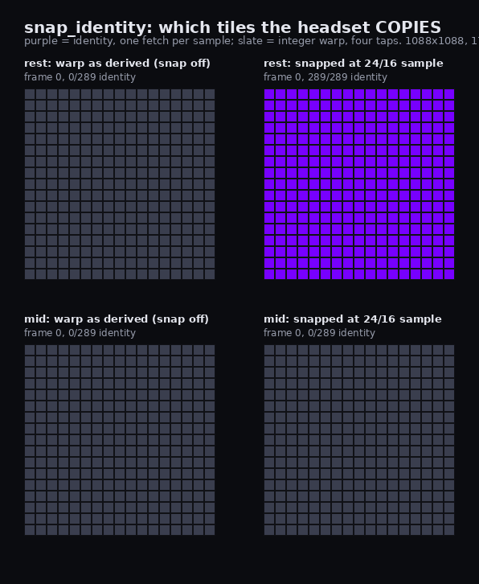

* **Date** 2026-09-06
* **Fixture** `rest` and `mid`, 1088x1088 mono, 8 frames, generated by
  `tools/quality/capture/gen_synthetic.py` — `rest` is `--motion static
  --peak-rate 4.5` (0.05 deg/frame at 90 Hz), `mid` is `--motion pan`
  (30 deg/s)
* **Settings** QP 26, `--inter --coded-vectors --intra-period 6 --ctx v3
  --custom-tables --tab v2 --intra-dir off`; left panels `--snap-identity 0`,
  right panels `--snap-identity 24`
* **The number** at rest, snapping takes the frame from **0 of 289** identity
  tiles to **289 of 289** — every skipped tile becomes a copy on the decoder.
  On `mid` it is 0 of 289 either way: at 30 deg/s a tile corner moves several
  samples a frame and there is nothing to snap.
* **Command**

  ```sh
  NXE_IDENTITY_MAP=map.bin nxvc-vkenc --in rest.yuv420p.yuv --w 1088 --h 1088 \
      --pix yuv420p --frames 8 --qp 26 --poses rest.poses.json \
      --inter --coded-vectors --intra-period 6 --ctx v3 --custom-tables \
      --tab v2 --intra-dir off --snap-identity 24 --device 0 --out out.nxv
  # then nx-scratch/snapid/pictures.py map
  ```

  The map is the encoder's own predicate (`warp_identity_tile_map`) written out
  through `NXE_IDENTITY_MAP`, not a second implementation of it — a picture of
  a predicate drawn by different code would be a picture of the difference.

---

## `snapid-threshold.png` — what the threshold buys, and what it costs

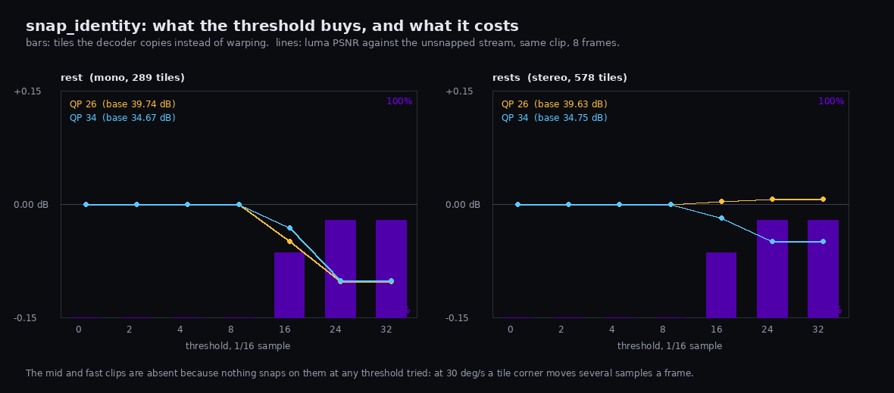

* **Date** 2026-09-06
* **Fixture** `rest` (mono, 289 tiles) and `rests` (stereo 2x1088x1088, 578
  tiles), 8 frames each, same generator settings as above
* **Settings** QP 26 and 34, thresholds 0/2/4/8/16/24/32 in 1/16 luma samples
* **The number** nothing snaps below **16/16 = one whole sample**, because a
  head "at rest" still moves about 0.57 samples a frame; at 16 the threshold
  catches 2 of 7 inter frames and at 24 it catches 3, for **−0.05 to −0.08 dB**
  and a byte change between **−1.1 % and +0.3 %**
* **Command**

  ```sh
  nx-scratch/snapid/sweep.py     # every clip, QP and threshold
  nx-scratch/snapid/pictures.py chart
  ```

  The PSNR axis is a **delta against the unsnapped stream**, not the absolute
  figure: the question is what snapping costs, and on an absolute axis a
  0.05 dB change is a flat line that says nothing.

---

## Figure 12 — The effort ladder changes sign with the content


**Date** 2026-09-06 · **Fixture** vrroom `rest`/`mid`/`fast`/`objmotion`/`still`
and `pan8` · **Settings** `nxvc-vkenc --ctx v3 --intra-dir off --coded-vectors
--inter --intra-period 180`, 8 frames, `--eyes 2` (mono for `pan8`), QP 22 / 26
/ 30 / 34 / 40, rANS (`--custom-tables --tab v2`) and `--entropy lite`; the
right panel is `nxv-enc --no-rdo` against `nxv-enc --int-trellis 1
--rdoq-effort 3` at the acid flags.

**The number it illustrates.** Effort 1 is **−2.4 / −4.4 %** BD-rate on `pan8`
and **+0.1 to +3.2 %** on all five vrroom clips, on both entropy coders; the
reference's integer trellis is **−2.8 to −10.7 %** on all six. Neither the
coded-tile fraction (13–25 %; forcing it to 27–37 % with intra period 6 does
not move a sign) nor the entropy coder explains it. Coding the same clips
intra-only collapses the effect to **−0.9 to +1.0 %** everywhere, which locates
it in the inter reference chain: the requantiser prices a dropped coefficient
against the current frame only, and what compounds downstream is whether that
coefficient was noise (`pan8`, which wins) or detail (vrroom, which loses).
The earlier "within 0.03 dB" reading reproduces exactly — 34.204 dB against
34.204 dB, 29433 B against 29355 B on `rest` at QP 34 — when `nxv-enc`'s full
RD mode decision is left on. **Effort 0 becomes the default.**

```sh
FX=nx-scratch/fixtures/vrroom nx-scratch/effvr/sweep.py
FX=nx-scratch/enceffort/fx W=1088 H=1088 EYES=1 \
  OUT=nx-scratch/effvr/pan.json nx-scratch/effvr/sweep.py pan8
nx-scratch/effvr/intra.py
nx-scratch/effvr/chart.py
```

The bars are BD-rate and not a dB delta on purpose: this tool trades bytes for
dB at a fixed quantiser, so a single-QP dB reading of it is guaranteed to be
either zero or misleading. That is the whole of the discrepancy it settles.
## Figure 12 — The HEVC base layer, priced on headset GPU time instead of bytes

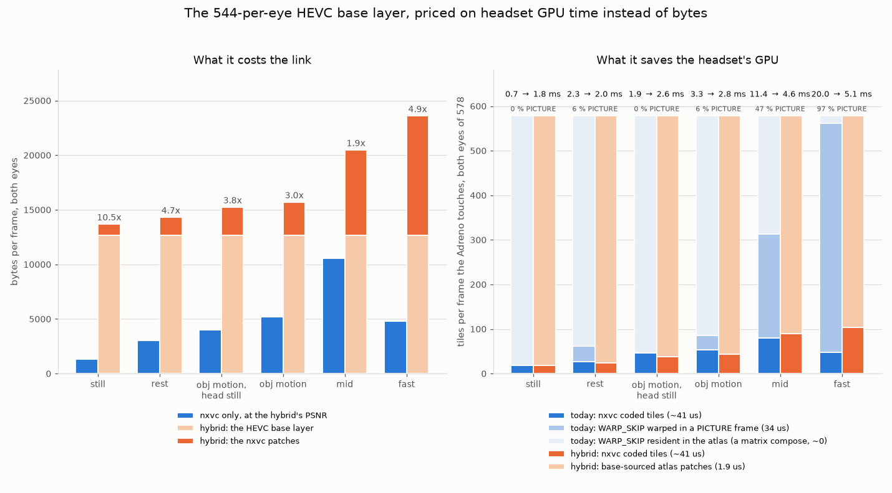

**Date** 2026-09-06 · **Fixture** `nx-scratch/fixtures/vrroom`, all six trajectories,
2176x1088 side by side, 32 frames · **Settings** nxvc-only: `--inter on --atlas on
--row-present on --eyes 2 --atlas-picture-disp 8` (ADR-0029's recommendation) at
QP 22/26/30/34/38. Hybrid: libx265 at 544x544 per eye, 10 Mbit/s, **zero latency**
(`bframes=0 rc-lookahead=0`), bilinear upsample, nxvc patches where the base's per-tile luma
MSE exceeds the MSE of 34 dB, coded through `--skip-map`.

**The number it illustrates.** ADR-0030's headline: the base layer's Adreno saving tracks the
**PICTURE-frame share and nothing else** — **0.7 → 1.8 ms** at `still` (0 % PICTURE, the hybrid
is *worse*), **11.4 → 4.6 ms** at `mid` (47 %, +60 %) and **20.0 → 5.1 ms** at `fast` (97 %,
+74 %) — while costing **1.9x to 10.5x the bytes at equal PSNR** on every trajectory. The left
panel's stack shows why the link loses: the 12,666 B/frame base is a floor paid every frame
whether one tile is patched or none is. The right panel's pale segment is the point ADR-0029
already won — a `WARP_SKIP` tile resident in the atlas costs a matrix compose, not the 34 us
warp — which is why there is nothing left for the base layer to save except in a PICTURE frame.

```sh
python3 tools/quality/hybrid_gpu_price.py           # the streams and results.json
python3 tools/quality/hybrid_gpu_annotate.py        # folds the ATLAS/PICTURE split in
python3 tools/quality/plot_hybrid_gpu.py --in nx-scratch/hybgpu/results.json --out docs/assets
python3 tools/quality/hybrid_gpu_table.py           # the ADR-0030 tables
```
