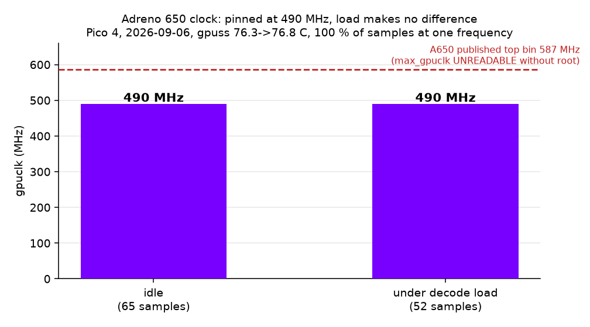
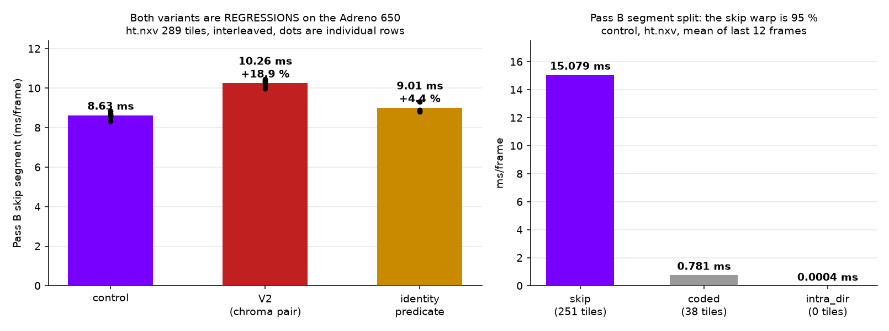

# Gallery

Every measured result gets a picture and an entry here: what device, what
fixture, what settings, the number, and the command that produced it. An entry
without a reproducible command is not an entry.

Appends only. Two agents writing here at once conflict trivially.

---

## Adreno 650 clock under load vs idle



* **Date** 2026-09-06
* **Device** Pico 4, Adreno 650, non-root `adb shell`, headset awake (SLAM and
  passthrough running), gpuss 76.3 -> 76.8 C across the load sample
* **Fixture** `ht.nxv` (289 tiles, 251 skip / 38 coded) for the load pass;
  nothing streaming for the idle pass
* **Settings** stock; no performance level requested by the client
* **The number** **490 MHz idle, 490 MHz under decode load** — 65/65 and 52/52
  samples respectively, one frequency, zero variance. The GPU does not boost
  for a decode. The A650's published top bin is 587 MHz, so this is roughly
  20 % of clock left on the table — but `max_gpuclk` is **UNREADABLE** without
  root, so the top bin is quoted from the part's spec and is not a device
  reading.
* **Also measured** of the kgsl attributes, only `gpuclk` is readable without
  root. `devfreq/cur_freq`, `devfreq/available_frequencies`, `devfreq/governor`,
  `max_gpuclk`, `thermal_pwrlevel`, `num_pwrlevels`, `gpu_busy_percentage` all
  come back empty. This confirms the note in `scripts/passb-device-rows.sh`.
* **Command**

  ```sh
  ./scripts/adreno-clock-probe.sh idle 20
  # load pass: sample gpuclk while a decode runs
  adb shell "cd /data/local/tmp/nxwarp-vkds && \
    (./nxvc-vkdec --in ht.nxv --out /dev/null --stats > seg.txt 2>&1 &) ; \
    end=\$((\$(date +%s)+12)); : > clkload.txt; \
    while [ \$(date +%s) -lt \$end ]; do cat /sys/class/kgsl/kgsl-3d0/gpuclk >> clkload.txt; sleep 0.2; done; \
    sort -n clkload.txt | uniq -c"
  ```
* **What it means** the client can ask for a performance level
  (`XR_EXT_performance_settings`, or Pico's own level API). That is the WiVRn
  integrator's change, not this repo's. Note the nearest prior in this tree:
  `VK_EXT_global_priority` HIGH was a **10x regression** on a headset because
  priority is per process and the compositor loses. Different mechanism, but
  this class of knob has bitten here before.

---

## Pass B device rows: the segment split, and two variants that both lose



* **Date** 2026-09-06
* **Device** Pico 4, Adreno 650, gpuclk pinned 490 MHz, gpuss 65.4 -> 71.3 C
  across the rows (the ~76 C plateau of the awake device drifted down while the
  cross-builds ran; every row reports its own temperatures)
* **Fixture** `ht.nxv`, 289 tiles, 251 skip / 38 coded, 16 frames, mean of the
  last 12
* **Binaries** built from `passb-adreno` for arm64-v8a, NDK 29.0.14206865,
  android-29, sha256 verified either side of every push
* **Rows are interleaved** control/V2/identity within each round, three rounds,
  and the whole thing run twice independently. The ratio is the measurement.

### The split

| segment | tiles | ms/frame | share of Pass B |
|---|---|---|---|
| skip (`reconstruct_skip_store`) | 251 | **15.079** | **95 %** |
| coded | 38 | 0.781 | 5 % |
| intra_dir | 0 | 0.0004 | 0 % |

Confirms the Phase 1 attribution on the device: the warp of the skipped tiles
is the term. `intra_dir` is not merely small, it is **zero tiles** — the
directional wavefront never runs on this stream.

### The variants

| variant | mean | vs control | rows |
|---|---|---|---|
| control | **8.61 ms** | — | 8.344 8.720 8.650 8.644 8.846 8.560 |
| V2, chroma pair | **10.26 ms** | **+19.2 %** | 10.114 9.989 10.390 10.279 10.334 10.438 |
| identity predicate | **9.01 ms** | **+3.7 %** | 9.320 8.796 8.902 |

**V2 is a regression, and not a marginal one.** Ranges do not overlap the
control in either independent interleave (+18.6 % and +19.2 %). Sharing the
coordinate between the two chroma planes removes 1024 coordinate computations a
tile and costs a fifth of the segment. It is the same shape as every other
"remove work" lever in `vk/decoder/passB/README.md`: the paired form puts two
dependent ring fetches in one thread where the separate passes had two
independent streams, and this part pays for the dependency, not the
instruction.

**The identity predicate never fires here and costs 3.7 % to ask.** `ht.nxv` is
a head-turn fixture, so its WARP_SKIP tiles carry a real homography and their
corners are not the identity grid. The predicate is correct and free of
regressions in correctness — it is simply the wrong fixture. A STATIC_MV-heavy
stream is what would price it, and one does not exist on the device.

### Commands

```sh
# split + variants, interleaved
adb shell "cd /data/local/tmp/nxwarp-vkds && \
  run(){ NXVC_VKD_SEG_MS=1 ./\$1 --in \$2 --out /dev/null --stats 2>&1 \
         | grep segms | tail -12 \
         | awk '{s+=\$3; c+=\$5; n++} END{printf \"%.3f %.3f %d\", s/n, c/n, n}'; }; \
  for r in 1 2 3; do for b in ctl v2 id; do echo \"round\$r \$b \$(run vkdec-\$b ht.nxv)\"; done; done"
```

### Two limits on these numbers

* **No 578-tile inter fixture exists on the device.** `T2.nxv` and `sbs.nxv` are
  578 tiles but INTRA, so they have no skip segment and `segms` does not print
  for them at all (`ts_count` is 12 only on an inter frame). Every skip row here
  is 289 tiles. A paired-inter fixture would have to be encoded first.
* **The bench absolutes are inflated about 1.57x and must not be compared to
  live figures.** 16 frames reporting ~51 ms of GPU each is 816 ms inside a
  measured 521 ms wall, which is impossible. The discriminating test was cheap
  and rules out the obvious cause: `--stats` off changes nothing (261/325 ms
  with, 314/321 ms without), and the device shell timer is sound (a 2 s sleep
  measures 2021 ms). The numbers are internally consistent — `passA + passW +
  passB` equals `gpu` exactly, and the two `segms` segments sum to `passB` less
  the inter-segment drain — so the best hypothesis is a uniformly wrong
  `timestampPeriod` scale, which leaves every RATIO here valid and every
  absolute unusable. 816/521 = 1.57 is the implied factor.
