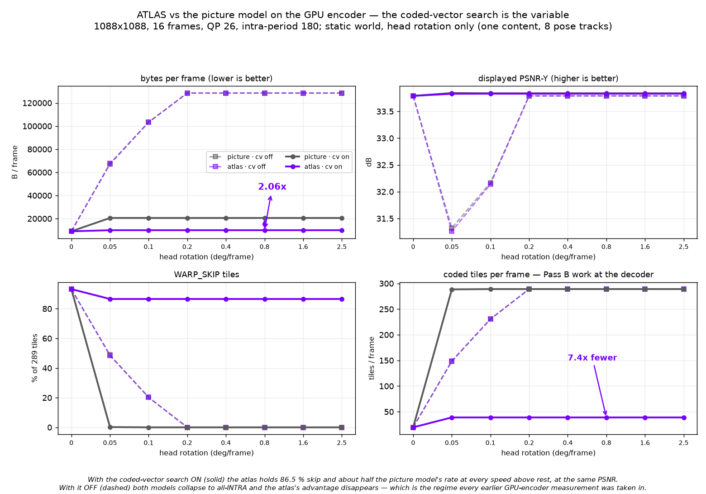
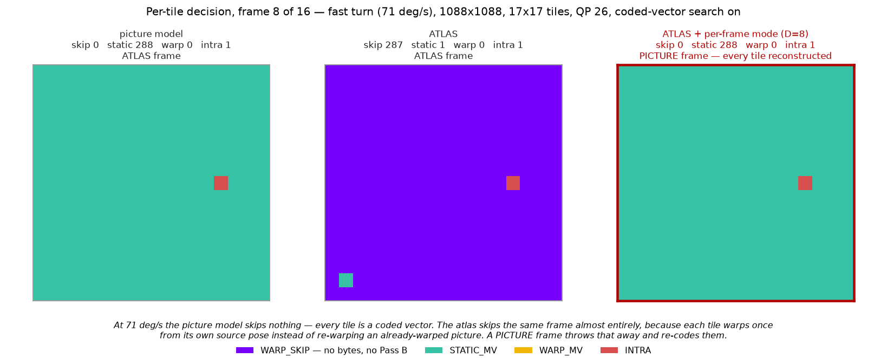
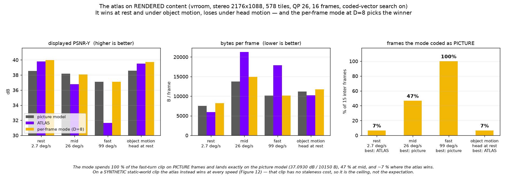

# Gallery

Every visual result in this repository, as a picture, with the command that
regenerates it.

**House rules.** One entry per figure. Each entry carries the date, the fixture,
the settings, *the number it illustrates*, and an exact regenerating command.
PNGs live in `docs/assets/<topic>-<what>.png`, cropped at 2-3x and kept under
about 500 kB; anything larger stays in `nx-scratch/` with a pointer from here.
These are the figures of a later paper, so they are captioned as figures and
numbered, and a figure that illustrates no number does not belong here.

Append; do not renumber. If a measurement is superseded, add the new figure and
leave the old one with a note saying what replaced it.

---

## Figure 1 — Rate-distortion on the vrroom corpus


**Date** 2026-09-06 · **Fixture** `nx-scratch/fixtures/vrroom` (all four
trajectories) · **Settings** `--atlas on --row-present on`, `--eyes 2`, QP 26 /
34 / 40, effort 0, planar rd; modes `all-ATLAS` (`--atlas-picture-disp 0`),
`all-PICTURE` (`--atlas-picture-period 1`), `D=8`
(`--atlas-picture-disp 8`).

**The number it illustrates.** The dominance results of ADR-0029's "Re-run on
rendered content" table: at QP 26 the atlas wins at rest (38.94 dB / 1643 B/f
against 38.02 / 4208) and under object motion (38.79 / 3510 against 37.97 /
5668), and loses at mid (36.62 / 9780 against 38.03 / 7031) and fast (32.65 /
13843 against 38.21 / 6566). The `D=8` curve sits on whichever of the two wins
at each velocity without being told which, and at fast turn it lies exactly on
`all-PICTURE` because it spends 100 % of frames there.

```
python3 tools/quality/capture/gen_vrroom.py --out nx-scratch/fixtures/vrroom
python3 nx-scratch/atlasprice/vrtable.py rest      # and mid, fast, objmotion
python3 tools/quality/plot_vrroom.py --in nx-scratch/atlasprice/work5 --out docs/assets
```

---

## Figure 2 — The effort ladder and the planar mode do not pay


**Date** 2026-09-06 · **Fixture** vrroom, all four · **Settings** `D=8`, QP 34,
`--int-rdoq 0|1`, `--rdoq-effort 3`, `--intra-dir on|layer`.

**The number it illustrates.** `int_rdoq` 0, `int_rdoq` 1 and the full trellis
land within **0.03 dB** of each other on all four fixtures — the three
left-hand columns sit on the zero line. `--intra-dir layer` ("planar prefer")
costs **0.12 to 0.27 dB** *and* more bytes on every fixture, which is a
dominance result in the wrong direction. Plotted as a delta from effort 0 /
planar rd because absolute bars would hide a 0.03 dB spread inside the axis.

```
python3 tools/quality/plot_vrroom.py --in nx-scratch/atlasprice/work5 --out docs/assets
```

---

## Figures 3-6 — The vrroom corpus, one frame per trajectory

| | |
|---|---|
|  **Fig 3** rest, 2.7 deg/s |  **Fig 4** mid, 26.2 deg/s |
|  **Fig 5** fast, 99.1 deg/s |  **Fig 6** object motion, head at rest |

**Date** 2026-09-06 · **Fixture** `nx-scratch/fixtures/vrroom`, frame 8, left
eye, 544x408 crop at 2x · **Settings** Blender 5.2 EEVEE, `Standard` view
transform, stereo 63 mm, 1088x1088 an eye, 100 degrees, 90 Hz, 32 frames.

**The number it illustrates.** Not a number — the *content*, which is the
premise of every measurement above it. `gen_synthetic.py` produced a
band-limited procedural panorama with no specular, no thin geometry, no text
and no independently moving objects, and docs/LOWPOLY-MODE.md called it
"unusually kind". These four frames are what replaced it: text at reading
distance, a mirror-like specular floor, thin high-contrast bars, checkerboard
walls, two textured humanoid meshes that move on their own. The measured
angular velocities are 2.7 / 26.2 / 99.1 deg/s, the fast clip peaking at
796 deg/s across its one-frame 8-degree step.

Full-resolution frames (627-646 kB each) are at
`nx-scratch/fixtures/vrroom/<track>-frame8.png`.

```
python3 tools/quality/capture/gen_vrroom.py --out nx-scratch/fixtures/vrroom
ffmpeg -f rawvideo -pix_fmt yuv420p -s 2176x1088 -i nx-scratch/fixtures/vrroom/mid.yuv420p.yuv \
  -vf "select=eq(n\,8),crop=544:408:180:400,scale=1088:816:flags=neighbor" \
  -frames:v 1 docs/assets/vrroom-mid.png -y
```

---

## Figures 7-9 — Coarse landings are blocky, not soft

| | | |
|---|---|---|
|  **Fig 7** baseline, seam 1.14 |  **Fig 8** T=8, seam **1.53** |  **Fig 9** T=2, seam **1.81** |

**Date** 2026-09-06 · **Fixture** `nx-scratch/atlasenc/turn` (fast turn), frame
12, 256x256 crop at 2x, nearest-neighbour · **Settings** `--atlas on
--atlas-picture-disp 8`, QP 26, `--atlas-coarse-disp 0 | 8 | 2`.

**The number it illustrates.** The seam ratio of ADR-0029's single-level coarse
refresh section: **1.14 → 1.53 → 1.81** against a source of 0.93, while
high-frequency energy *falls* 3.04 → 2.76 → 2.61. Both moving at once is the
failure mode: the tiles get softer inside while the 64-sample grid becomes
visible, which is blocking rather than the low-poly degradation the project
asks for. Visible in the figures as sphere silhouettes that are round at
baseline and acquire straight, tile-aligned cuts by T=2.

```
B=build/bin; T=nx-scratch/atlasenc/turn/turn
$B/nxv-enc --in $T.yuv420p.yuv --w 1088 --h 1088 --pix yuv420p --qp 26 \
  --poses $T.poses.json --inter on --threads 1 --atlas on \
  --atlas-picture-disp 8 --atlas-coarse-disp 8 --out T8.nxv
$B/nxv-dec --in T8.nxv --out T8.yuv
ffmpeg -f rawvideo -pix_fmt yuv420p -s 1088x1088 -i T8.yuv \
  -vf "select=eq(n\,12),crop=256:256:384:384,scale=512:512:flags=neighbor" \
  -frames:v 1 docs/assets/coarse-seam-T8.png -y
python3 nx-scratch/atlasprice/seams.py 12 source=$T.yuv420p.yuv baseline=T0.yuv coarse=T8.yuv
```

---

## Figure 10 — The atlas rarely holds one pose, except at rest


**Date** 2026-09-06 · **Fixture** synthetic pose-consistent pan, a fixed
multi-frequency scene sampled through the yaw (`nxv-posestats`) · **Settings**
1088x1088, 289 tiles, one eye, 4:2:0, QP 28, inter + atlas, `D=8`
(`atlas_picture_disp`), 60 frames, five rotation rates.

**The number it illustrates.** The dominant-pose share of
`docs/COMPOSITOR-POSE-DISPLAY.md`, and with it the whole case for the proposal.
**At rest the display pass warps 0 tiles against today's 289** — one pose, 100 %
dominant, the flat purple pair in the lower panel. At `creep` (0.10 deg/frame,
9 deg/s) the share **oscillates between 49 % and 89 %** on the encoder's refresh
cycle rather than decaying smoothly, averaging 61.7 %, and the warped count
falls from 167.5 to 110.8 — 34 %. At `slow` and above the two schemes coincide
(13.4 against 13.4), and at `mid` and `fast` the `D=8` trigger makes every frame
a PICTURE frame, which puts every entry at one pose by construction and leaves
nothing to skip. The upper panel's flat 100 % lines for `mid`/`fast` are the
mode switch doing the proposal's job already.

```
cmake --build build --target nxv-posestats
./build/bin/nxv-posestats --size 1088 1088 --frames 60 --disp 8 --csv > pose_d8.csv
python3 tools/quality/plot_pose.py --csv pose_d8.csv --out docs/assets --disp 8
```

---

## Figure 11 — The compositor's warp is not avoided, it is used


**Date** 2026-09-06 · **Fixture** none — a diagram of the proposed display path
· **Settings** n/a.

**The number it illustrates.** The two paths Figure 10 counts, and which entry
takes which: entries at the dominant pose are sampled with **no warp at all**
(100 % of them at rest, about 62 % at 9 deg/s), the rest are warped to the
*dominant* pose rather than the current one, and the Pico compositor's own
re-warp — which happens whether or not anyone wants it — carries the composite
the remaining distance. It also carries the exactness claim the document makes:
the atlas, the 64-byte table and everything conformance compares are untouched,
because 13.12.5's display warp is not normative.

```
python3 tools/quality/plot_pose.py --csv pose_d8.csv --out docs/assets --disp 8
```

---

## The seam ratio, since every entry above quotes it

Mean `|x[i] - x[i-1]|` over sample pairs that straddle the 64-sample tile grid,
divided by the same over pairs inside tiles, on the decoded luma. **1.0 means a
tile edge looks like any other pair; above 1 the grid is visible.** It is
scale-free, so configurations at different bitrates can be compared directly,
and it is reported for every visual result from now on. `nx-scratch/atlasprice/seams.py`.
Every measured result gets a picture and an entry here: what device, what
fixture, what settings, the number, and the command that produced it. An entry
without a reproducible command is not an entry.

Appends only. Two agents writing here at once conflict trivially.

---

## Adreno 650 clock under load vs idle


* **Date** 2026-09-06
* **Device** Pico 4, Adreno 650, non-root `adb shell`, headset awake (SLAM and
  passthrough running), gpuss 76.3 -> 76.8 C across the load sample
* **Fixture** `ht.nxv` (289 tiles, 251 skip / 38 coded) for the load pass;
  nothing streaming for the idle pass
* **Settings** stock; no performance level requested by the client
* **The number** **490 MHz idle, 490 MHz under decode load** — 65/65 and 52/52
  samples respectively, one frequency, zero variance. The GPU does not boost
  for a decode. The A650's published top bin is 587 MHz, so this is roughly
  20 % of clock left on the table — but `max_gpuclk` is **UNREADABLE** without
  root, so the top bin is quoted from the part's spec and is not a device
  reading.
* **Also measured** of the kgsl attributes, only `gpuclk` is readable without
  root. `devfreq/cur_freq`, `devfreq/available_frequencies`, `devfreq/governor`,
  `max_gpuclk`, `thermal_pwrlevel`, `num_pwrlevels`, `gpu_busy_percentage` all
  come back empty. This confirms the note in `scripts/passb-device-rows.sh`.
* **Command**

  ```sh
  ./scripts/adreno-clock-probe.sh idle 20
  # load pass: sample gpuclk while a decode runs
  adb shell "cd /data/local/tmp/nxwarp-vkds && \
    (./nxvc-vkdec --in ht.nxv --out /dev/null --stats > seg.txt 2>&1 &) ; \
    end=\$((\$(date +%s)+12)); : > clkload.txt; \
    while [ \$(date +%s) -lt \$end ]; do cat /sys/class/kgsl/kgsl-3d0/gpuclk >> clkload.txt; sleep 0.2; done; \
    sort -n clkload.txt | uniq -c"
  ```
* **What it means** the client can ask for a performance level
  (`XR_EXT_performance_settings`, or Pico's own level API). That is the WiVRn
  integrator's change, not this repo's. Note the nearest prior in this tree:
  `VK_EXT_global_priority` HIGH was a **10x regression** on a headset because
  priority is per process and the compositor loses. Different mechanism, but
  this class of knob has bitten here before.

---

## Pass B device rows: the segment split, and two variants that both lose


* **Date** 2026-09-06
* **Device** Pico 4, Adreno 650, gpuclk pinned 490 MHz, gpuss 65.4 -> 71.3 C
  across the rows (the ~76 C plateau of the awake device drifted down while the
  cross-builds ran; every row reports its own temperatures)
* **Fixture** `ht.nxv`, 289 tiles, 251 skip / 38 coded, 16 frames, mean of the
  last 12
* **Binaries** built from `passb-adreno` for arm64-v8a, NDK 29.0.14206865,
  android-29, sha256 verified either side of every push
* **Rows are interleaved** control/V2/identity within each round, three rounds,
  and the whole thing run twice independently. The ratio is the measurement.

### The split

| segment | tiles | ms/frame | share of Pass B |
|---|---|---|---|
| skip (`reconstruct_skip_store`) | 251 | **15.079** | **95 %** |
| coded | 38 | 0.781 | 5 % |
| intra_dir | 0 | 0.0004 | 0 % |

Confirms the Phase 1 attribution on the device: the warp of the skipped tiles
is the term. `intra_dir` is not merely small, it is **zero tiles** — the
directional wavefront never runs on this stream.

### The variants

| variant | mean | vs control | rows |
|---|---|---|---|
| control | **8.61 ms** | — | 8.344 8.720 8.650 8.644 8.846 8.560 |
| V2, chroma pair | **10.26 ms** | **+19.2 %** | 10.114 9.989 10.390 10.279 10.334 10.438 |
| identity predicate | **9.01 ms** | **+3.7 %** | 9.320 8.796 8.902 |

**V2 is a regression, and not a marginal one.** Ranges do not overlap the
control in either independent interleave (+18.6 % and +19.2 %). Sharing the
coordinate between the two chroma planes removes 1024 coordinate computations a
tile and costs a fifth of the segment. It is the same shape as every other
"remove work" lever in `vk/decoder/passB/README.md`: the paired form puts two
dependent ring fetches in one thread where the separate passes had two
independent streams, and this part pays for the dependency, not the
instruction.

**The identity predicate never fires here and costs 3.7 % to ask.** `ht.nxv` is
a head-turn fixture, so its WARP_SKIP tiles carry a real homography and their
corners are not the identity grid. The predicate is correct and free of
regressions in correctness — it is simply the wrong fixture. A STATIC_MV-heavy
stream is what would price it, and one does not exist on the device.

### Commands

```sh
# split + variants, interleaved
adb shell "cd /data/local/tmp/nxwarp-vkds && \
  run(){ NXVC_VKD_SEG_MS=1 ./\$1 --in \$2 --out /dev/null --stats 2>&1 \
         | grep segms | tail -12 \
         | awk '{s+=\$3; c+=\$5; n++} END{printf \"%.3f %.3f %d\", s/n, c/n, n}'; }; \
  for r in 1 2 3; do for b in ctl v2 id; do echo \"round\$r \$b \$(run vkdec-\$b ht.nxv)\"; done; done"
```

### Two limits on these numbers

* **No 578-tile inter fixture exists on the device.** `T2.nxv` and `sbs.nxv` are
  578 tiles but INTRA, so they have no skip segment and `segms` does not print
  for them at all (`ts_count` is 12 only on an inter frame). Every skip row here
  is 289 tiles. A paired-inter fixture would have to be encoded first.
* **The bench absolutes are inflated about 1.57x and must not be compared to
  live figures.** 16 frames reporting ~51 ms of GPU each is 816 ms inside a
  measured 521 ms wall, which is impossible. The discriminating test was cheap
  and rules out the obvious cause: `--stats` off changes nothing (261/325 ms
  with, 314/321 ms without), and the device shell timer is sound (a 2 s sleep
  measures 2021 ms). The numbers are internally consistent — `passA + passW +
  passB` equals `gpu` exactly, and the two `segms` segments sum to `passB` less
  the inter-segment drain — so the best hypothesis is a uniformly wrong
  `timestampPeriod` scale, which leaves every RATIO here valid and every
  absolute unusable. 816/521 = 1.57 is the implied factor.
Every visual result in this repository, with what produced it. A picture that
cannot be regenerated from the line beside it does not belong here.

The rule: **date, fixture, settings, the number the picture is making, and the
command.** Pictures live in `docs/assets/`.

---

## `snapid-tilemap.png` — which tiles the headset copies


* **Date** 2026-09-06
* **Fixture** `rest` and `mid`, 1088x1088 mono, 8 frames, generated by
  `tools/quality/capture/gen_synthetic.py` — `rest` is `--motion static
  --peak-rate 4.5` (0.05 deg/frame at 90 Hz), `mid` is `--motion pan`
  (30 deg/s)
* **Settings** QP 26, `--inter --coded-vectors --intra-period 6 --ctx v3
  --custom-tables --tab v2 --intra-dir off`; left panels `--snap-identity 0`,
  right panels `--snap-identity 24`
* **The number** at rest, snapping takes the frame from **0 of 289** identity
  tiles to **289 of 289** — every skipped tile becomes a copy on the decoder.
  On `mid` it is 0 of 289 either way: at 30 deg/s a tile corner moves several
  samples a frame and there is nothing to snap.
* **Command**

  ```sh
  NXE_IDENTITY_MAP=map.bin nxvc-vkenc --in rest.yuv420p.yuv --w 1088 --h 1088 \
      --pix yuv420p --frames 8 --qp 26 --poses rest.poses.json \
      --inter --coded-vectors --intra-period 6 --ctx v3 --custom-tables \
      --tab v2 --intra-dir off --snap-identity 24 --device 0 --out out.nxv
  # then nx-scratch/snapid/pictures.py map
  ```

  The map is the encoder's own predicate (`warp_identity_tile_map`) written out
  through `NXE_IDENTITY_MAP`, not a second implementation of it — a picture of
  a predicate drawn by different code would be a picture of the difference.

---

## `snapid-threshold.png` — what the threshold buys, and what it costs


* **Date** 2026-09-06
* **Fixture** `rest` (mono, 289 tiles) and `rests` (stereo 2x1088x1088, 578
  tiles), 8 frames each, same generator settings as above
* **Settings** QP 26 and 34, thresholds 0/2/4/8/16/24/32 in 1/16 luma samples
* **The number** nothing snaps below **16/16 = one whole sample**, because a
  head "at rest" still moves about 0.57 samples a frame; at 16 the threshold
  catches 2 of 7 inter frames and at 24 it catches 3, for **−0.05 to −0.08 dB**
  and a byte change between **−1.1 % and +0.3 %**
* **Command**

  ```sh
  nx-scratch/snapid/sweep.py     # every clip, QP and threshold
  nx-scratch/snapid/pictures.py chart
  ```

  The PSNR axis is a **delta against the unsnapped stream**, not the absolute
  figure: the question is what snapping costs, and on an absolute axis a
  0.05 dB change is a flat line that says nothing.

---

## Figure 12 — The coded-vector search, not the atlas, decides whether the atlas pays



**Date** 2026-09-06 · **Fixture** `nx-scratch/atlasref/s{0.0,0.05,0.1,0.2,0.4,0.8,1.6,2.5}`,
1088x1088, 16 frames — ONE synthetic content (`md5 a325d144`, static world, no
object motion) with eight pose tracks; head rotation rate is the only variable ·
**Settings** QP 26, intra-period 180, rANS, `--ctx v3 --tab v2
--custom-tables`, one eye, 289 tiles; two arms (picture model, `--atlas`) x two
decisions (`--coded-vectors` on and off).

**The number it illustrates.** **2.06x.** With the coded-vector search ON the
atlas holds 86.5 % `WARP_SKIP` and half the picture model's rate at equal PSNR
(9969 against 20547 B/frame, -0.007 dB) at *every* speed from 0.05 to 2.5
deg/frame — flat across a factor of fifty in angular velocity — and codes 38.9
tiles a frame against 289, 7.4x less Pass B. With the search OFF both models
collapse to all-INTRA (128531 B/frame) and the atlas's advantage vanishes
entirely. Every earlier GPU-encoder measurement in ADR-0029 was taken with it
off, which is why the reference's shape never reproduced there.

**Superseded in part by Figure 14, which measures the same question on RENDERED
content and reverses it under head motion. Read this as the ceiling.**

**Read this with Figure 1, which disagrees.** Figure 1 is RENDERED content
(vrroom) and has the atlas losing at mid and fast; this is a synthetic clip
whose world never changes, so an atlas tile's source pixels stay valid
indefinitely and only the pose moves. The two are not in conflict about the
mechanism — they bound it. This figure shows what the atlas is worth when
staleness costs nothing; Figure 1 shows what it is worth when staleness costs
what rendered content makes it cost. The honest reading is that 2.06x is the
ceiling, not the expectation.

**Caveat.** `--coded-vectors` is not byte-identical to `nxv-enc`: E1c searches
`STATIC_MV` only while the reference under `--int-coded-vectors on` also
searches `WARP_MV`. Fast turn matched exactly; near-still differed by 94 bytes
in 159505.

```sh
# per speed, per arm; --atlas for the atlas arm, --coded-vectors for "cv on"
nxvc-vkenc --in atlasref/s0.4.yuv --w 1088 --h 1088 --pix yuv420p --qp 26 \
    --frames 16 --nsub 3 --matrix 1 --wm 0 --tskip off --chroma-qp-off 0 \
    --ctx v3 --eyes 1 --intra-dir off --poses atlasref/s0.4.poses.json \
    --intra-period 180 --inter --custom-tables --tab v2 --device 0 \
    --coded-vectors --atlas --display-psnr --modes --out out.nxv
```

---

## Figure 13 — What the two models decide, tile by tile, on one fast-turn frame



**Date** 2026-09-06 · **Fixture** `nx-scratch/atlasref/fastturn-adr` (71 deg/s
mean), 1088x1088, frame 8 of 16, 17x17 tiles · **Settings** QP 26, intra-period
180, `--coded-vectors`, one eye; three arms — picture model, `--atlas`, and
`--atlas --atlas-mode` at the default `D = 8`.

**The number it illustrates.** **287 of 289 tiles skipped** under ATLAS on a
frame where the picture model skips **none** and codes 288 `STATIC_MV` vectors.
The per-frame-mode arm fires a PICTURE frame here and reproduces the picture
model's map exactly — 0 skip, 288 static — which is 13.12.11 behaving as
specified and also why `D = 8` is the wrong default for THIS encoder on THIS
content: the PICTURE frame throws away 287 tiles that cost nothing. (On the
rendered corpus of Figure 1 the same `D = 8` is what makes the mode win, so the
default is content-dependent and not simply wrong.)

```sh
# once per arm; --tile-map writes frame,tile,row,col,eye,mode,picture
nxvc-vkenc --in atlasref/fastturn-adr.yuv --w 1088 --h 1088 --pix yuv420p \
    --qp 26 --frames 16 --nsub 3 --matrix 1 --wm 0 --tskip off \
    --chroma-qp-off 0 --ctx v3 --eyes 1 --intra-dir off \
    --poses atlasref/fastturn-adr.poses.json --intra-period 180 --inter \
    --custom-tables --tab v2 --device 0 --coded-vectors \
    --atlas --atlas-mode --tile-map tf-mode.csv --out /dev/null
```

`mode` is the nxvw value: 0 `WARP_SKIP`, 1 `STATIC_MV`, 2 `WARP_MV`, 3 `INTRA`.
`picture` is 1 on a frame coded as a PICTURE frame.

---

## Figure 14 — On rendered content the atlas wins at rest, loses under head motion, and the mode picks the winner



**Date** 2026-09-06 · **Fixture** `nx-scratch/fixtures/vrroom`, all four
trajectories, stereo 2176x1088, 578 tiles, 16 frames · **Settings** QP 26,
intra-period 180, `--coded-vectors`, `--ctx v3 --tab v2 --custom-tables`; three
arms — picture model, `--atlas`, and `--atlas --atlas-mode` at `D = 8`.

**The number it illustrates.** The atlas wins at **rest** (39.8043 dB / 5960
B/f against 38.5435 / 7560 — +1.26 dB *and* 21 % fewer bytes) and under
**object motion** (39.5035 / 10251 against 38.5904 / 11181), and loses under
head motion: **mid** 36.7809 / 21261 against 38.1922 / 13711 (-1.41 dB and 55 %
more bytes) and **fast** 31.6560 / 17892 against 37.0930 / 10150 (**-5.44 dB**
and 76 % more). The per-frame mode at `D = 8` lands on whichever wins without
being told: **100 %** PICTURE frames at fast, landing exactly on the picture
model to the byte (37.0930 / 10150); 47 % at mid; 6.7 % at rest and object
motion, where it beats both single models (39.9954 dB at rest).

**This supersedes Figure 12's generalisation.** Figure 12 measured a synthetic
static-world clip and found the atlas 2.06x better at every speed. That clip has
no staleness cost — its world never changes, so a held tile is free — which is
exactly the counterweight rendered content supplies. Figure 12 is the ceiling;
this is the expectation. It also reverses the reading that the per-frame mode is
inert: on this corpus it is the mechanism that makes one configuration work
across the whole velocity range.

```sh
# per trajectory, per arm; add --atlas / --atlas --atlas-mode for the other arms
nxvc-vkenc --in vrroom/fast.yuv420p.yuv --w 2176 --h 1088 --eyes 2 \
    --pix yuv420p --qp 26 --frames 16 --nsub 3 --matrix 1 --wm 0 --tskip off \
    --chroma-qp-off 0 --ctx v3 --intra-dir off --poses vrroom/fast.poses.json \
    --intra-period 180 --inter --custom-tables --tab v2 --device 0 \
    --coded-vectors --atlas --atlas-mode --display-psnr --modes --out out.nxv
# PICTURE % from NXE_MODE_TRACE=1 on stderr
```
