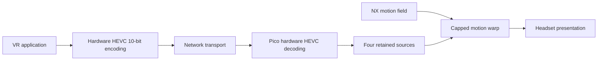

# NXVC Hybrid: verified state and next checks

Snapshot: 11 September 2026. NXVC Hybrid means HEVC compression with NX motion prediction and reprojection. Native NXVC is the separate custom compression path. Historical results must stay attached to their original mode and configuration.

## Selected user-tested path

2176×2176 source pixels per eye; 90Hz display target; experimental 60 FPS source cap; recent-past source preference; 11.11ms maximum motion-field extrapolation; tiny blur off. This is a capped prediction horizon, not an 11.11ms motion-to-photon guarantee. Image warp and its pose compensation use the same fraction.

Short tests after startup show about 90 viewer iterations/s and 59 fresh-source selections/s. Four-source retention reduced estimated-timeline stalls in earlier higher-resolution tests, but spatial motion errors and occasional backward steps remain. These quantities do not establish perfectly smooth, correctly predicted or physically low-latency presentation.

## Available but not promoted

- **Source cap removed:** two short 100%-resolution runs reached about 83 fresh-source selections/s while retaining about 90 viewer iterations/s. Decode-to-selection bookkeeping fell by 19–22ms. Both modes experienced automatic-bitrate congestion events; equivalent quality/bandwidth and physical latency are not established. The 60 FPS source cap was restored.
- **Distinct-ID retention fix:** slot selection now has a host-tested implementation that preserves the four newest distinct IDs even when IDs skip. Android compilation passes, but the new APK is not installed. The installed client still uses the earlier four-slot modulo indexing.
- **Regional and image-only motion experiments:** galleries preserve cleaner shapes and failed estimates, but these prototypes are not available as live presets.

## What the headset counters mean

- **Viewer rate:** application rendering/submission cadence.
- **Fresh-source rate:** transitions to newly selected decoded source frames.
- **Tracking prediction estimate:** a server tracking/request timestamp statistic, formerly labelled motion-to-photon.
- **Warp timeline gap / advance / remainder:** timestamp arithmetic using the final capped, pose-checked warp amount. The UI averages valid samples for roughly half a second and expires the displayed result after two seconds without publication. It cannot measure prediction accuracy or optical latency.

## Next checks, in order

1. Verify that headset captures actually show the scene. The latest visual attempt instead showed **Environment Too Dark**; a live process and advancing scene logs were insufficient.
2. Test the distinct-ID retention APK briefly with working tracking, checking stereo matching, image lifetime, source selection and regressions. Preserve a rollback build.
3. Compare capped and uncapped source delivery at a controlled modest bitrate. Auto-rate drops/rebounds currently confound quality comparisons. Match resolution, motion and recording conditions.
4. Judge visible edge stability and object advancement alongside timing. Increasing fresh delivery may reduce the amount of extrapolation needed, but does not remove correspondence/visibility errors.

Avoid more filter-parameter sweeps: previous local smoothing, zero-motion gating and regional heuristics did not produce a general clean-motion solution. No longer JIT sleep is selected: the 5ms versus 10ms trial did not reduce the measured decode-to-display-target interval.

## Evidence

[100% pacing](../bench/results/90fps-2026-09-11/pico-res100-pacing/README.md) · [Retention repeat and recordings](../bench/results/90fps-2026-09-11/pico-retained-repeat/README.md) · [Higher source rate](../bench/results/90fps-2026-09-11/pico-source-rate/README.md) · [Network and visual-capture caveats](../bench/results/90fps-2026-09-11/pico-source-network/README.md) · [Distinct-ID fix](../bench/results/90fps-2026-09-11/retained-slot-fix/README.md) · [Image-only research paper](IMAGE_ONLY_MOTION.md)
