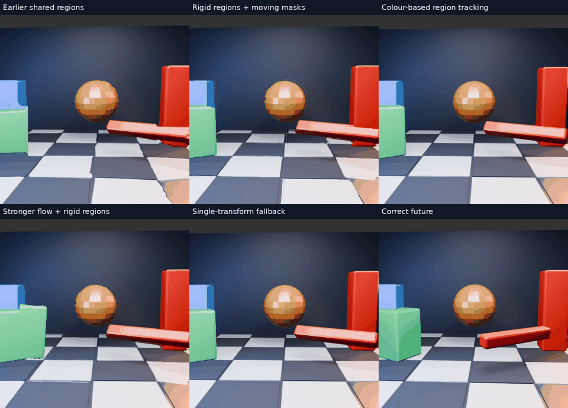

# Shape-preserving image prediction for NX Warp

**Experimental report · 11 September 2026**

## Abstract

We investigated image-only extrapolation for the custom WiVRn NX streaming pipeline, prioritizing rigid geometry and temporal stability over average pixel error. A moving 3D scene exposed severe deformation in interpolated block-motion fields. Denser grids reduced average error but retained torn silhouettes. Shared regional transforms made some shapes cleaner; transporting region masks eliminated one source of deformation but introduced visibility and overlap failures. Restricting transforms to rotation, translation and modest uniform scaling improved geometric behavior. A single projective-transform fallback preserves straight lines in its coordinate mapping and avoids internal region tears, at the cost of leaving independent object motion unpredicted. **Universal, stable object prediction is not solved, and no latency advantage is established by these experiments.**

## 1. Visual overview

[Full-resolution overview video](../bench/results/90fps-2026-09-11/motion-surfaces/overview.mp4) · [Every experiment, animation and log](../bench/results/90fps-2026-09-11/motion-surfaces/README.md)

The user preferred the finer 8px grid and cleaner regional geometry even when pixel error did not improve. The resulting quality objective is explicit: **straight moving edges should stay straight, and prediction should not introduce objectionable jitter.** A slightly stale rigid shape may be preferable to a newly deformed one. That preference does not establish that our current implementations satisfy either requirement.

## 2. Experimental setup

The deterministic Blender/Eevee scene contains a translating camera with changing orientation, independently translating and rotating objects, fixed pillars, a sphere, floor tiles and occlusion. It has 36 source images at 512×512 and 60Hz, with fixed exposure and no motion blur. Motion is deliberately aggressive: one object crosses eight scene units while the camera advances 2.2 units in 35/60 seconds. This is a stress fixture, not representative gameplay.

For output index i, previous/current/future are source indices i−2, i and i+2. Prediction therefore extrapolates 33.33ms beyond the latest available source, using an equally spaced preceding pair. The 32 outputs play at 15fps, four times slower than source-index progression. Every diagnostic output is predicted; these clips do not reproduce a live cadence mixing fresh and extrapolated frames.

Original image pixels are converted from sRGB to linear RGBA8 before GPU upload. The production warp writes sRGB, and the reference is converted consistently. This quantizes dark tones. Both eye layers receive identical input. RGB RMSE covers the central 384×384 pixels in each layer; tables report the arithmetic mean of 32 per-frame RMSE values. Full videos show the entire image, including borders.

The original field estimator and final image sampling run on the Radeon RX 7900 XTX through the headless Vulkan fixture. Later region experiments read back vectors, fit models and build inverse-coordinate maps on the CPU, then use the GPU warp for image reconstruction. Those host round trips and dense maps are **diagnostic infrastructure**, not a proposed production path. DIS experiments additionally replace the motion estimator with OpenCV's CPU DIS implementation. No renderer IDs, depth, meshes or future-image features enter prediction. The known future is used only for evaluation and the reference panel.

## 3. From motion cells to surfaces

### 3.1 Dense motion fields

A cell vector describes where current content came from in the preceding image. The original warp bilinearly samples this field. Neighbouring vectors that disagree produce different local pulls, so an originally straight edge can bend. Reducing cell spacing from 64 to 8 pixels adds 64 times as many cells; it does not remove wrong estimates or boundary mixing. The finest matching window remains 32 source pixels wide.

### 3.2 Shared regional transforms

We grouped adjacent cells by current-image colour and fitted affine displacement models with residual rejection. Cautious replacement retained the dense field at unsupported cells; stronger replacement applied an accepted model to the whole connected region. The latter made some edges straighter but also grouped surfaces incorrectly. Additional consensus fitting did not reliably improve the preferred version.

Fitting a common model is insufficient if it is still interpolated with another region's model at the boundary. We therefore tested inverse mapping with **transported source masks**: a destination sample is assigned to a region only when that region's inverse transform lands inside its source mask. This moves the mask with the surface instead of choosing the region at the destination's old location.

### 3.3 Restricting deformation

Unconstrained affine fits permit shear and excessive scaling. The next variant fits a similarity transform—translation, rotation and uniform scaling—with determinant bounds 0.8–1.25 on the inverse mapping. Such a transform preserves straight segments algebraically. Mask errors, overlaps and missing content can still damage the resulting silhouette.

Source masks are refined from the 8px colour grid using the closest-colour neighbouring cell. Small regions are drawn over larger regions as an explicitly heuristic layering rule, **not inferred depth**. Unclaimed pixels initially retain the current image. This exposes old fragments when an object moves away. A separate variant extends a neighbouring different region into small holes, up to 16 pixels. It approximates missing content; it does not recover it.

### 3.4 Alternative tracking

We tested colour/centroid/area/covariance matching between previous and current regions. Elongated regions may receive bounded orientation changes; ambiguous matches are rejected. A lighting-tolerant colour representation reduced some splits but could connect much of the scene into one region. Constraining colour growth relative to a seed reduced this merging while introducing other tracking failures. These variants remain rejected prototypes.

A CPU DIS optical-flow diagnostic supplied an alternative field to the same rigid-region renderer. It improved some estimates but did not eliminate visibility and grouping failures. This is an estimator comparison, not a claim that DIS meets our latency budget.

### 3.5 A shape-safe fallback

The final diagnostic fits one current-to-previous homography from DIS correspondences using RANSAC. It requires more than 35% inliers and bounded corner movement; an invalid estimate falls back toward identity. The matrix is damped with weights 0.7 for the current estimate and 0.3 for the preceding filtered estimate. This can reduce abrupt transform changes while also delaying adaptation. It is not a demonstrated jitter-free solution.

A single nonsingular projective mapping preserves straight lines before clipping and sampling. The coordinate-map check passed for 96 segments across the 32 actual fitted/fallback matrices. Unlike multiple independently moving masks, it has no internal region overlap or uncovered-region holes. **It cannot predict independent object motion.** Only 17 of 32 raw estimates passed the fit gate; the others used the damped identity fallback. In a real VR integration this must also respect existing pose reprojection rather than apply head motion twice.

## 4. Quantitative results

| Method | Mean RGB RMSE |
|---|---:|
| Hold latest source | 39.670 |
| Original 8px motion grid | 37.727 |
| Preferred shared affine regions | 38.538 |
| Transported masks, affine models | 42.097 |
| Transported masks, similarity models | 38.981 |
| Similarity models + limited hole extension | 38.939 |
| Region moment tracking | 42.633 |
| Lighting-tolerant moment tracking | 42.177 |
| Seed-bounded moment tracking | 48.170 |
| DIS + similarity regions | 38.665 |
| Single-transform fallback | 38.839 |

These scores are **not a perceptual ranking**. The 8px field can score better while visibly bending objects. The single-transform fallback looks rigid but leaves object motion stale. The gallery preserves failed variants instead of selecting only attractive frames.

The preliminary green-edge detector qualified just three frames under strict reference checks. On those frames, shared regions reduced measured bending relative to the 8px field, but all predictions failed the provisional 2px tolerance. A more permissive detector produced a large error even on the held reference, so we do not use its claimed improvement as evidence. Reliable segment visibility and edge correspondence remain evaluation work, not solved measurements.

## 5. Findings and unresolved problems

1. **Grid density alone does not solve deformation.** More local freedom can create finer tears.
2. **Region masks must move with their transforms.** Mixing transforms at old destination regions is not equivalent to moving surfaces.
3. **Rigid mappings help shape quality but do not establish correct motion.** Segmentation, visibility and correspondence remain central failure modes.
4. **A conservative fallback is necessary.** A clean older object can be preferable to a deformed prediction, but that is a quality tradeoff—not evidence of lower content latency.
5. **Temporal stability remains unproven.** The short animations reveal artifacts but cannot establish long-term tracking stability, comfort or absence of jitter.

The useful next step is to admit regional prediction only when correspondence, boundary and temporal-consistency checks support it, and otherwise retain the existing pose-corrected source image or another validated fallback. Hidden surfaces cannot generally be recovered from a pair of images. A longer image history may help, but does not remove that limit.

## 6. Reproducibility and integration status

The [gallery directory](../bench/results/90fps-2026-09-11/motion-surfaces/README.md) contains runner scripts, per-frame logs, score summaries and full-resolution MP4s. The original [scene generator](../bench/results/90fps-2026-09-11/motion-scene/scene.py) and frame-comparison scripts specify source animation and timing. The WiVRn fixture supports a 512px image with an 8px estimator grid, and a dense inverse-map override for region experiments. The dense override skips redundant motion estimation; it is not a million-cell live decoder feature.

Scripts retain the original local sibling paths and need adjustment for another checkout. Python dependencies are NumPy/Pillow, plus OpenCV 5.0.0.93 for DIS and homography experiments; ffmpeg packages the videos. Vulkan validation was enabled. GPU readback outputs are actual computations, but **this work does not measure Pico GPU time, network transport, HEVC decoding, synchronized stereo or motion-to-photon latency**.

No regional method or 8px grid was deployed as a live default. The separately requested tiny-blur default was built and installed for the supported ordinary opaque client motion path; it has an off switch and does not solve regional prediction. The selected large-centre NX runtime configuration remains intact.

## Follow-up: image-only layers and background completion

A [new animated layer experiment](../bench/results/90fps-2026-09-11/motion-layers/README.md) tests rigid colour regions, optical-flow consistency and filling the old silhouette before composition. It isolates two remaining problems: correspondence for fast motion, and visibility when objects uncover or overlap pixels. These CPU diagnostics are not integrated and do not establish a latency improvement.

The subsequent [persistent-tracking study](../bench/results/90fps-2026-09-11/motion-tracking/README.md) adds five animations, a timing/error chart, identity tests and an activation check for retained background. Broader masks reduce fragmentation; optional adjacent merging improves this scene’s mean error, but silhouette damage, rotation and live cost remain unresolved.

A [conservative silhouette refinement](../bench/results/90fps-2026-09-11/motion-silhouettes/README.md) subsequently produced negligible error improvement and substantial extra CPU work. Its animations and tests are preserved, but the pass is rejected for live use.

The [prediction-horizon comparison](../bench/results/90fps-2026-09-11/motion-horizon/README.md) renders independent +11.11ms targets for eight matched samples. Shorter horizons greatly lower held-image error too; the evidence favors reducing source age rather than claiming a stronger predictor. Display cadence alone does not establish actual image age.

The subsequent [actual GPU cap test](../bench/results/90fps-2026-09-11/motion-gpu-cap/README.md) covers all 32 predictions. A one-third shift worsens mean RGB error but reduces nonpositive sampling-map Jacobians from 8.60% to 0.95%, supporting a distortion-versus-motion tradeoff rather than a universal quality or latency win.

The [quantized-field follow-up](../bench/results/90fps-2026-09-11/motion-quantized-cap/README.md) reproduces the signed-byte representation before GPU warping. Its nearly unchanged error indicates that vector precision is not the main source of this scene’s distortion; this is not a full client SNORM/foveation test.

The cap was subsequently [installed and activated on the Pico](../bench/results/90fps-2026-09-11/pico-cap/README.md). Two short moving-scene runs completed, with an actual client log proving step reduction before pose compensation and a headset recording. This establishes functional integration, not 90 fresh FPS, physical-motion quality or lower latency.

The [Pico app-time follow-up](../bench/results/90fps-2026-09-11/pico-motion-clock/README.md) distinguishes requested display timestamps from capture age and checks the coupled image/pose fraction. A live functional run recorded source-clock pose adjustments; object alignment and physical latency remain unproved.

The [visible-object alignment evaluation](../bench/results/90fps-2026-09-11/motion-alignment/README.md) measures progress toward the reference green block position. Median projected progress is about 34% full versus 16% capped on 30 eligible frames. This quantifies remaining position error, not physical latency; occlusion and deformation can bias silhouette centres.

The [field-transport experiment](../bench/results/90fps-2026-09-11/motion-transport/README.md) solves a source-anchored inverse map. It increases the block’s median position progress to 44%, but introduces tearing; a residual-based fallback loses that progress gain. These CPU-solved GPU-warp diagnostics remain unsuitable for live integration.

The [camera-rotation separation diagnostic](../bench/results/90fps-2026-09-11/motion-rotation/README.md) reduces static rotation image mismatch by 92%, but leaves spurious estimated motion and increases matching difficulty in the mixed scene. Known rotation alone is insufficient; no live change is promoted.
