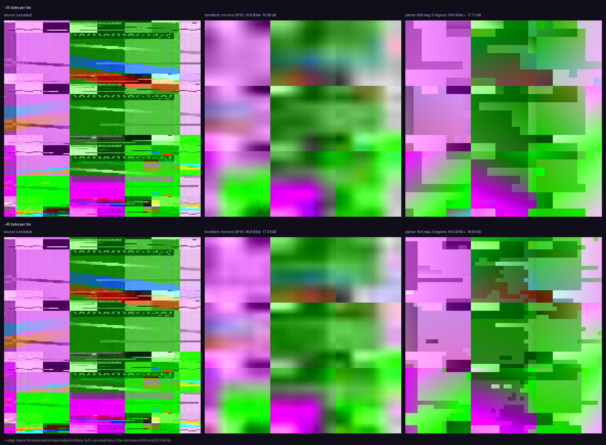

# A piecewise-planar tile mode

**Status:** proposal, with a measured CPU prototype. Nothing here is
implemented in the codec, and no syntax has been allocated. Every number below
was measured on `nx-scratch/inter_pan8.yuv` frame 0 (1088x1088, 4:2:0, 289
tiles) against `nxv-enc` from `build-vk`, and the prototype is
`nx-scratch/lowpoly-work/planar_tile.py`.

## 1. The failure mode this is about

A transform codec at a bitrate below what the content needs fails by turning
the picture into its own coding grid. Blocks of the wrong colour, ringing along
every edge, and — worst in a headset, because the head never stops moving — the
whole pattern reshuffling frame to frame. That artefact is the one the eye is
least willing to forgive, because nothing in the world looks like it.

There is a second way to spend the same bits. If a tile is described as *two to
four regions, each a smoothly shaded surface, meeting at sharp boundaries*, then
running out of bits costs detail rather than structure: the regions get coarser,
the boundaries stay where they are, and the picture degrades toward the look of
a low-polygon model. Still wrong, but wrong in a way the eye has a name for.

The client-side display filter in the WiVRn NX client (a sectored
variance-minimising kernel over the decoded image) reaches for the same look
without touching the bitstream. This document asks the other question: what if
the **encoder** could say it directly, and spend its bits on the regions instead
of on a transform whose basis the content does not fit?

## 2. What it extends

`NEAR_SKIP` (tool bit 28, SYNTAX 3.3 and 13.9) already carries a plane. Its
nine-byte correction record is, per colour plane, three signed bytes `c0`, `c1`,
`c2` — a DC level and two ramps — reconstructed as

```
means[by][bx] = dc_offset + d0
              + ((dh * (2*bx - nb + 1)) >> log2(nb))
              + ((dv * (2*by - nb + 1)) >> log2(nb))
```

That is a plane over the tile, quantised to the DC-plane step, in three bytes.
13.9 is explicit that it "introduces a second way of writing a `means` field and
nothing else", and that a GPU decoder pays "less than any other tile" for it:
no entropy decode, no rANS lane flush, no inverse transform.

**This proposal is that record, `R` times per tile, plus a way of saying which
part of the tile each copy governs.** Everything it needs downstream —
`dequant_step(qp >> 1, 16)`, the ramp convention, the planar interpolation of
7.2, the `clamp(..., 0, maxval)` — already exists and is already normative. The
new arithmetic is a per-sample region lookup.

The difference from `NEAR_SKIP` is that a near-skip tile is a *correction to a
warped reference* and has no tile structure at all, whereas this is a tile's
whole content. So it cannot live in the row header; it is a tile mode.

## 3. The mode

For a 64x64 tile:

* `R` in 2..4 **regions**.
* Each region is one plane per coded colour plane: three bytes (`c0`, `c1`,
  `c2`) in exactly 13.9's shape and with exactly 13.9's reconstruction. Alpha is
  not regionised.
* An **edge map** saying which region each part of the tile belongs to. Two
  forms, both measured below:
  * **bitmap** — one label per sub-block, at 8x8 or 4x4 granularity, so 64 or
    256 labels of `ceil(log2 R)` bits;
  * **line** — `L` straight half-plane splits, each a 6-bit angle and a 10-bit
    signed offset in two bytes, the regions being the `2^L` sign combinations.

The planes are evaluated **per sample**, not per sub-block. Inside a region the
reconstruction is a smooth ramp; the only thing quantised to the sub-block grid
is where one region stops and the next begins. A per-sub-block constant field
would just be a coarser version of the block noise the mode exists to replace,
which is the single most important thing to get right about it.

The encoder fits by variance minimisation: k-planes, alternating a
least-squares plane fit per region with a reassignment of every sub-block to the
region whose plane leaves it the smallest squared error, initialised from a 1-D
k-means on sub-block mean luma. It converges in under eight iterations on
essentially every tile.

### 3.1 Bytes per tile

`1` header byte (region count, split form, granularity) + the map + `3 * R * 3`
plane bytes for Y, Co and Cg.

| | R = 2 | R = 3 | R = 4 |
|---|---|---|---|
| planes (3 bytes x R x 3 planes) | 18 | 27 | 36 |
| line map (2 bytes per split) | 2 (L=1) | 4 (L=2) | 4 (L=2) |
| bitmap 8x8 (64 labels) | 8 | 16 | 16 |
| bitmap 4x4 (256 labels) | 32 | 64 | 64 |
| **total, line** | **21** | **32** | **41** |
| **total, bitmap 8x8** | **27** | **44** | **53** |
| **total, bitmap 4x4** | **51** | **92** | **101** |

Two things fall straight out of that table. The line form is nearly free and the
bitmap form is not; and above R = 2 the **map dominates the budget** — at 4x4
granularity it is 70% of the tile.

### 3.2 The map is compressible, and that is the whole result

A region label map is about as spatially coherent as data gets. Measured over
all 289 maps of the frame, coding each label under a two-neighbour context
(left, up):

| map | raw | order-0 entropy | context (left, up) |
|---|---|---|---|
| 8x8, R = 3 | 16 B | 12.5 B | **6.6 B** |
| 4x4, R = 2 | 32 B | 31.9 B | **11.9 B** |
| 4x4, R = 3 | 64 B | 49.3 B | **16.5 B** |

Roughly a 4:1 cut at 4x4, and the codec already owns the machinery: a rANS
payload with adaptive contexts is what every coded tile uses. Those are entropy
bounds with an untransmitted model, not a coder's output, so treat them as the
ceiling — but the gap between raw and bound is far too big to leave on the table
and is what decides whether the mode is interesting at all.

Under context coding the practical configurations are:

| configuration | bytes/tile |
|---|---|
| 8x8 map, R = 3 | 1 + 6.6 + 27 = **34.6** |
| 4x4 map, R = 2 | 1 + 11.9 + 18 = **30.9** |
| 4x4 map, R = 3 | 1 + 16.5 + 27 = **44.5** |

## 4. Measured against the transform codec

The prototype coded every tile of the frame at each configuration; `nxv-enc`
coded the same frame intra-only (`--inter off`) at the QP that lands on the same
byte count. Luma PSNR over the whole frame:

**Prototype, all configurations** (raw map, before any entropy coding):

| configuration | B/tile | luma PSNR | chroma PSNR |
|---|---|---|---|
| line, L = 1 (2 regions) | 21.0 | 14.85 dB | 17.84 dB |
| line, L = 2 (up to 4) | 40.4 | 15.47 dB | 18.51 dB |
| line, L = 3 (up to 8) | 62.8 | 15.53 dB | 18.86 dB |
| bitmap 8x8, R = 2 | 27.0 | 16.50 dB | 17.46 dB |
| bitmap 8x8, R = 3 | 44.0 | 17.11 dB | 17.89 dB |
| bitmap 8x8, R = 4 | 53.0 | 17.12 dB | 18.18 dB |
| bitmap 4x4, R = 2 | 51.0 | 17.92 dB | 17.52 dB |
| bitmap 4x4, R = 3 | 92.0 | 18.94 dB | 17.95 dB |
| bitmap 4x4, R = 4 | 101.0 | 19.54 dB | 18.07 dB |

**Transform codec, same frame, intra:**

| | B/tile | luma PSNR | chroma PSNR |
|---|---|---|---|
| `nxv-enc --qp 62` | 35.8 | 16.96 dB | — |
| `nxv-enc --qp 58` | 40.6 | 17.18 dB | 19.24 dB |
| `nxv-enc --qp 55` | 45.8 | 17.34 dB | — |
| `nxv-enc --qp 52` | 48.1 | 17.40 dB | 19.62 dB |
| `nxv-enc --qp 44` | 82.4 | 19.95 dB | 21.31 dB |
| `nxv-enc --qp 43` | 91.4 | 20.47 dB | 21.78 dB |

**Head to head at equal bytes**, taking the context-coded map rate:

| budget | transform | piecewise-planar | delta |
|---|---|---|---|
| ~35 B/tile | QP 62, 35.8 B, 16.96 dB | 8x8 R=3, 34.6 B, 17.11 dB | **+0.15 dB** |
| ~45 B/tile | QP 55, 45.8 B, 17.34 dB | 4x4 R=3, 44.5 B, 18.94 dB | **+1.60 dB** |
| ~48 B/tile | QP 52, 48.1 B, 17.40 dB | 8x8 R=4, 53.0 B raw, 17.12 dB | −0.28 dB |
| ~91 B/tile | QP 43, 91.4 B, 20.47 dB | 4x4 R=3, 92.0 B raw, 18.94 dB | −1.53 dB |

The shape of that is the finding. **At 35 to 45 bytes a tile the planar mode is
level with or ahead of the transform codec; by 90 bytes it is a decibel and a
half behind and falling.** It saturates — R = 4 at 4x4 buys 19.54 dB and there
is nowhere further to go without a residual — while the transform codec keeps
climbing. That is exactly the profile of a *low-rate* tool, and it is why the
proposal is a mode alongside the transform and never a replacement for it.

Three honest caveats on the numbers. Chroma is clearly worse (17.9 dB against
19.2-21.8): the chroma planes are forced to share the luma-derived label map,
and a real design would either allow a chroma-only split or accept this as the
price. The line form loses badly — 1.6 dB behind the bitmap at the same rate —
because a small set of half-planes cannot follow content whose regions are not
convex. And `inter_pan8` is a synthetic tile atlas of flat panels and text, not
a natural scene; it is unusually kind to a piecewise-planar model and the result
should be re-measured on rendered game content before anyone believes the
margin.

## 5. What it looks like



`nx-scratch/live/lowpoly-mode-compare.png`, a 192x192 crop at 3x nearest, source
on the left, transform codec in the middle, piecewise-planar on the right, at
~35 and ~45 bytes a tile.

PSNR is the least interesting thing in that image. The transform codec at these
rates is a **soft, colour-smeared blur** — the panel boundaries have dissolved,
the coloured bands have bled into each other, and what is left has no structure
the eye can hold. The planar mode at the same bytes keeps every boundary: the
dark panel is still a dark panel with an edge, the red and blue bands are still
separate, and the shading inside each region is smooth rather than blocky.

It also shows the mode's own failure, which is not the transform codec's.
Region boundaries are quantised to the sub-block grid, so a boundary that is not
axis-aligned comes out as a **staircase** — very visible at 8x8, still visible
at 4x4. This is the thing to design against, and it is the reason to keep the
line form in the design even though it loses on PSNR: a straight-line split
gives a true sharp diagonal, at two bytes, where a bitmap gives stairs. The
likely right answer is a bitmap map with an optional per-region line refinement,
which is not what the prototype measured and so is not claimed here.

## 6. Where it fits the atlas model

Under `ATLAS` (ADR-0029, SYNTAX 13.12, `docs/ATLAS-DECODER.md`) the decoder
stops reconstructing skipped tiles and the atlas becomes a **patch store** that
the client's display pass samples through a per-tile warp. The measured budget
there is 2.4-3.0 ms per eye against 12.3 ms today, and essentially all of the
saving is the deletion of `reconstruct_skip_store`.

A piecewise-planar tile is the cheapest possible *new* patch for that store:

* **It costs the decoder less than any other coded tile**, by the same argument
  13.9 already makes for near-skip. No entropy decode of coefficients, no rANS
  lane flush, no inverse transform — a label lookup and three multiply-add per
  sample. It is strictly cheaper than a coded tile and strictly more expensive
  than a skip, by one region lookup.
* **It is a whole tile, not a correction**, so unlike `NEAR_SKIP` it can seed a
  patch that has no reference at all — a disoccluded tile, a tile whose
  reference generation was lost, a tile entering the frustum.
* **It is exactly the right quality for where the atlas is weakest.** The atlas
  model's cost is concentrated in the periphery and in fast motion, which is
  where foveation has already thrown away resolution and where the eye is least
  able to resolve texture but most able to see structure move. A patch that
  keeps boundaries and loses texture, at 35 bytes, is a better peripheral patch
  than a transform tile at the same 35 bytes.

So the natural placement is: **the encoder's cheapest non-skip answer**, chosen
by RD like any other mode, and expected to be picked overwhelmingly in the
periphery and on tiles the rate controller has starved.

## 7. Syntax delta

Small, and it does not disturb anything already allocated.

**Tool bit.** One new bit, `PLANAR` — call it 32 pending an allocation review —
requiring `INTER` no more than `INTRA` does; a planar tile has no reference.
Per SYNTAX 2, a tool bit the decoder does not offer means the encoder never
emits the mode, so the mode is negotiated and old decoders are unaffected.

**Tile header word1.** `mode` is 3 bits with values 5-7 reserved (4.1). This
takes **`mode == 5`, `PLANAR`**, which is the whole cost in the fixed header:
zero new bits. Its constraints:

* `mode == 5` requires the `PLANAR` tool bit;
* `mv_present`, `quad_mv` and `ref_sel` must be 0 and are ignored — a planar
  tile has no reference and no vector;
* `tskip`, `split4x4`, `xform_size`, `wm_id`, `table_set` and `nsub_log2` must
  be 0: there is no transform and no rANS payload to which any of them applies;
* `res_level` keeps its meaning (a planar tile may be coded at 32x32 or 16x16),
  and `alpha_mode` keeps its meaning, so a planar tile can still be
  constant-alpha or carry a coded alpha payload;
* `payload_len` in word0 is the length of the planar body below, which keeps a
  planar tile skippable by a parser that does not implement the mode.

**Tile body**, replacing the rANS payload, after the existing optional fields:

| offset | size | field |
|---|---|---|
| 0 | u8 | bits 0-1 `region_count - 2`; bit 2 `split_form` (0 bitmap, 1 line); bit 3 `granularity` (0 = 8x8, 1 = 4x4); bits 4-7 reserved, must be 0 |
| 1 | 2 x (R-1) | `split_form == 1`: per line, u16 with bits 0-5 angle, bits 6-15 signed offset |
| 1 | var | `split_form == 0`: the label map, `ceil(log2 R)` bits per sub-block, context-coded (left, up) in the frame's rANS |
| — | 3 x R x planes | per region, per colour plane in order Y, Co, Cg: `c0`, `c1`, `c2` |

**Decoding process**, a new section 13.13, reusing 13.9 verbatim: derive the
label per sample from the edge map; per plane, dequantise each region's three
coefficients with `dequant_step(qp >> 1, 16)`; evaluate that region's plane at
the sample with 13.9's ramp convention; `clamp(..., 0, maxval)`. Notably there
is **no** planar interpolation step and no `means` field — the plane *is* the
sample field, which is 13.9 without its final indirection.

**Reserved-bit rejection vectors.** New ones for each of the "must be 0"
constraints above, in the shape ERRATA already uses.

**What does not change:** the tile-row header, `skip_bitmap`, `dc_bitmap`, the
transport directory (a planar tile is an ordinary coded tile with a `dir_len`
and a `dir_qp`), the reference model, the warp, and every existing mode.

## 8. What is not proven

* Everything above is one frame of one synthetic clip. The margin at 45 bytes
  is the claim most likely to shrink on rendered content.
* The context-coded map rates are entropy bounds, not a coder's output.
* Temporal behaviour is entirely unmeasured, and it is the thing that matters
  most in a headset: if the region segmentation flickers between frames on
  static content, the mode trades block noise for a worse artefact. A real
  design almost certainly needs the segmentation to be predicted from the
  co-located tile's previous map.
* The staircase on non-axis-aligned boundaries is real and unaddressed.
* No GPU decoder cost has been measured; the claim in section 6 is an argument
  from 13.9's, not a number.
