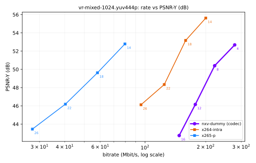

# NX Warp quality harness: end-to-end proof with the mock codec

Generated 2026-09-04T04:27:06+02:00 by `tools/quality/report.py`.

Rate is the mean bitrate of the coded elementary stream at the sequence's frame rate (no container overhead). Quality metrics are computed by `tools/quality/nxq/metrics.py` in numpy; VMAF comes from ffmpeg's libvmaf.

## vr-mixed-1024.yuv444p

- **Source**: `synthetic:mixed:seed1`
- **Geometry**: 2048x1024 yuv444p, 6 frames at 90 fps, layout `sbs`
- **ffmpeg**: n9.0.1; encoders: libx264, libx265; VMAF: yes
- **Run**: 2026-09-04T04:26:07+02:00 on `x0x0x0x0x0x`, 48.8 s

### Rate-distortion points

**nxv-dummy** (codec under test)

| QP | Mbit/s | kB/frame | PSNR-Y | PSNR-YCbCr | SSIM | MS-SSIM | VMAF |
|---:|---:|---:|---:|---:|---:|---:|---:|
| 16 | 147.79 | 205.3 | 42.75 | 42.93 | 0.9891 | 0.9888 | 97.73 |
| 12 | 177.65 | 246.7 | 46.16 | 46.37 | 0.9943 | 0.9947 | 98.82 |
| 8 | 221.48 | 307.6 | 50.40 | 50.53 | 0.9972 | 0.9976 | 99.38 |
| 4 | 278.53 | 386.8 | 52.68 | 52.73 | 0.9986 | 0.9987 | 99.40 |

**x264-intra** (anchor)

| QP | Mbit/s | kB/frame | PSNR-Y | PSNR-YCbCr | SSIM | MS-SSIM | VMAF |
|---:|---:|---:|---:|---:|---:|---:|---:|
| 26 | 95.56 | 132.7 | 46.12 | 46.81 | 0.9960 | 0.9982 | 98.42 |
| 22 | 124.62 | 173.1 | 48.34 | 49.08 | 0.9973 | 0.9989 | 99.03 |
| 18 | 159.05 | 220.9 | 53.17 | 53.57 | 0.9980 | 0.9994 | 99.36 |
| 14 | 200.17 | 278.0 | 55.62 | 55.93 | 0.9986 | 0.9997 | 99.41 |

**x265-p** (anchor)

| QP | Mbit/s | kB/frame | PSNR-Y | PSNR-YCbCr | SSIM | MS-SSIM | VMAF |
|---:|---:|---:|---:|---:|---:|---:|---:|
| 26 | 27.65 | 38.4 | 43.45 | 44.33 | 0.9900 | 0.9966 | 97.77 |
| 22 | 40.30 | 56.0 | 46.19 | 47.00 | 0.9932 | 0.9979 | 98.82 |
| 18 | 58.14 | 80.7 | 49.63 | 50.31 | 0.9963 | 0.9990 | 99.26 |
| 14 | 79.53 | 110.5 | 52.79 | 53.30 | 0.9980 | 0.9995 | 99.37 |

### BD-rate

Bjontegaard delta rate of `nxv-dummy` against each anchor. Negative BD-rate means fewer bits at matched quality (better); positive BD-PSNR means more quality at matched rate (better).

On **PSNR-Y (dB)**:

| anchor | BD-rate (%) | BD-PSNR (dB) | overlap | method |
|---|---:|---:|---|---|
| x264-intra | +63.51 | -8.641 | 46.123 to 52.682 | cubic |
| x265-p | +306.47 | n/a | 43.454 to 52.682 (the two curves do not overlap in rate (anchor spans [27.65, 79.53], test spans [147.8, 278.5]); pick matched operating points closer together) | cubic |

On **SSIM (Y)**:

| anchor | BD-rate (%) | BD-quality (SSIM (Y)) | overlap | method |
|---|---:|---:|---|---|
| x264-intra | +75.07 | -0.005 | 0.996 to 0.999 | cubic |
| x265-p | +308.67 | n/a | 0.990 to 0.998 (the two curves do not overlap in rate (anchor spans [27.65, 79.53], test spans [147.8, 278.5]); pick matched operating points closer together) | cubic |

### Phase 1 exit criterion

> PAPER.md 3.11: *within 1.0 dB PSNR of x264 intra (`--keyint 1`, zerolatency) at 100 to 400 Mbit on VR captures*

**FAIL** against `x264-intra` over 147.8 to 200.2 Mbit/s (the part of the 100-400 Mbit band both curves cover):

| | dB |
|---|---:|
| worst delta (at 158.9 Mbit/s) | -9.061 |
| mean delta | -8.346 |
| best delta | -7.172 |
| tolerance | -1.000 |

### Angular-velocity split

PAPER.md 2.11 item 1 asks for results on the 20 percent of frames with the highest angular velocity. Threshold 32.2 deg/s, 2 of 6 frames.

| codec | point | Mbit/s | PSNR-Y high velocity | PSNR-Y rest | delta |
|---|---:|---:|---:|---:|---:|
| x264-intra | 14 | 200.17 | 55.60 | 55.64 | -0.04 |
| x264-intra | 18 | 159.05 | 53.16 | 53.18 | -0.02 |
| x264-intra | 22 | 124.62 | 48.10 | 48.46 | -0.36 |
| x264-intra | 26 | 95.56 | 46.02 | 46.17 | -0.15 |
| x265-p | 14 | 79.53 | 51.91 | 53.22 | -1.31 |
| x265-p | 18 | 58.14 | 48.75 | 50.07 | -1.32 |
| x265-p | 22 | 40.30 | 45.06 | 46.75 | -1.70 |
| x265-p | 26 | 27.65 | 42.44 | 43.96 | -1.51 |
| nxv-dummy | 4 | 278.53 | 52.71 | 52.67 | +0.04 |
| nxv-dummy | 8 | 221.48 | 50.39 | 50.41 | -0.02 |
| nxv-dummy | 12 | 177.65 | 46.17 | 46.15 | +0.03 |
| nxv-dummy | 16 | 147.79 | 42.75 | 42.75 | -0.01 |

---

_Plots rendered with matplotlib._
