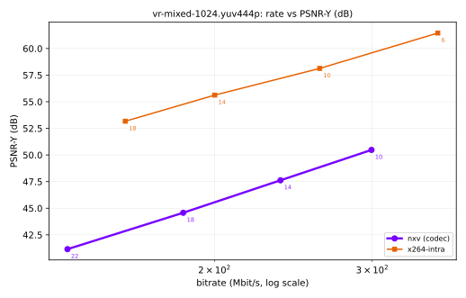

# NX Warp Phase 1 baseline: reference intra codec vs x264 intra

Generated 2026-09-04T04:30:20+02:00 by `tools/quality/report.py`.

Rate is the mean bitrate of the coded elementary stream at the sequence's frame rate (no container overhead). Quality metrics are computed by `tools/quality/nxq/metrics.py` in numpy; VMAF comes from ffmpeg's libvmaf.

## vr-mixed-1024.yuv444p

- **Source**: `synthetic:mixed:seed1`
- **Geometry**: 2048x1024 yuv444p, 6 frames at 90 fps, layout `sbs`
- **ffmpeg**: n9.0.1; encoders: libx264, libx265; VMAF: yes
- **Run**: 2026-09-04T04:29:35+02:00 on `x0x0x0x0x0x`, 34.3 s

### Rate-distortion points

**nxv** (codec under test)

| QP | Mbit/s | kB/frame | PSNR-Y | PSNR-YCbCr | SSIM | MS-SSIM | VMAF |
|---:|---:|---:|---:|---:|---:|---:|---:|
| 22 | 137.10 | 190.4 | 41.16 | 42.12 | 0.9866 | 0.9947 | 95.08 |
| 18 | 184.61 | 256.4 | 44.58 | 45.50 | 0.9923 | 0.9976 | 97.19 |
| 14 | 237.00 | 329.2 | 47.62 | 48.46 | 0.9951 | 0.9985 | 98.47 |
| 10 | 299.42 | 415.9 | 50.48 | 51.21 | 0.9968 | 0.9991 | 98.93 |

**x264-intra** (anchor)

| QP | Mbit/s | kB/frame | PSNR-Y | PSNR-YCbCr | SSIM | MS-SSIM | VMAF |
|---:|---:|---:|---:|---:|---:|---:|---:|
| 18 | 159.05 | 220.9 | 53.17 | 53.57 | 0.9980 | 0.9994 | 99.36 |
| 14 | 200.17 | 278.0 | 55.62 | 55.93 | 0.9986 | 0.9997 | 99.41 |
| 10 | 262.14 | 364.1 | 58.13 | 58.28 | 0.9991 | 0.9998 | 99.45 |
| 6 | 355.02 | 493.1 | 61.45 | 61.33 | 0.9995 | 0.9999 | 99.45 |

### BD-rate

Bjontegaard delta rate of `nxv` against each anchor. Negative BD-rate means fewer bits at matched quality (better); positive BD-PSNR means more quality at matched rate (better).

On **PSNR-Y (dB)**:

| anchor | BD-rate (%) | BD-PSNR (dB) | overlap | method |
|---|---:|---:|---|---|
| x264-intra | n/a | -9.772 | - (the two curves do not overlap in quality (anchor spans [53.17, 61.45], test spans [41.16, 50.48]); pick matched operating points closer together) | cubic |

On **SSIM (Y)**:

| anchor | BD-rate (%) | BD-quality (SSIM (Y)) | overlap | method |
|---|---:|---:|---|---|
| x264-intra | n/a | -0.005 | - (the two curves do not overlap in quality (anchor spans [0.998, 0.9995], test spans [0.9866, 0.9968]); pick matched operating points closer together) | cubic |

### Phase 1 exit criterion

> PAPER.md 3.11: *within 1.0 dB PSNR of x264 intra (`--keyint 1`, zerolatency) at 100 to 400 Mbit on VR captures*

**FAIL** against `x264-intra` over 159.0 to 299.4 Mbit/s (the part of the 100-400 Mbit band both curves cover):

| | dB |
|---|---:|
| worst delta (at 159.0 Mbit/s) | -10.307 |
| mean delta | -9.762 |
| best delta | -9.108 |
| tolerance | -1.000 |

### Angular-velocity split

PAPER.md 2.11 item 1 asks for results on the 20 percent of frames with the highest angular velocity. Threshold 32.2 deg/s, 2 of 6 frames.

| codec | point | Mbit/s | PSNR-Y high velocity | PSNR-Y rest | delta |
|---|---:|---:|---:|---:|---:|
| x264-intra | 6 | 355.02 | 61.46 | 61.45 | +0.01 |
| x264-intra | 10 | 262.14 | 58.13 | 58.13 | -0.00 |
| x264-intra | 14 | 200.17 | 55.60 | 55.64 | -0.04 |
| x264-intra | 18 | 159.05 | 53.16 | 53.18 | -0.02 |
| nxv | 10 | 299.42 | 50.47 | 50.48 | -0.02 |
| nxv | 14 | 237.00 | 47.60 | 47.64 | -0.04 |
| nxv | 18 | 184.61 | 44.56 | 44.59 | -0.02 |
| nxv | 22 | 137.10 | 41.12 | 41.18 | -0.06 |

---

_Plots rendered with matplotlib._
