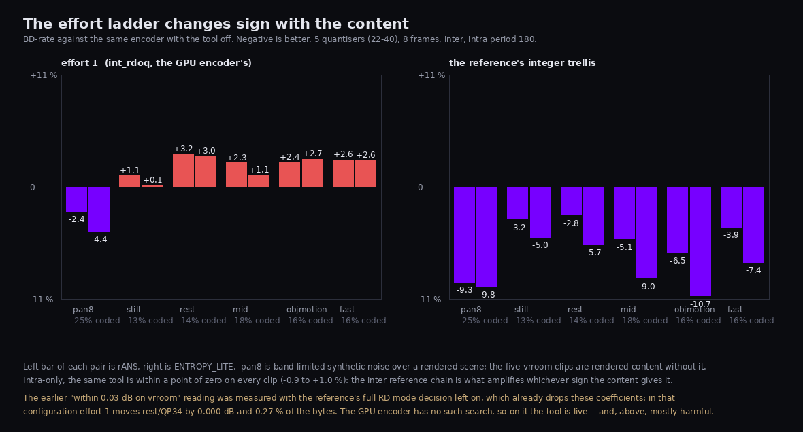

# vk/encoder — the NX Warp GPU encoder

The encoder side of the codec: a chain of Vulkan compute passes, all indirect
where the tile count varies, with no CPU work between them. It runs on the
compositor's own `VkDevice` (Monado's on Linux, the helper's on Windows), so
the source frame is already a `VkImage` in the right device and the handoff is
an image memory barrier plus a timeline semaphore, not a copy.

Specification: `docs/PAPER.md` §3.6 (pipeline shape, timeline values, GPU-side
rate control, host-cached output buffer), §4.6 and §4.6.1 (rate-control inputs
and the degradation ladder), §5.2 (perceptual terms), §1.3 (colour), §3.7
(bit-exactness and vendor rules), §3.2.6 (subgroup portability).

## The pipeline

| Pass | Shape | Work | State |
|---|---|---|---|
| **E0** `convert` | one group per tile, 16×16 lanes | import-format source → tile-major coded planes. RGBA8 / RGB10A2 → YCoCg-R, or 2-plane 4:2:0 YCbCr passed through. 4:4:4 and 4:2:0. | **done** |
| E0b `warp` | fullscreen, 8×8 | warped reference from the previous reconstruction and the pose delta; writes the warped image and the per-tile corner displacements | not started |
| **E1** `stats` | one group per tile, 256 lanes | per-tile mean luma, moments, sum of squared deviations, structure tensor, warped SAD at a per-tile offset | **done** |
| **E2** `prefix` | workgroup scan + single-block second level | exclusive prefix sum over per-tile byte sizes, up to 8192 tiles | **done** |
| **E3** `forward` | one group per tile, 64 lanes | DC-plane intra prediction, residual, forward 8×8 DCT through LDS, dead-zone quantisation with the weighting matrix, sign hiding, coefficients in coding-unit order. Directional intra behind a specialization constant | **done** |
| **E4** `rans_encode` | 8 lanes per tile, 8 tiles per group, persistent | rANS backwards over the operation list into a bounded per-tile slot, over 12, 16 or 27 contexts, built-in or transmitted tables; writes the tile header and the byte count E2 scans | **done** |
| **E4L** `lite_encode` | one tile per group, 64 lanes, one unit per lane | ENTROPY_LITE (30), FIXED variant: five byte-aligned sections per tile, offsets from two prefix sums, no arithmetic coder and no serial state. Selected instead of E4 by `--entropy lite` | **done** |
| **E5** `packetize` | one group per tile | compaction into tile-row segments, tile-row and frame headers, the transmitted table area, straight into the host-cached output buffer | **done** |
| E3b `reconstruct` | one group per tile | the decoder's Pass B, *byte-identical SPIR-V*, writes the new reference | not started |

The pass letters follow the paper's table with one renaming: the paper calls
the transform pass E2 and the reconstruction pass E3, but E2 is taken here by
the prefix sum, so the transform is E3 and the reconstruction becomes E3b.
E0b is a placeholder for work the paper folds into E0.

The reconstruction pass being *byte-identical shader code to the decoder* is
the single most important rule in the project: the encoder must never hold a
reference the decoder cannot reproduce.  E3 already contains the reconstruction
the directional predictor needs (it is the same arithmetic), so E3b is a matter
of writing the reference picture out, not of writing the maths again.

## What is in the tree today

```
stats/
  tile_stats.h        the per-tile statistics record: the ABI between the GPU
                      kernels and rc/, the mode decision, and the packetizer
  rc_adapter.h        converts a record into what nxrc::TileStats wants
  nxe_common.glsl     GLSL mirror of the above plus the shared integer helpers
  E0_convert.comp     colour conversion / passthrough
  E1_stats.comp       per-tile analysis
  E2_prefix.comp      two-level exclusive prefix sum (3 passes, one source)
  stats_cpu.h/.c      bit-exact CPU models of E0, E1 and E2
forward/
  nxe_enc.h           the E3/E4/E5 contract: frame parameters, the per-tile
                      job record, the coefficient and slot geometry
  nxe_tables.h/.c     the normative constant tables, so the directory builds
                      without the reference codec
  nxe_enc_common.glsl GLSL mirror of all of the above
  forward.comp        E3
  rans_encode.comp    E4
  lite_encode.comp    E4-lite (ENTROPY_LITE, tool bit 30)
  lite_cpu.h/.c       its bit-exact CPU model
  packetize.comp      E5 (two variants: zero the frame's bytes, then write)
  forward_cpu.h/.c    bit-exact CPU model of E3
  rans_cpu.h/.c       bit-exact CPU model of E4 and of E5's layout
tools/
  vk_min.h/.cpp       throwaway Vulkan boilerplate; delete when vk/common lands
  nxvc-stats-test.cpp GPU-vs-CPU diff harness and timing for E0/E1/E2
  nxvc-vkenc.cpp      the encoder harness: --in yuv --out nxv
  nxe_host.cpp        its frame driver (the E0 stand-in, the table-set choice)
  nxe_vk.cpp          the Vulkan backend for E3/E4/E5
  nxe_selftest.cpp    the built-in configuration table and its digests
cmake/gen_spv.cmake   glslc → SPIR-V → C array
```

## The two things in E4 that are not obvious

**A GPU cannot materialise the operation list.** `ref/src/entropy.cpp` encodes
a tile by building the whole global operation list and walking it backwards.
But `encode_units` drives the lane machines in *rounds* — one operation per
unfinished lane per round, in lane order — and a lane machine reaches `kDone`
once and never restarts. So lane *l* occupies rounds 0..nops[l]-1 and the
global order is (round ascending, lane ascending). The backward sweep is
therefore eight lanes in lockstep over descending rounds, with a running
emission counter for the byte order and no list at all.

**The bytes are produced back to front.** Their offsets are only known once the
emission count is, which would force a counting pass and then a placing pass
over the same operations. Instead the renormalisation words are anchored at the
*end* of the tile's slot, one whole word each, emission *e* at
`slot_end - 1 - e`: the position is known the moment the word is produced, and
reading that region forwards yields exactly the bitstream's order. It costs a
word per 16-bit emission and buys the whole second sweep.

The other thing worth knowing is that the sign-data-hiding decision, which the
reference makes by comparing `double` squared errors, is reproduced exactly in
integers. Multiplying the comparison by 256 and factoring the difference of
squares gives `-d * step * (32a - (2m + d)*step)`, formed as a 64-bit product
with `imulExtended`; the derivation is at `nxe_hide_sign_unit`.

## The library

`nxvc_vk_encoder` is the installable form: the C ABI in
`include/nxvc/nxvc_vk_enc.h`, built from the same sources `nxvc-vkenc` drives,
so the byte-identity the acid test pins is the byte-identity the library ships.
It is the encoder half of the pair `nxvc_vk_decoder` completes and takes the
same five adopted handles, which is what lets it run on a compositor's own
`VkDevice` — WiVRn's server selects it with the encoder option
`"backend": "vk"`.

Everything the ABI does not expose is a tool that is off. The configuration is
*fixed* at the acid test's flag set rather than defaulted to it: there is no
way through the ABI to ask for directional intra or a transform tool, and
inter, alpha, 4:4:4 and 10-bit are refused at `create()` rather than accepted
and quietly coded as something else.

What the fixed set now contains is every **entropy-side** tool: `CTX_V3` (25),
`CUSTOM_TABLES` (6) and `TAB_V2` (26) alongside `CTX_V2` (21) and `SIGN_HIDE`
(22). All five are lossless -- they change how the coefficients are coded and
never which coefficients there are -- so turning them on moves bytes and not
pixels, and `vk.encoder.acid.api` pins the whole set against `nxv-enc` at the
matching flags. They are worth **9.5 % BD-rate** on the measurement below,
which at the headset's roughly one millisecond of decode per kilobyte is
frame rate.

`nxvc_vke_tile` carries each tile's byte **offset** as well as its length,
which the reference codec's C ABI cannot report. E5 computes the layout, so
this is a read of it; a transport that has it can lose one tile per lost
datagram instead of a whole frame.

Two seams were found by joining E0 to E3 for the first time and are worth
knowing about:

* **`NXE_TS_F_CHROMA_RAW`.** E0's YCbCr passthrough zero-centres chroma, as
  the paper asks, and `nxvc_ref` with `NXVC_CT_NONE` codes it unsigned, as
  `nxvc_image` delivers it. The two are not interchangeable and the difference
  cannot be split, so the flag selects the reference's convention for a stream
  that has to match `nxv-enc`.
* **Two `nxe_frame_params`.** `stats/tile_stats.h` and `forward/nxe_enc.h`
  each define a struct with that tag and different members. They are never
  included together, and the library keeps E0 in its own translation unit for
  exactly that reason.

Tests live in `tests/vk-encoder/` and are named `vk.encoder.*`. Anything
needing a GPU exits 77 and is reported as a ctest skip when no ICD, no device,
or no device meeting the kernels' requirements is present.

`vk.encoder.acid.*` is the one that decides whether the coding passes are
right: it drives `nxv-enc` and `nxvc-vkenc` from one description of the same
synthesized picture, requires the two streams to be byte-identical, and then
requires `nxv-dec` to decode both to identical pixels. It needs the reference
tools, so it exists only in a build from the repo root; the standalone encoder
build gets `vk.encoder.forward.cpu`, which pins the same streams by digest.

The reference side of that comparison is

```
nxv-enc --no-rdo --no-custom-tables --intra-dir off \
        --split4x4 off --cfl off --tab v1 --xform 8 --entropy rans \
        --ctx v1|v2|v3
```

with every tool this pipeline does not implement **named**, not merely absent.
Three of them -- `split4x4`, `cfl` and `tab_v2` -- are on in the reference
encoder's defaults and were previously off here only as a side effect of other
flags, so the test was passing while covering a smaller stream than its own
header comment claimed. See "The minor-6 tools" below.

`vk.encoder.mirror` needs no target and no GPU: it compares every constant
`nxe_enc.h` and `nxe_enc_common.glsl` both define, 53 of them. They are two
hand-written copies of one contract, and the header used to claim static
assertions kept them in step -- which could not be true, because nothing in a
C++ translation unit can see a GLSL `#define`. `NXE_LANE_OPS_CAP` is the worst
case: the host sizes E4's operation scratch from the C header and the shader
strides it from the mirror, so a drift there points every rANS lane at another
lane's slot and writes a wrong stream with nothing logged.

## Data layout

**Tile-major packed planes.** A 64×64 tile is 4096 contiguous samples, so a
workgroup that owns a tile reads one contiguous run and never strides by the
frame width — the layout the Pass-B-style kernels want. Samples are 16-bit
two's complement, two per 32-bit word, low half first. That is the `int16`
storage width §3.7 mandates, packed by hand rather than through an `int16_t`
SSBO so nothing depends on `VK_KHR_16bit_storage` and the shader ALU stays in
`int32` throughout. A thread always owns whole words, so packing is never a
read-modify-write race. Planes are laid out Y, then Co, then Cg.

**Frames that are not a multiple of 64** are padded to the tile grid by edge
replication in E0. Those tiles carry `NXE_TS_F_PADDED`; their statistics
include the replicated samples, because those are the samples actually being
coded.

## Two source paths

On Linux the compositor hands over a `VK_FORMAT_G8_B8R8_2PLANE_420_UNORM`
image (`G10X6_B10X6R10X6_2PLANE_420_UNORM_3PACK16` at 10 bits), already
foveated: the colour conversion and the chroma decimation happened upstream.
On Windows the SteamVR helper hands over RGBA through the D3D11 shared texture
(§3.8). E0 has both paths and the stream header records which colour space the
planes are in — `YCoCg-R` for the RGB path, `YCbCr` for the passthrough.
Converting the compositor's YCbCr to YCoCg-R would inject a rounding error into
every frame before a single bit was coded, because the matrix is not
integer-reversible; passthrough costs nothing and loses nothing. The
passthrough subtracts the chroma midpoint so both paths hand the same shape of
data downstream: unsigned luma, signed zero-centred chroma.

E0 reads the *stored codes* through a UINT view and never applies a transfer
function. The source must therefore already be display-referred; the reasoning
is at the head of `E0_convert.comp`.

## Bit-exactness

The CPU models in `stats_cpu.c` are the specification and the shaders are
validated against them, in the same relationship §3.7 sets up for the decoder.
The argument that the GPU cannot disagree is short: every accumulator is an
integer sum, integer addition is associative (and the `u32` accumulators are
associative modulo 2³²), so the reduction tree the hardware happens to build
cannot change the answer. The kernels read `gl_NumSubgroups` and
`gl_SubgroupID` rather than assuming a width, use only `subgroupAdd` and
`subgroupExclusiveAdd` (core Vulkan 1.1, no clustered ops per §3.2.6), and
combine across subgroups through shared memory with a barrier.

That is why the harness has to run on both lavapipe and RADV: they differ by
4× to 8× in subgroup width, which is the only axis along which these kernels
could go wrong.

## The statistics record and `rc/`

`nxe_tile_stats` is an array of 52-byte integer structs, one per tile.
`nxrc::TileStats` is a struct of arrays of floats. The shapes differ on
purpose — a GPU workgroup wants to write an exact integer record, a CPU
library doing `log2` over a tile array wants floats — and `rc_adapter.h` is the
single place that reconciles them, doing the division and the logarithm on the
host where they are free and harmless.

The one thing that is *not* free to differ is the gradient operator. E1 uses
the central difference with the neighbour clamped inside the tile, which is
exactly what `nxrc::compute_one_tile_stats` uses, because rc's classifier
thresholds are calibrated in absolute units against it. E1 accumulates the
undivided difference (halving an odd difference would need a fraction), so the
record's tensor is exactly 4× rc's, and the cross term is carried as two
unsigned sums so it stays exact and in range at 10 bits as well.

## Building

The directory is self-contained. From the repo root with `-DNXWARP_BUILD_VK=ON`
it is added by `vk/CMakeLists.txt`; on its own:

```
cmake -S vk/encoder -B build-enc -DCMAKE_BUILD_TYPE=Release
cmake --build build-enc -j4
ctest --test-dir build-enc
```

`glslc` is found on `PATH` or in the NDK's `shader-tools`. If the Vulkan
headers are not in `/usr/include`, pass
`-DNXWARP_VULKAN_INCLUDE_DIR=<dir containing vulkan/vulkan.h>`.

To run the diff against a specific device, or against lavapipe:

```
./build-enc/nxvc-stats-test --list
./build-enc/nxvc-stats-test --device 0
VK_ICD_FILENAMES=/path/to/lvp_icd.x86_64.json ./build-enc/nxvc-stats-test --device 0
```

The coding passes have the same shape of harness:

```
./build-enc/nxvc-vkenc --selftest --cpu          # the models and their digests
./build-enc/nxvc-vkenc --selftest --device 0     # GPU against the models
./build-enc/nxvc-vkenc --in f.yuv --w 4096 --h 2048 --eyes 2 --pix yuv420p \
                       --qp 24 --out f.nxv --check --bench 50
```

`--check` runs the CPU models alongside every frame and fails on the first
coefficient or byte that differs; `--cpu` is a complete encoder with no Vulkan
at all. The flags mirror `nxv-enc`'s, which is what lets the two be pointed at
the same input and diffed.

## The minor-6 tools

Bitstream minor 6 added seven tool bits. This is where each one stands on the
**encoder** side, and the reason is different in almost every case -- which is
why the list is here rather than in a commit message.

| bit | tool | encoder | why |
|---|---|---|---|
| 6 | `CUSTOM_TABLES` | **done** | `--custom-tables`; not a minor-6 bit, listed here because 26 needs it |
| 25 | `CTX_V3` | **done** | `--ctx v3`; byte-identical to the reference on every non-directional configuration |
| 26 | `TAB_V2` | **done** | `--custom-tables --tab v2`; byte-identical to the reference |
| 19 | `XFORM_4X4_SPLIT` | not started | needs directional intra first; see below |
| 24 | `INTRA_CFL` | not started | needs directional intra first; see below |
| 27 | `XFORM_LARGE` | not started | follow-up |
| 28 | `NEAR_SKIP` | not started | inter, Phase 2 |
| 29 | `QUAD_MV` | not started | inter, Phase 2 |
| 30 | `ENTROPY_LITE` | **done** | `--entropy lite`; byte-identical to the reference. Negotiated, ships off |

**`CTX_V3` is the one that was worth doing now**, because it is the only
minor-6 tool this harness can actually *prove*. It changes entropy coding
only, so it composes with everything already here, and a `--ctx v3` stream is
not directional -- which means the acid test can compare it against `nxv-enc`
byte for byte. It does: four `v3-` configurations, byte-identical on the CPU
model, on lavapipe and on RADV.

The whole tool is three functions -- `v3_ctx_cbf`, `v3_ctx_last`,
`v3_ctx_level` in `rans_cpu.c`, mirrored in `nxe_enc_common.glsl` -- plus one
piece of per-lane state. The state is the interesting part. The neighbour
class is carried along a **rANS lane**, not along the unit list: a lane owns
units *l*, *l+N*, *l+2N*, … and the class describes the last unit *this lane*
finished, so the derivation is causal inside the lane and needs no cross-lane
read and no barrier. For the ordinary tile that is the block directly above.
E4 has to carry it through a sweep that regenerates units **backwards**, so
phase A -- the only pass that walks a lane's units forwards -- records each
unit's incoming class in the top eight bits of the per-unit slot word, next to
the operation count. A count cannot reach 2²⁴ (`NXE_UNIT_MAX_OPS` is 1411), so
the fallback path costs no extra buffer.

`vk.encoder.forward.diff` covers that fallback only by accident: it engages
when a lane exceeds `NXE_LANE_OPS_CAP` operations, which at QP 0 it does. It
was verified deliberately by rebuilding with the cap at its 1411 floor -- both
copies of the constant, which is a mistake worth making once and is now what
`vk.encoder.mirror` exists to catch -- and confirming all thirteen digests on
both ICDs.

**`XFORM_4X4_SPLIT` and `INTRA_CFL` cannot be done the way the acid test
works today**, and this is the finding that matters most for planning. Both
are on in the reference encoder's defaults, but `ref/src/codec_impl.inc` gates
them on directional intra:

```
e->fp.split4 = (cfg.split4x4 && cfg.intra_dir && !cfg.lossless);
e->fp.cfl    = (cfg.chroma_from_luma && cfg.intra_dir && cfg.ctx_v2
                && !fp.dir_layer);
```

so neither bit can appear in a stream with `--intra-dir off`. And a
directional configuration is exactly the one the acid test *skips*, because
the reference searches its own per-block intra modes and this pipeline takes
them as an input. Worse, both are **encoder decisions** made by the same
per-block rate-distortion analysis that chooses the intra mode -- a `double`
trellis -- so reproducing the coding is not the hard part; reproducing the
*decision* is, and it is the same wall the directional mode search is behind.

So the honest order is: the split and CfL coding can be implemented and
covered by pinned digests the way `dir-replace` and `dir-layer` are, but they
cannot be covered by byte-identity until the mode search itself is either
reproduced on the GPU or exported from the reference. That is a decision about
the harness, not about E3.

**`TAB_V2` and `CUSTOM_TABLES` are done, and they are where the bytes were.**
Both are entropy-side only -- the coefficients E3 produces are the same either
way, and the measured PSNR is identical to four decimal places at every QP --
so they compose with everything here and, like `CTX_V3`, a stream carrying
them is not directional and the acid test can compare it against `nxv-enc`
byte for byte.

The training is host work, and it costs no second look at the frame. The
per-tile table-set choice already builds each tile's full (context, symbol)
histogram -- that is what `select_set` minimises over -- so `train_table_sets`
keeps those histograms, pools them by the set each tile chose, quantises each
row to the 5-bit log-domain delta alphabet, and drops the rows that do not beat
their built-in default by more than the eighty bits they would cost. The
reference's Lloyd loop then reassigns every tile against the trained tables and
retrains, three times.

Two things about that are worth knowing.

* **The tables must be reset to the built-ins at the top of every frame.**
  `f.tabs` holds the previous frame's trained sets, and the reference's
  training pass scores against `deftabs`. Without the reset, frame 1 of a
  sequence is byte-identical and frame 2 is not -- the first assignment of
  every later frame is made against tables the frame does not carry, and the
  training then pools the wrong tiles. It is a one-frame test that cannot see
  it, which is why `ct-multi` in the selftest table is three frames.
* **The decision is doubles, and it stays doubles.** A row is kept or dropped
  by comparing two `std::log2` sums against 80 bits, so a different summation
  order transmits a different set of rows. `log2_prob` memoises
  `log2(v / 1024)` over the 1024 values a probability can take -- the same
  double for the same input, so it is memoisation and not an approximation,
  and it took libm back out of the largest cost of the stage.

The stream side is three fields and one binding: `table_bytes` in
`nxe_frame_params` (it took `pad1`'s word, so the record did not change size),
every E5 offset shifted by it, and an eighth binding on E5 carrying the
serialized area, which the shader lays down between the frame header and the
first tile-row header.

## `ENTROPY_LITE` (30), and what it is for

Lite is the only tool here that is a **decoder** lever. Every other entropy
tool on this list makes the stream smaller at no cost to the headset; Lite
makes it *bigger* and makes the headset's Pass A four times faster, which is
the trade that matters when Pass A is 8-11 ms per eye per frame on the Pico 4
and the frame budget is 11.

The reason Pass A costs that is not arithmetic, it is *latency*: the rANS
round chain is serial per tile, and 289 tiles at eight tiles per workgroup is
thirty-seven workgroups in flight on a GPU that wants hundreds. Lite has no
chain at all. A tile is five byte-aligned sections -- H0, H1, P, S, B -- whose
per-unit bit offsets follow from two prefix sums, so one lane can decode any
unit and, in the FIXED variant, one thread can decode any single coefficient.

`lite_encode.comp` is a **second kernel, not a branch in E4**, and the reason
is that the two want opposite shapes. E4 is eight lanes in lockstep over a
backward round chain, eight tiles to a workgroup, and all of that machinery
exists to serialise an arithmetic coder. Lite has none: a unit's bits depend
on that unit alone and its bit offset is a prefix sum, so the shape that pays
is one tile per workgroup and one unit per lane. Phase A computes every unit's
facts and its width in P, S and B at once; one lane turns the widths into
exclusive prefixes; phase B writes, each lane owning a whole unit. Bits go in
with `atomicOr` over a payload region the kernel zeroes first, because
adjacent units share the byte at their boundary -- and that byte is the only
cross-unit dependency anywhere in the tool.

E5 needed one branch behind a specialization constant: a Lite tile has no
rANS flush states, so its payload is a plain byte run four to a word after the
field word, where E4's is one emission per whole word anchored at the END of
the slot. The bound moved too -- `NXE_LITE_PAYLOAD_MAX` is 28330 bytes against
rANS's 25000, derived section by section -- because a tool that trades bytes
for time has to say so in its own sizing.

### Two things that cost a debugging pass each, and are worth knowing

**The scan tables are in SHARED memory.** `nxe_enc_common.glsl` declares
`nxe_zigzag8` and friends as `shared` and every kernel that reads them must
call `nxe_init_tables()` before its first barrier. E4-lite did not, and the
zigzag came back as whatever LDS held. The stream that produced was internally
consistent, decoded without complaint, and was not the reference's -- which is
the worst shape a bug can have here.

**lavapipe segfaults on a nested loop whose OUTER loop is live on a few lanes
of sixty-four.** Twice: the H0/H1 section written as a loop over the tile's
thirteen coded-unit groups with a loop over each group's units inside it, and
the mode unit handled as a branch inside the unit loop -- three lanes of
sixty-four, with a loop inside. RADV runs both correctly. Both are now flat
loops over the thing there are many of (units, and mode blocks), which is
better code anyway: a unit's H1 bit is `gbase[group]` plus its index in the
group, and a mode block's section-B offset is three bits per non-MPM block
before it, and every lane can work out its own. The rule this leaves behind:
**in this directory, a loop that only a handful of lanes enter should not
contain another loop.**

### Measured

Byte-identity is `vk.encoder.acid.lite.{cpu,0}` (the whole selftest table at
tool bit 30, 18 configurations), `vk.encoder.acid.api.lite` (the C ABI, four
quantisers), `vk.encoder.inter.acid.lite` (WARP_SKIP + INTRA + STATIC_MV), and
five `--selftest` rows including a DIRECTIONAL one, which is the only coverage
of Lite's mode unit and has no reference stream to compare against.
`vk.encoder.lite.decode` closes the loop the other way: `nxvc_vk_decoder`
decodes what this encoder produced to the same pixels `nxv-dec` does, intra
and inter, at QP 22, 30 and 40.

**Bytes per frame**, 1088x1088 4:2:0, 16 frames of the band-limited synthetic
head turn (`gen_synthetic.py --motion turn --seed 7`), `--ctx v3
--intra-dir off`, RX 7900 XTX on RADV. The rANS column carries the entropy
tools the library ships on (frame-trained tables, TAB_V2); the Lite column
cannot, because the syntax forbids the combination.

| QP | intra rANS | intra Lite | | inter rANS | inter Lite | |
|---|---|---|---|---|---|---|
| 22 | 56700 | 68779 | +21.3 % | 16572 | 19487 | +17.6 % |
| 26 | 45629 | 52363 | +14.8 % | 12395 | 13832 | +11.6 % |
| 30 | 36774 | 39211 | +6.6 % | 9298 | 9846 | +5.9 % |
| 34 | 29864 | 29513 | **-1.2 %** | 7214 | 7323 | +1.5 % |
| 40 | 22170 | 19825 | **-10.6 %** | 4970 | 5180 | +4.2 % |

**Lite is not uniformly more expensive, and above QP 34 on intra it is
cheaper.** That is not a surprise once the constant is counted: an rANS tile
pays a four-byte flush state per lane, which is 32 bytes a tile and 9248 bytes
a frame at 289 tiles no matter how little the tile carries. Lite pays nothing
per tile. At QP 22 the payload dwarfs that and Lite costs 21 %; at QP 40 the
flush IS most of an intra frame and Lite wins outright. The headset's range is
22..40 and the honest summary is "between +21 % and -11 %, crossing over
around QP 34" rather than the single figure the decoder's merge report quotes
for its own corpus.

**Pass A**, `nxvc-passA-test --tiles 2048 --iters 50`, RX 7900 XTX on RADV,
the harness's own corpus (610 B/tile rANS, 916 B/tile Lite):

| variant | ballot/dense | ballot/sparse | lds/dense | lds/sparse |
|---|---|---|---|---|
| rANS | 1.193 ms | 1.195 ms | 1.217 ms | 1.184 ms |
| Lite | 0.430 ms | **0.383 ms** | 0.406 ms | 0.405 ms |

**2.8x to 3.1x** on an idle box, variant for variant.
`docs/MERGE-REPORT.md` measured 4.1x on its own corpus and that number is not
being replaced here -- this is the same harness on the same 2048 tiles, and
the two corpora are not the same content.

**The ENCODER is faster too**, which was not the point of the tool and is
worth knowing anyway. `nxvc-vkenc --bench 50`, 1088x1088 (289 tiles), QP 30,
`--ctx v3` with no transmitted tables on either side, RX 7900 XTX on RADV,
median of 50, four runs (the fourth on an idle box):

| | E3 forward | E4 / E4L | E2 | E5 | total |
|---|---|---|---|---|---|
| rANS | 0.343 / 0.399 / 0.436 / 0.384 | 0.885 / 0.967 / 1.049 / 0.973 | 0.013 | 0.014 | 1.255 / 1.402 / 1.525 / 1.390 |
| Lite | 0.117 / 0.116 / 0.128 / 0.117 | 0.144 / 0.196 / 0.199 / 0.196 | 0.013 | 0.013 | 0.286 / 0.353 / 0.367 / 0.355 |

The entropy pass is **5x to 6x** faster, which is the shape of the tool: E4's
eight lanes per tile over a serial round chain against E4-lite's whole
workgroup over independent units.

**The E3 column also moved, and that is NOT explained.** E3 is the same
SPIR-V, the same dispatch and the same buffers on both rows, and it is
repeatably 0.12 ms beside Lite and 0.40 ms beside rANS. The likeliest
mechanism is the timestamp: it is written at COMPUTE_SHADER after the
barrier between E3 and the entropy pass, so it carries that barrier's cache
work, and the rANS path has a 268 MB operation scratch that the Lite path
never touches. That is a hypothesis and not a measurement. Read the E4 and
total columns; do not build on the E3 one.

`XFORM_LARGE` (bit 27) is the largest single win in the tournament and is the
next real piece of work here. It is a second E3 pipeline from the same source
-- `NXE_XFORM_LOG2` is already a specialization constant and every loop bound,
LDS extent and scan lookup derives from it -- plus the `xform_size` field in
word1, the re-gridded DC plane, and `last_shift_of` in the LAST and LEVEL
banding. `v3_ctx_level` already takes `band_scan_pos` as a separate argument
for exactly that reason. The inter tools (28, 29) are Phase 2 and wait on E0b
and E3b.

## What the inter path will cost, measured before it is built

`docs/adr/0028-gpu-inter-needs-an-integer-mode-decision.md` is the decision; this
is the measurement it rests on, repeated here because it changes the order the
work should be done in.

16 frames of a 1088x1088 4:2:0 band-limited synthetic head turn (`gen_synthetic.py
--motion turn`, seed 7, peak 123 deg/s, ideal-warp ceiling 24.6 dB full-frame),
QP 30, `--no-rdo --intra-dir off --preset fast --me-effort 1 --quad-mv off
--near-skip off`, decoded back through `nxv-dec`:

| configuration | B/frame | Mbit/s per eye at 90 Hz | PSNR-Y | vs intra |
|---|---|---|---|---|
| intra only | 32339 | 23.3 | 38.42 dB | 1.00x |
| WARP_SKIP + INTRA only | 16035 | 11.5 | 36.86 dB | 2.02x |
| full inter (SKIP / STATIC_MV / WARP_MV) | 7926 | 5.7 | 36.62 dB | **4.08x** |

Tile modes over 4624 tiles of the full-inter stream: WARP_SKIP 81.0 %, INTRA
8.9 %, STATIC_MV 7.0 %, WARP_MV 3.1 %.

**WARP_SKIP alone is 2.02x and does not reach the 3x the budget needs.** The
10.1 % of tiles carrying a coded vector are worth as much again as the 81 % that
skip, so skip and the coded-vector modes belong in one increment rather than two
milestones -- and **STATIC_MV outweighs WARP_MV more than 2:1** here, so landing
WARP_MV first lands the smaller half.

Three further findings sit in the ADR and are summarised here because they are
about this directory:

* **The reference's default mode decision cannot be reproduced on a GPU.** It
  prices every candidate with a real rate from `table_set_cost`, which is a sum
  of `std::log2` terms; `log2` is not correctly rounded and is not the same
  function on a host libm and on a GPU, and every comparison downstream is a
  `double` derived from it. The GPU encoder therefore gets its own integer
  decision, added to the reference as a preset so the two stay byte-comparable.
* **E3's documented inter hook does not exist.** `nxe_enc.h` claimed E3 "already
  reads its prediction from a buffer (`pred_src`)"; there is no such buffer,
  `forward.comp` has five bindings and none of them is a predictor, and its
  prediction is recomputed by `pred_at()` and never materialised. E3 needs a
  sixth binding and a mode branch. The header has been corrected.
* **The reconstruction rule is unchanged.** The reference the encoder keeps is
  the decoder's own Pass W and Pass B as byte-identical SPIR-V (E3b above), and
  nothing in the decision change touches that.

## What E3b actually needs

The E3b row in the table above says the reconstruction pass is "a matter of
writing the reference picture out, not of writing the maths again", because
"E3 already contains the reconstruction the directional predictor needs".

**That is true only in the directional build.** `s_recon` is declared

```glsl
shared int s_recon[NXE_SC_INTRA_DIR * 4096 + 1];
```

so with `NXE_SC_INTRA_DIR == 0` it is a one-element array, and the
non-directional residual path (`residual_blocks`) never writes it -- the only
writes are in `residual_blocks_dir`.  The non-directional configuration is
exactly the one the acid test pins and the one the library ships, so in the
build that matters **E3 does not reconstruct the tile at all**.  It has no
reason to: the DC-plane predictor needs the reconstructed block *means*, which
`dc_plane` does compute, and nothing else.

This is the third claim in this directory that was written as an accomplished
fact and was not one, after `nxe_enc.h`'s `pred_src` buffer and the static
assertions that could not see a GLSL define.  The pattern is worth naming: all
three were about a *future* consumer, and nothing compiled against them, so
nothing failed.

So the encoder's reference store is two halves, and only one of them is easy:

* **skipped tiles.**  A WARP_SKIP tile's reconstruction IS its predictor --
  the decoder clamps the warped samples and adds no residual -- so the store is
  Pass W's output moved into the ring's layout.  `inter/E3b_ring.comp` does
  exactly that and mirrors `nxvwRefRingStore` line for line.  It is compiled
  but **not dispatched**, because it is useless on its own: frame 0 is
  all-intra, so a ring with no intra tiles in it has nothing for frame 1 to
  predict from.
* **intra tiles.**  Blocked, and deliberately not worked around.  The two ways
  to get the reconstruction are to compute it in E3 -- dequantise, inverse
  transform, add the prediction, clamp -- or to run the decoder's Pass B on the
  encoder's coefficients.  The first is a re-derivation of the decoder's
  arithmetic, which is the one thing the E3b rule exists to forbid, and it
  would be a second copy of the maths that agrees until it does not.  So the
  route is Pass B, and the work is an adapter: Pass B wants Pass A's buffers
  (`Coef` in its sparse or dense layout, `TileRecs`, `Modes`, `TileOrder`,
  `UnitLens`) and a destination image it does not need here, and the encoder
  has the coefficients in its own per-tile layout.  That adapter is the next
  piece of work, and it is a piece of work rather than a line of glue.

## Measured: the inter path

`nxvc-vkenc`, RX 7900 XTX on RADV, QP 30, 16 frames, one eye, 4:2:0, with the
entropy tools the library ships on (frame-trained tables, TAB_V2, CTX_V3).
`NXE_TIME=1`, mean over frames 2..15 so the first two -- which pay pipeline
warm-up -- are excluded.  The GPU was idle apart from the desktop compositor;
nothing else was submitting.

| per eye | config | pre-E3 | tables | E4/E5 | total | B/frame |
|---|---|---|---|---|---|---|
| 1088x1088 | intra only | 2.14 | 0.99 | 1.03 | **4.06 ms** | 36779 |
| 1088x1088 | inter, skip+intra | 2.22 | 0.54 | 0.85 | **3.30 ms** | **13446** |
| 2048x2048 | intra only | 6.97 | 2.63 | 1.06 | **12.01 ms** | 129826 |
| 2048x2048 | inter, skip+intra | 7.28 | 1.72 | 0.92 | **11.08 ms** | 85142 |

**Inter is cheaper as well as smaller.**  At 1088x1088 it is 2.73x fewer bytes
and 0.76 ms *faster*, which is not a paradox: Pass W, the decision and the
Pass B reference store cost 0.08 ms between them, and a frame in which 82 % of
the tiles carry no payload gives back more than that in table training (0.99 ->
0.54) and in E4/E5 (1.03 -> 0.85).  The passes that got cheaper are the ones
whose work is proportional to the number of CODED tiles.

Two things this table is not:

* **The 2048x2048 rate is not a content result.**  That source is the
  1088x1088 clip mirror-tiled up, and the pose track belongs to the 1088
  geometry, so the mirrored halves move the wrong way under the warp and the
  skip fraction collapses.  It is there to time a 4-Mpix frame, and the timing
  is honest; read the rate at 1088 only.
* **`tables` is HOST time, and it was measured on four cores at `nice -n 19`.**
  It is the frame's table training, which is CPU work beside the GPU rather
  than on it.  A compositor with the machine to itself will see less; this
  column is a floor on the win, not a measurement of the encoder.

## STATIC_MV, and what WARP_MV would cost

E3 has its inter residual path: a coded inter tile subtracts Pass W's
predictor, and its DC plane codes the block means of THAT residual, offset back
so the quantised quantity is the same `m - dc_off` on both paths.  An intra
tile's reconstructed mean is clamped to the sample domain and an inter tile's
is not, because the latter is `dc_offset + a residual mean` and clamping it
would cap the DC correction the warp needs -- `reconstruct_dc_plane()` makes
exactly that distinction and Pass B inherits it.

1088x1088, QP 30, 16 frames, the real pose track, byte-identical to `nxv-enc`
at each setting:

| configuration | B/frame | vs intra | PSNR-Y | total |
|---|---|---|---|---|
| intra only | 36779 | 1.00x | 38.42 dB | 4.94 ms |
| inter, skip only | 13446 | 2.73x | 36.92 dB | 4.79 ms |
| inter, + STATIC_MV | **9303** | **3.95x** | 36.30 dB | **4.69 ms** |

**STATIC_MV is free.** It costs 0.03 ms in the passes before E3 and gives it
back in table training and E4/E5, because a frame with fewer coded tiles is
cheaper everywhere those passes scale with coded tiles.  The whole inter
encoder is still faster than the intra one.

### WARP_MV is measured and is NOT obviously worth it

The reference at `--int-coded-vectors on` against `static`, same clip:

| | B/frame | PSNR-Y | STATIC_MV | WARP_MV |
|---|---|---|---|---|
| `static` | 9303 | 36.30 dB | 11.0 % | -- |
| `on` | 8729 | 36.18 dB | 7.7 % | 1.9 % |

**6.2 % fewer bytes, and 0.12 dB worse.**  WARP_MV mostly takes tiles away
from STATIC_MV rather than from INTRA or WARP_SKIP.

The GPU cost is the question.  STATIC_MV is searchable here because its
predictor is the IDENTITY plus a vector, so a candidate is a translation of the
ring and the quarter-pel tap is eight lines of integer arithmetic.  WARP_MV's
predictor is the full homography, and the quarter-pel stage needs the TRUE
predictor at nine vectors.  The naive route is nine more Pass W dispatches per
frame -- about 1.6 ms at 1088x1088, which is a third of the whole encode for
6 % of the rate, and not worth it.

The route that would be worth it, if the rate is wanted: SYNTAX.md 13.10 adds
the vector per sample AFTER the tile's corner interpolation, so the warped
coordinate field is computed once per tile and the nine candidates are nine
shifts of it.  The expensive and delicate part -- the perspective divide in
`warp_tile_corners()` -- can then stay on the HOST in the normative library,
which the encoder already links for `derive_homography()`, and the GPU does
only the in-tile bilerp and the bilinear tap: the same code STATIC_MV already
uses, of which STATIC_MV is the identity case.  That is not a second copy of
the homography.  It is not implemented, and this table is why it was not
implemented first.

## What the coding passes do not implement

What the coding passes do **not** implement, and refuse rather than ignore:
inter prediction, resolution levels, alpha, and
more than eight rANS lanes on the GPU path (`--nsub 4` and `5` are CPU-only;
paper 6.3 fixes v1 at eight). The RD trellis is deliberately absent: it changes
which levels are coded, never how they are decoded, and it is a `double`
trellis. `--no-rdo` is the reference configuration this pipeline reproduces.

## Snapping the warp to the identity

`--snap-identity N` (`nxe::Config::snap_identity`, N in 1/16 luma samples,
0 = off) replaces a nearly-still warp with the **identity** matrix. Encoder
side, no syntax: an identity `warp_ext` is an ordinary matrix -- it is what a
frame with no reference carries -- and the decoder then takes its copy fast
path on every skipped tile (`NXVW_ABL_IDENTITY`, docs/PASSB-ADRENO-PLAN.md 3b)
instead of running the integer warp.

**Why it is worth anything at all.** On the Pico, 8.25 of 13.7 ms of Pass B per
pair is the integer warp on WARP_SKIP tiles, and at rest almost all of that
buys sub-sample motion nobody can see. The decoder's predicate is three
conditions; this encoder satisfies two of them for free, because
`update_pred_state` records a vector only for WARP_MV and this encoder never
emits WARP_MV, so every stored vector is permanently (0, 0) -- a whole sample.
The third condition is the corners, and that is what the snap supplies.

The decision is **per frame, on the worst tile corner in the picture**, both
eyes together: they are one picture to the decoder's skip module, and snapping
one eye while the other warps would buy half the saving for all of the error.
Every tile corner is evaluated rather than the picture's four, because the map
is projective and the extreme need not be at a picture corner.

### Measured

`nxvc-vkenc` on RADV, `gen_synthetic.py` clips at 1088x1088 (289 tiles) and
2x1088x1088 (578 tiles), 8 frames, `--inter --coded-vectors --intra-period 6
--ctx v3 --custom-tables --tab v2 --intra-dir off`, every stream decoded back
through `nxv-dec`. "identity" is the share of tile-frames whose warp is the
identity, which is the share the decoder's fast path takes.

| clip | QP | threshold | B/frame | vs off | luma PSNR | identity | frames snapped |
|---|---|---|---|---|---|---|---|
| rest, mono | 26 | 0-8 | 18593 | -- | 39.74 | 0 % | 0/7 |
| rest, mono | 26 | **16** | 18602 | +0.05 % | 39.69 | **28.6 %** | 2/7 |
| rest, mono | 26 | 24-32 | 18598 | +0.03 % | 39.64 | **42.9 %** | 3/7 |
| rest, mono | 34 | 0-8 | 11112 | -- | 34.67 | 0 % | 0/7 |
| rest, mono | 34 | **16** | 11011 | **-0.91 %** | 34.64 | **28.6 %** | 2/7 |
| rest, mono | 34 | 24-32 | 10994 | -1.06 % | 34.57 | 42.9 % | 3/7 |
| rest, stereo | 26 | **16** | 36474 | +0.07 % | 39.64 | 28.6 % | 2/7 |
| rest, stereo | 26 | 24-32 | 36550 | +0.28 % | 39.64 | 42.9 % | 3/7 |
| rest, stereo | 34 | **16** | 21785 | **-0.49 %** | 34.73 | 28.6 % | 2/7 |
| rest, stereo | 34 | 24-32 | 21789 | -0.47 % | 34.70 | 42.9 % | 3/7 |
| mid (30 deg/s) | 26, 34 | 0-32 | unchanged | -- | unchanged | **0 %** | 0/7 |
| fast (150 deg/s) | 26, 34 | 0-32 | unchanged | -- | unchanged | **0 %** | 0/7 |

Three things fall out of that table.

**Nothing snaps below one whole sample.** A head "at rest" is not still: the
generator's `static` profile at 4.5 deg/s moves a tile corner about 0.57
samples a frame, so thresholds of 2, 4 and 8 sixteenths produce a stream
byte-identical to the tool being off. The sweep's whole lower half is a null
result and it is the useful half: **a sub-sample threshold is not a
conservative setting, it is an inert one.**

**It sometimes makes the stream SMALLER.** At QP 34 the snapped stream is
0.5-0.9 % smaller. An identity predictor on a picture that has not moved is a
*better* predictor than a sub-sample warp of it, because the warp resamples --
four taps of a picture that was already right -- and the residual pays for the
blur. The saving is small and the direction is the point.

**Motion kills it outright.** At 30 deg/s nothing snaps at any threshold tried,
including two whole samples. This is a REST tool, and the honest way to read
the identity column is as an availability figure for still frames rather than
as a codec-wide win.

### What it is worth on the headset

The saving is `identity tiles x 34 us` on the Pico's Adreno, which for the
578-tile stereo pair at threshold 16 is `0.286 x 578 x 34 us` = **5.6 ms per
pair** on the frames it fires, against a measured Pass B warp share of 8.25 ms.
At threshold 24 it is `0.429 x 578 x 34 us` = **8.4 ms**, which exceeds that
share and is the sign to read the arithmetic as an upper bound: 34 us/tile is
the whole skip module and the warp is 86 % of it, so the honest bracket is
**4.8 to 7.2 ms per pair on a snapped frame** and zero on the frames the
threshold does not catch. Nothing here has run on the device; this is
arithmetic on somebody else's measurement, and it is a reason to measure rather
than a result.

### The clip that says "rest" and is not

The vrroom corpus's `rest` trajectory -- the one the device fixtures use -- has
a worst tile-corner displacement of **min 5.5, mean 25.7, max 41.2 sixteenths
of a sample per frame**, about 2.5 samples. That is forty times the 0.57 of the
generator's `static` profile, and it is why the device rows measure an identity
fraction of 0/578 today: not because the pose delta is merely never bit-exactly
zero, but because the head is moving two and a half samples a frame.

Snapping it needs a threshold of 48/16 = three samples, and at three samples
this stops being a rounding: on that clip it costs **4.0 dB and 2.3x the
bytes** (34.89 -> 30.89 dB, 144212 -> 337974). The stream built that way
(`nx-scratch/fixtures/device/vrroom-rest-sbs578-inter-snap.nxv`) is a TIMING
fixture -- it makes the decoder's copy segment non-empty at 578 tiles so it can
be measured -- and its rate and quality must not be read as what the tool
costs.

"Rest" in that corpus means a seated human, not a tripod. A tool aimed at
still frames needs a fixture that is actually still, and the generator's
`--motion static --peak-rate 4.5` is the one this section measures on.

**Recommended default: 16** -- one whole sample. It is the smallest threshold
that does anything at all, it costs 0.05 dB and between -0.9 % and +0.07 % of
bytes, and it is the value at which the error a snap introduces is bounded by
half a sample, which is the same bound the quarter-pel vector search already
lives with. 24 buys half again as many frames for another 0.05 dB and is
defensible; 32 buys nothing over 24 on any clip measured. The tool ships **off**
(`snap_identity = 0`) until the Pico measurement exists.

Two pictures, in docs/GALLERY.md: the per-tile map of what the decoder copies,
and the threshold sweep.

## The effort levels, measured

`nxvc_vke_create_info::effort` buys bytes with server GPU time. There are two
levels, and the interesting part of this section is why there is no third.

| level | what it adds | `nxv-enc` flags on top of the acid set |
|---|---|---|
| 0 | the plain dead-zone quantiser | -- |
| 1 | the **integer requantiser**: a level of ±1 whose squared error is worth less than the bits it saves is dropped | `--int-rdoq 1` |

Every level is byte-identical to `nxv-enc` at those flags, on the GPU and on
the CPU model, over rANS and Lite, intra and inter; `vk.encoder.acid.effort.*`
is that claim.

### What each level is worth

`nxvc-vkenc` on RADV (RX 7900 XTX), the `pan8` synthetic pan clip
(`gen_synthetic.py --motion pan --seed 7`), 8 frames, inter with STATIC_MV
searched, `--ctx v3`, QP 22/26/30/34/40, every stream decoded back through
`nxv-dec` and the luma PSNR taken against the source. BD-rate is against
effort 0 over the five points.

| clip | entropy | effort 1 | wider search (`--mv-range 31`) | both |
|---|---|---|---|---|
| 1088×1088, 289 tiles | rANS | **-1.36 %** | -0.42 % | -1.88 % |
| 1088×1088, 289 tiles | Lite | **-3.53 %** | -0.66 % | -4.14 % |
| 2×1088×1088, 578 tiles | rANS | **-1.54 %** | -0.05 % | -1.45 % |
| 2×1088×1088, 578 tiles | Lite | **-3.60 %** | +0.09 % | -3.53 % |

At QP 30 on the stereo clip that is 28761 → 26333 B/frame for 0.68 dB, and
26333 B is what effort 0 needs about 1.5 quantiser steps of quality to reach.
**Lite gains twice as much as rANS**, which is the shape of the tool rather
than an accident: Lite spends a fixed field on every coded coefficient, so a
dropped ±1 saves a whole field, while rANS was already coding that level at
close to its entropy.

And it is free:

| 578 tiles, 5 runs × 8 frames, median ms/frame | effort 0 | effort 1 | + `--mv-range 31` |
|---|---|---|---|
| rANS, QP 26 | 9.12 | **9.18** | 9.55 |
| rANS, QP 30 | 9.07 | **9.21** | 9.53 |
| Lite, QP 26 | 6.19 | **6.00** | 6.32 |
| Lite, QP 30 | 6.06 | **5.97** | 6.62 |
| 289 tiles, rANS, QP 30 | 5.56 | **5.61** | -- |

Effort 1 is inside the run-to-run spread of effort 0 — it is 64 extra integer
compares per block inside a pass that was already resident and already reading
those two arrays. The wider search is **not** free: it is 0.3–0.6 ms a frame,
because the sweep is (2r/2+1)² candidates and 31 is 1024 of them against 16's
289.

**The recommendation was effort 1**, for any budget. At 90 Hz the server has
about 11 ms a frame, of which the encoder is spending 9.1 (578 tiles, rANS)
or 6.1 (Lite); effort 1 does not move that and takes 1.5–3.6 % off the wire.

**It is withdrawn on rendered content.** Everything above is measured on the
`pan8`/`pan8s` fixtures, and the sign of the result does not survive the move
to the vrroom corpus. See "The effort levels, re-measured on rendered content"
below; the short version is that effort 1 pays only on `pan8`, and the default
should be effort 0.

### Why there is no level 2

A level 2 would have to be a wider or finer search, a rate-distortion mode
decision counting real bits, or an RDOQ over more than one level. All three
were priced on the REFERENCE encoder first, which is the right place: the GPU
reproduces `nxv-enc --int-decision on` byte for byte, so a knob that does not
move the rate there cannot move it here. Same clip, same five quantisers,
BD-rate against the same effort-0 curve:

| reference-side candidate | BD-rate | can it cross to the GPU? |
|---|---|---|
| `--mv-range 32` (a wider sweep) | **+0.00 %** | yes, and it is worth nothing |
| `--quad-mv on` (WARP_MV searched) | -2.02 % | no: its predictor is the full homography |
| `--rdoq-effort 1` (the fast trellis) | -5.71 % | no |
| `--rdoq-effort 3` (the full trellis) | -6.64 % | no |
| `--qp-search 2` (per-tile QP offsets) | -6.79 % | not without a rate model on the device |
| `--rdoq-effort 3 --qp-search 2` | -6.79 % | no |
| that plus WARP_MV | -8.93 % | no |
| `--int-decision off` (the float mode decision) | -8.63 % | no |
| the DEAD ZONE retuned (`NXVC_DZ_AC`, twelve profiles) | best -0.26 % | yes, and it is worth nothing |

The trellis is the biggest thing on that list that is *about the quantiser*,
and it was ruled the one that cannot cross. `rdoq_unit` prices every candidate
level with a real rate from `table_set_cost` — a sum of `std::log2` terms — and
walks a trellis over the scan. Neither half was thought to survive: `log2` is
not the same function on a host libm and on a device, and a trellis over the
scan is a serial dependency where the hardware wants sixty-four independent
lanes.

**Both halves of that turned out to be wrong, and the section below is the
measurement.** `RateCost` was always Q10 integers — the `log2` is in the table
that *builds* it, which `nxe_neglog2.inc` now replaces — and the serial chain is
serial only within one 8x8 unit, of which a 64x64 plane has sixty-four.

What is left of it, once both halves are removed, is one coefficient at a time
against a constant rate — which is effort 1, and which recovers a quarter of
the trellis's rANS gain and two thirds of its Lite gain for none of its cost.

The dead zone is the other integer-friendly knob and the other negative
result. It is four offsets in forty-eighths of a step, `NXVC_DZ_AC` overrides
them, and the encoder's own quantiser is `(16|c| + dz) / t` on both sides -- so
a profile that paid would be a level, and a cheap one. Twelve profiles were
swept on the same clip and quantisers: the shipped flat 16 is inside 0.3 % of
the best of them (flat 13, **-0.26 %**), every ramp over the four scan bands is
worse (+2.4 % to +28 %), and a narrower flat dead zone trades rate for PSNR
about as efficiently as the quantiser itself does (flat 10 is +1.12 %). The
current value is where it should be, which is a duller finding than a tool but
is the reason there is no tool.

The wider search is the opposite finding and the more surprising one: it is
implementable, exact, and worth nothing. The reference at `--mv-range 32`
produces a stream within one byte a frame of the 16 one at four of five
quantisers. The reason is that the pose warp has already removed the global
motion before the search runs, so what is left is object motion inside a
64×64 tile, and the ±16 sweep already reaches it; a candidate 24 samples away
is not a better prediction of a disc that moved four. `--mv-range` stays on
both harnesses, and `vk.encoder.acid.effort.*` pins the two encoders together
at 31, so the measurement can be repeated on other material rather than
believed.

Per-tile QP offsets (-6.79 %) are the candidate worth revisiting, and they are
a project rather than a level: the reference chooses `qp_delta` by comparing
D + λR over candidate quantisers with R from its own rate model, which is the
same `double` estimate the mode decision could not use. An integer version
needs a bit estimate the device can trust, which is the piece of work ADR 0028
deferred. **That estimate now exists** — see below — and the decision that
would use it does not.

## The effort levels, re-measured on rendered content

The section above recommends effort 1 on the strength of −1.4 to −3.6 % BD-rate
on `pan8`/`pan8s`. A separate reading of the same tool on the vrroom corpus
reported that it "does nothing (within 0.03 dB) across all four fixtures".
Both are reproducible, and neither is the whole answer.



### The 0.03 dB reading is a configuration, not a property of the content

`nxv-enc` without `--no-rdo` runs the reference's full rate-distortion mode
decision, which already discards the coefficients a requantiser would drop.
Run in that configuration the tool is very nearly inert, and the earlier number
comes back exactly:

| `rest`, QP 34, `--atlas on --atlas-picture-disp 8 --intra-dir on` | PSNR | bytes |
|---|---|---|
| `--int-rdoq 0` | 34.204 dB | 29433 |
| `--int-rdoq 1` | 34.204 dB | 29355 |

0.000 dB and 0.27 % of the bytes. **The GPU encoder has no such search** — that
is why `int_rdoq` exists on it at all — so the number that decides the GPU
default has to be measured with `--no-rdo`, or on `nxvc-vkenc` itself. With
that done, the tool is not inert on vrroom at all: at QP 34 it costs 0.6–1.4 dB
and saves 7–12 % of the bytes on every clip in the corpus. Whether that trade is
worth taking is a question only a rate-distortion curve can answer, and a
single-quantiser dB comparison cannot.

### The curve says the sign depends on the content

BD-rate over QP 22/26/30/34/40, 8 frames, `--eyes 2` (mono for `pan8`), inter,
intra period 180, against the same encoder with the tool off. Negative is
better. `coded` is the share of tiles outside the skip bitmap — the only tiles
a requantiser can act on.

| clip | coded | effort 1, rANS | effort 1, Lite | ref trellis, rANS | ref trellis, Lite |
|---|---|---|---|---|---|
| `pan8` | 25.0 % | **−2.41 %** | **−4.38 %** | −9.35 % | −9.82 % |
| `still` | 13.0 % | +1.09 % | +0.12 % | −3.18 % | −4.96 % |
| `rest` | 14.0 % | +3.19 % | +2.99 % | −2.77 % | −5.65 % |
| `mid` | 18.0 % | +2.35 % | +1.15 % | −5.12 % | −9.00 % |
| `objmotion` | 16.4 % | +2.43 % | +2.73 % | −6.47 % | −10.70 % |
| `fast` | 15.6 % | +2.65 % | +2.59 % | −3.94 % | −7.41 % |

The reference's integer trellis is negative on all six. Effort 1 is negative on
exactly one — the fixture the low-poly work already called "unusually kind".

The obvious confounder is the coded-tile fraction: `pan8` codes 25 % of its
tiles and the vrroom clips 13–18 %, so perhaps real inter content simply leaves
too few coefficients to requantise. It does not hold. Shortening the intra
period to 6 raises the coded fraction on both — `pan8` to 36.7 %, `rest` to
27.5 % — and the signs do not move:

| clip | intra period | coded | effort 1, rANS | effort 1, Lite |
|---|---|---|---|---|
| `pan8` | 180 | 25.0 % | −2.41 % | −4.38 % |
| `pan8` | 6 | 36.7 % | −1.36 % | −3.53 % |
| `rest` | 180 | 14.0 % | +3.19 % | +2.99 % |
| `rest` | 6 | 27.5 % | +2.29 % | +2.01 % |

Nor is it the entropy coder: rANS and Lite agree on the sign in every row above.

### Where the magnitude comes from

The requantiser prices a dropped coefficient against **this frame only**. On an
inter stream a coded tile's reconstruction is also the next frame's reference,
so an error it introduces is paid again downstream — a cost the decision never
sees. Coding the same clips intra-only removes the chain, and with it almost
the whole effect, in *both* directions:

| clip | entropy | inter | intra-only |
|---|---|---|---|
| `pan8` | rANS | −2.03 % | +0.58 % |
| `pan8` | Lite | −4.17 % | −0.85 % |
| `rest` | rANS | +3.49 % | +1.03 % |
| `rest` | Lite | +2.92 % | +0.26 % |
| `objmotion` | rANS | +2.59 % | +1.04 % |
| `objmotion` | Lite | +2.33 % | +0.28 % |

(6 frames, same quantisers; the inter column is re-run here at 6 frames, so it
differs slightly from the 8-frame table above.)

Intra-only the tool is worth between −0.9 % and +1.0 % everywhere: the immediate
rate-distortion trade it makes is close to a wash, on kind content and unkind
alike. The inter chain is the amplifier, and what it amplifies is whether the
±1 coefficients being dropped were noise or signal. `pan8` is band-limited
synthetic noise laid over a rendered scene; dropping its ±1s leaves a *cleaner*
reference, the next prediction is better, and the gain compounds. The vrroom
clips have no such layer — their ±1s are specular detail and thin geometry —
so dropping them degrades the reference and the loss compounds instead.

That is also why the constant 3-bit rate estimate (`NXE_RDOQ_BITS_Q8 768`) is
not the fixable part. Making it exact would move the intra-only column, which
is already within a point of zero. The term that is missing is propagation, and
a single-frame requantiser cannot have it.

### What to ship

**Effort 0 is the default and callers should leave it there.** The library
default was already `NXVC_VKE_EFFORT_DEFAULT`; what this measurement withdraws
is the advice to raise it. Effort 1 stays selectable and stays byte-identical
to `nxv-enc --no-rdo --int-rdoq 1`, but it is a `pan8` result, and the WiVRn
server's `"effort": 1` should go back to 0 — on rendered content it costs
0.1–3.2 %, which is real bytes on a wireless link for nothing.

Where a CPU encoder is in the loop, the tool that pays is the reference's
integer trellis (`--int-trellis 1 --rdoq-effort 3`): −2.8 to −10.7 % on the
same six fixtures, and negative on every one of them. It has no GPU
implementation, and this measurement is the argument for writing one — a level
2 that is the trellis, not a wider search.

```sh
FX=nx-scratch/fixtures/vrroom nx-scratch/effvr/sweep.py     # the corpus
FX=nx-scratch/enceffort/fx W=1088 H=1088 EYES=1 \
  OUT=nx-scratch/effvr/pan.json nx-scratch/effvr/sweep.py pan8
nx-scratch/effvr/intra.py                                  # inter vs intra-only
nx-scratch/effvr/chart.py                                  # docs/assets/effort-vrroom.png
```

## The trellis, in exact integers

`nxv-enc --int-trellis 1`, and `nxvc_config::int_trellis`.

The same trellis: same three states over the previous level's class, same
candidate magnitudes per effort, same LAST decision, same provable `hi` bound.
Three things change and nothing else does:

* **the distortion** becomes `orig - dequant(m, step)` — the decoder's own
  reconstruction through `(q * t + 8) >> 4` — instead of the float
  `a - m * (step / 16.0)`. That is not merely an integer spelling of the same
  number, it is the right number: the double form was pricing an error the
  decoder never makes. `int_rdoq_unit` has always measured it this way.
* **the rate** does not change at all. `RateCost::sym` was already `i32` Q10
  bits; what was floating was the `std::log2` that *built* it, and
  `scripts/gen-neglog2.py` is that function as a table.
* **the accumulator** becomes `(d * d) << 18` plus `lam_q8 * rate_q10` in
  `i64`, with no division anywhere. A position's cost is under 2^48 and a
  1024-coefficient unit accumulates to 2^58, which fits.

Lambda is `(901 * t * t) >> 12` over the Q4 step — the same integer family the
requantiser uses, with `ref`'s own rate-distortion constant (`kLambdaScale`
0.22, and 0.22 x 4096 = 901) rather than the requantiser's 0.342.

There is no epsilon and no tolerance in any of that, which is the point: two
implementations that perform these adds in this order reach the same levels or
one of them has a bug. That is what a GPU needs and what the doubles could
never promise.

### Measured

1088x1088, 8 frames, QP 22/26/30/34/40, BD-rate against effort 1
(`--no-rdo --int-rdoq 1`):

| | pan8 rANS | pan8s rANS | pan8 Lite | pan8s Lite |
|---|---|---|---|---|
| trellis, double, `--rdoq-effort 3` | -4.07 % | -2.26 % | -4.51 % | -5.34 % |
| **trellis, integer, same effort** | **-4.04 %** | **-2.20 %** | **-3.97 %** | **-5.09 %** |
| trellis, double, `--rdoq-effort 1` | -3.11 % | +2.15 % | -4.72 % | -5.30 % |
| trellis, integer, `--rdoq-effort 1` | -3.11 % | +1.98 % | -4.70 % | -5.29 % |

**Integerising the trellis keeps its gain**: about **-3.1 % on rANS and -4.5 %
on Lite**, averaged over the two clips, at the full effort. (The fast trellis at
effort 1 is not the one to take: it is *positive* on pan8s rANS, so it can lose
rate on a clip the full one wins.)

The AC blocks alone integerise for nothing -- measured against the double
trellis they were identical to 0.02 %. The half-percent that does move is the
**DC plane**, which is the intra predictor: a level chosen there changes `pred`
for all sixty-four blocks, so the sub-half-step difference between
`m * (step / 16.0)` and `dequant(m, step)` is amplified. Leaving the DC plane on
the dead-zone quantiser instead was tried and is worse on average -- pan8 rANS
-4.09 %, pan8s rANS **-1.59 %**, for -2.84 % against the integer DC's -3.12 % --
so the DC plane goes through the integer trellis and the half-percent is what it
costs to have a trellis a shader can run at all.

Sign data hiding goes with it: `hide_sign_unit_int` is the same move search on
the same footing, so the trellis and the sign move it has to live with are
decided by one arithmetic rather than two.

Streams from it decode through `nxv-dec` and `nxvc-vkdec` to the same bytes.
`vk.encoder.trellis` pins the two trellises within 2 % per quantiser — they are
byte-identical at QP 30 and 40 on its fixture and within 0.2 % at QP 22 — and
requires the integer one to beat effort 1.

### Effort 2: the trellis in the encoder's own CPU model

`nxvc-vkenc --cpu --trellis 1`, and it is **byte-identical to
`nxv-enc --int-trellis 1 --rdoq-effort 3`** at the acid flags, on both entropy
coders, at QP 22/26/30/34/40. `vk.encoder.trellis.cpu` is that claim.

The trellis itself (`forward/nxe_trellis.c`) is a transcription and was right
almost immediately. What took the work was the ORDER the two encoders quantise
and train in, and it is worth writing down because none of it shows up as a
broken stream -- every wrong version decoded perfectly and was merely the wrong
size:

* **the first pass has to run the trellis**, not the dead-zone quantiser. ref's
  pass 0 quantises with the trellis against the built-in tables and trains the
  eight sets on *those* histograms; training on dead-zone coefficients puts
  every tile in a different set. Measured: 6312 bytes against the reference's
  5166 on the acid fixture, and byte-identical with custom tables off, which is
  what pointed at the tables rather than at the arithmetic.
* **each tile picks its table set from a plain quantisation of itself** before
  the trellis prices anything -- ref's inner two-pass, "so that the second,
  rate-distortion pass is costed against the table that will actually code it".
  Pricing against the QP-seeded set instead was a constant 14 bytes: a per-tile
  header field, not a coefficient.
* **the final per-tile choice is made against the trained sets**, without
  restoring the built-in ones first. `choose_table_sets` resets to the built-in
  tables before selecting, which is right for the training pass -- its job is to
  assign tiles to built-in sets so the trained ones can be pooled from them --
  and wrong for the emit pass, where the trained sets are what the stream
  carries.
* and under ENTROPY_LITE the trellis still needs *a* rate model. `table_set`
  names the variant in a Lite tile header, but ref runs `select_set` whatever
  the entropy tool is and prices against `tabs[table_set]`, so the set is chosen
  for the rate model and the header's value put back.

Effort 2 therefore quantises the frame twice with rANS custom tables on, and
once without -- there is nothing for a second pass to be against when the
tables never moved.

### What still differs

One case, and it is precise rather than vague: **8 frames, QP 34, rANS with
custom tables** diverges at frame 7, by 68 bytes of 15449. Three frames is
byte-identical at every quantiser, both coders; 8 frames is byte-identical at
QP 22, 26, 30 and 40 and on Lite at every quantiser. Both encoders are
deterministic (three runs of each, one hash), so it is a real logic difference
in the training convergence and not a race. It is not chased here and the test
runs at three frames rather than pinning a length that is known to fail.

### What is not built: the shader

The trellis runs in the reference only. It is now *portable* rather than
crossable-in-principle, and the ruling on the two obstacles below is: **quantise
twice**, and byte-identity is against `nxv-enc --int-trellis 1 --rdoq-effort 3`
with the pipeline's existing "pick the table set from the coefficients" order
kept. E3 is 0.61 ms of 11 at 578 tiles, so doubling it is affordable against a
3-5 % wire saving.

What is in the tree towards that: the reference path is now integer end to end
(blocks, DC plane and sign hiding), which is the specification the shader is
written against, and `forward/nxe_ctx.h` lifts the entropy-context derivation
out of `rans_cpu.c` so the trellis can reach it. The trellis prices a candidate
level *before* the level exists, so it cannot go through `nxe_unit_ops` the way
the rate model does and has to derive the same contexts itself.

What is not: `nxe_e3_*` has no trellis, so `nxvc-vkenc --cpu` is still the
dead-zone quantiser, and there is no GLSL. The shape and the obstacles:

* **Shape.** One block per lane. A 64x64 luma plane at the 8x8 transform is 64
  blocks, which is exactly E3's group width, and each lane walks its own
  64-position trellis with no reference to any other lane's coefficients.
* **Obstacle 1: the neighbour chain.** `rdoq_plane` conditions block `bi` on
  the class left by block `bi - nlanes`, so with 8 rANS lanes a 64-block plane
  is 8 sequential rounds of 8 blocks rather than one parallel sweep. That is a
  barrier per round inside the group, not a redesign.
* **Obstacle 2: the table set.** The trellis prices against the table set that
  will code the tile, and in this pipeline the table set is chosen *after* E3
  from the coefficients E3 produced. The reference resolves it by quantising
  twice (`quantize_tile_ex`'s two passes). A GPU E3 would either do the same —
  which doubles it — or price against the QP-seeded set, which is a different
  stream from `nxv-enc`'s and so would need the reference to offer the same
  mode before byte-identity means anything.

The second is the one that decides whether byte-identity is against `nxv-enc`
as it stands or against a new mode of it, and it should be settled before the
shader is written rather than discovered inside it.

## The integer rate model, measured

`forward/nxe_rate.h`. The bit estimate ADR 0028 deferred, built and measured;
the per-tile QP decision that consumes it is not built (see the note at the
end).

The reference's rate model is `double` in two places and neither crosses:
`build_rate_cost` fills its Q10 table with `-std::log2(freq / 1024.0) * 1024`,
and `table_set_cost` sums `std::log2` terms. `log2` is not the same function on
a host libm and on a device, and a rate model that disagrees in the last place
is a decision that picks a different tile, which is a different stream.

Two observations remove both, and neither needs new syntax:

* **The cost of a symbol is a table lookup.** `-log2(freq / kProbTotal)` with
  `freq` 10 bits has exactly 1024 possible values. `scripts/gen-neglog2.py`
  computes them once and `forward/nxe_neglog2.inc` is them, checked in. A table
  is the same function everywhere; `log2` is not.
* **The symbol stream already exists.** `nxe_unit_ops` materialises the exact
  operation list E4 encodes — `(context, symbol)` and `(bypass, bitcount)` —
  so a tile's rate is a sum over that list. The model does not re-implement the
  syntax and therefore cannot drift from it: it *is* the coder's own list.

A bypass operation costs exactly its bit count, because rANS codes `k` bypass
bits with `f = 1 << (10 - k)`, which is `k` bits with no rounding at all. So
the whole of the variable part — every term that moves when the quantiser moves
— is exact.

### What is not exact, and why it does not matter to a decision

Two terms sit outside the entropy coder: the 8-byte tile header, which is
exact, and the rANS state flush, which is not. Each active lane writes a 32-bit
state, but that state is not 32 bits of new information: it lives in
`[L, 2^16 · L)` with `L = 2^16`, so the symbols coded last are still inside it
when it is flushed, and this model has already charged them as entropy. The
duplicated part is `log2(x / L)`, uniform over `[0, 16)`, so 8 bits in
expectation — and the net cost of the flush is **24 bits per lane**, not 32.

The reference charges the full 32. It can afford to: every candidate in its QP
search has the same lane count, so a constant cancels out of the comparison. At
24 the model is also unbiased as an absolute size, which is what a rate
allocator would ask of it. Measured on pan8, 2 frames, QP 30, the whole-stream
bias at the two charges:

| lanes (`--nsub`) | flush at 32 bits | flush at 24 bits |
|---|---|---|
| 1 (0) | +0.80 % | **-0.04 %** |
| 2 (1) | +1.69 % | **+0.06 %** |
| 8 (3) | +4.63 % | **-1.02 %** |
| 32 (5) | — | -6.88 % |

24 is right from 1 to 8 lanes and drifts at 32, which is the expectation
argument failing where it should: with 32 lanes a lane codes few enough symbols
that its state never mixes, so less of the flush duplicates. 8 is the shipped
default and what the numbers below are quoted at.

### Measured against the coder

`nxvc-vkenc --rate-check` prices every tile with the model and compares it with
the bytes the coder then produced — same coefficients, same table set, same
lane count. It changes no byte of the stream. 1088x1088, 8 frames, `--nsub 3`,
rANS at `--ctx v3 --custom-tables --tab v2`:

| coder | clip | QP 22 | QP 26 | QP 30 | QP 34 | QP 40 |
|---|---|---|---|---|---|---|
| rANS, per-tile mean | pan8 | -0.07 % | -0.37 % | -0.48 % | -0.67 % | -0.74 % |
| rANS, per-tile mean \|err\| | pan8 | 1.15 % | 1.17 % | 1.26 % | 1.42 % | 1.68 % |
| rANS, per-tile mean | pan8s | -0.07 % | -0.14 % | -0.12 % | -0.13 % | -0.42 % |
| rANS, per-tile mean \|err\| | pan8s | 0.77 % | 0.84 % | 0.92 % | 1.14 % | 1.37 % |
| **Lite**, both clips | | **0.000 %** | **0.000 %** | **0.000 %** | **0.000 %** | **0.000 %** |

**The stated tolerance is therefore: exact under ENTROPY_LITE, and under rANS a
per-tile bias under 0.8 % with a mean absolute error under 1.7 %,** over both
clips at every quantiser from 22 to 40.

Lite is exact rather than close because there is nothing to estimate: it has no
arithmetic coder, so a tile's payload is a sum of fixed field widths and five
align-to-byte roundings. The only non-additive term is the alignment, and that
is additive one level up — a section's total is a sum over units and its pad is
a function of that total — so the model is five sums and five roundings, a
shape a workgroup produces in five reductions. `vk.encoder.rate` requires it to
equal the coder's byte count **to the bit**, not within a bound.

### The decision, and why it does not ship

`--qp-ladder` is the per-tile QP decision the rate model was built for: for each
offset in the ladder, quantise the tile, price it with `nxe_rate.h`, keep the
cheapest `D + λR`. One lambda for every candidate -- the tile's own at its
allocated QP -- because scoring each candidate at its own lambda compares two
different cost functions and always prefers the coarsest step.

λ is `(K · t · t) >> 12` over the Q4 quantiser step, the same integer family the
requantiser uses, with **K = 901** rather than its 1400: `ref`'s own
rate-distortion constant is `kLambdaScale = 0.22` and `0.22 · 4096 = 901`, while
1400 is `0.342`, the constant swept for a different comparison (one coefficient
against a constant three bits). `--qp-lambda` overrides it for a sweep.

**It is off by default and it is not an effort level, because it does not pay.**

First, the -6.79 % in the table above is not the QP search. `curve.py`'s legs
strip `--no-rdo` whenever `--qp-search` or `--rdoq-effort` is present, so that
row is the QP search **plus the trellis**, and `--rdoq-effort 3` alone is
-6.64 %. Isolated on the reference, keeping `--no-rdo`, pan8:

| reference leg | rANS | Lite |
|---|---|---|
| `--qp-search 2` | **-0.44 %** | **-1.37 %** |
| `--qp-search 4` | -1.19 % | -2.25 % |
| `--rdoq-effort 3` (trellis) | -3.49 % | -5.22 % |
| trellis + `--qp-search 2` | -3.48 % | -4.81 % |

The last row is the finding: on top of the trellis the QP search is worth
**nothing** on rANS and is **negative** on Lite. The prize was the trellis all
along, and the trellis is the half that cannot cross.

Second, this encoder's own measurement agrees, and adds that the sign depends on
the clip. 1088x1088, 8 frames, QP 22/26/30/34/40, against effort 1 alone:

| ladder | K | pan8 rANS | pan8s rANS | pan8 Lite | pan8s Lite |
|---|---|---|---|---|---|
| `-4,-2,0,2,4` | 450 | -1.15 % | +0.75 % | -2.21 % | -1.07 % |
| `-4,-2,0,2,4` | 600 | -0.91 % | +0.56 % | -1.95 % | -1.24 % |
| `-4..+4` step 1 | 600 | -1.15 % | +0.24 % | -2.37 % | -1.55 % |
| `-6..+6` step 2 | 600 | -1.07 % | — | -2.36 % | — |

**rANS averages -0.2 % to -0.5 % over the two clips and is positive on one of
them. Lite averages about -2 %.** Nine candidates buy a tenth of a percent over
five, which is not a ladder the RD justifies; five at K = 450-600 is the whole
of what is there.

The asymmetry is not the probability tables. `--qp-table-search` prices every
candidate under the best of the eight sets -- an upper bound on what re-picking
the table set per candidate could be worth, which is the one part of `ref`'s
rate model this decision does not otherwise reproduce -- and it moves pan8 from
-0.91 % to -0.95 % and pan8s from +0.56 % to +0.19 %. rANS's adaptive tables
have already absorbed most of what a per-tile quantiser would buy; Lite has no
tables, which is why Lite keeps its ~2 %.

So there is no shader. A candidate loop in E3 is perfectly buildable -- the
transform does not depend on the quantiser, so only the quantise and the cost
repeat, and at 578 tiles the whole encoder is 1.93 ms on an RX 7900 XTX (E3
0.613, E4 1.273) against an 11 ms budget, so four extra quantise-and-cost passes
would fit. It is not built because a wash on the default entropy coder is not
worth a pass, three-way byte-identity and a permanent maintenance surface. This
is the same verdict `--mv-range 32` got two sections above -- implementable,
exact, and worth nothing -- reached the same way, and the ladder stays on the
harness so the measurement can be repeated on other material rather than
believed.

If it is ever revisited, Lite is the case with something in it.

### What is not built

The shader. The decision above runs in the CPU model only, which is the
specification but not the pipeline. Two things are worth recording for whoever
does build it:

* **The syntax needs nothing.** `qp_delta` is already a mandatory v1 tile-header
  field — `docs/SYNTAX.md` 4.1 word1 bits 8-13, signed 6-bit, -32..+31, gated by
  no tool bit — and both decoders already honour it. No new tool bit, no minor
  bump, no `SYNTAX.md` change.
* **It cannot live in E1.** E1 is source-domain analysis: it runs before the
  transform and has no coefficients, and it is not wired into the encode
  pipeline at all (only `nxvc-stats-test` instantiates it). The decision needs
  quantised coefficients and the unit list, which is E3 and E4. The cheap shape
  is a candidate loop that reuses E3's transform — the DCT does not depend on
  the quantiser, so only the quantise and the cost repeat — with E3 writing the
  chosen `qp_delta` back into the job buffer for E4's tile header, the way
  `E1c_decide` already writes the job buffer.


## Measured

`nxvc-stats-test --device 0`, 2048×4096 (both eyes, 2048 tiles), RGBA8 4:2:0,
median of 50 iterations, timestamp queries around each dispatch:

| Device | E0_convert | E1_stats | sum |
|---|---|---|---|
| RX 7900 XTX (RADV) | 0.045 ms | 0.114 ms | 0.159 ms |

`nxvc-vkenc --bench 50`, the same geometry (2 × 2048², 2048 tiles), 4:2:0,
8 rANS lanes, frame matrix 1, no directional intra, RX 7900 XTX on RADV.
Milliseconds, median of 50, timestamp queries around each dispatch:

| QP | ctx | E3 forward | E4 rans_encode | E2 prefix | E5 packetize | total | bpp |
|---|---|---|---|---|---|---|---|
| 0  | v2 | 1.203 | 2.207 | 0.013 | 0.458 | **3.881** | 5.80 |
| 0  | v3 | 1.200 | 2.274 | 0.011 | 0.464 | **3.950** | 5.86 |
| 16 | v2 | 0.998 | 1.594 | 0.009 | 0.190 | **2.791** | 2.25 |
| 16 | v3 | 1.001 | 1.588 | 0.009 | 0.195 | **2.793** | 2.32 |
| 24 | v2 | 0.686 | 0.942 | 0.009 | 0.082 | **1.719** | 0.84 |
| 24 | v3 | 0.689 | 0.965 | 0.009 | 0.082 | **1.746** | 0.86 |
| 32 | v2 | 0.473 | 0.520 | 0.009 | 0.043 | **1.045** | 0.35 |
| 32 | v3 | 0.476 | 0.532 | 0.009 | 0.043 | **1.060** | 0.35 |
| 45 | v2 | 0.511 | 0.318 | 0.011 | 0.024 | **0.865** | 0.13 |
| 45 | v3 | 0.605 | 0.327 | 0.012 | 0.024 | **0.968** | 0.13 |

### The entropy tools, measured

Eight frames of a 1088x1088 4:2:0 band-limited synthetic sequence
(`gen_synthetic.py --motion mixed --eye-width 1088 --eye-height 1088 --seed 7`),
mono, `--no-rdo --intra-dir off --wm 0 --matrix 1`, RX 7900 XTX on RADV, every
stream byte-identical to `nxv-enc` at the matching flags and decoded back
through both `nxv-dec` and `nxvc-vkdec`:

| QP 30 configuration | B/frame | vs baseline | PSNR-Y |
|---|---|---|---|
| `--ctx v2` (the tools-off baseline) | 41016 | -- | 38.4292 dB |
| `--ctx v3` | 40919 | -0.24 % | 38.4292 dB |
| `--ctx v3 --custom-tables --tab v1` | 37593 | -8.35 % | 38.4292 dB |
| `--ctx v3 --custom-tables --tab v2` | **37163** | **-9.39 %** | 38.4292 dB |

**The PSNR column is the point of the table, not a footnote.** It is identical
to four decimal places across all four rows, at QP 24, 30 and 36 alike, because
entropy coding is lossless: E3's coefficients do not know which tables E4 will
use. A row here that moved would mean a bug, not a trade.

Over five quantisers (18, 24, 30, 36, 42) the full set against the baseline is
**-9.53 % BD-rate**, and the per-point saving is between 8.4 % and 9.9 %, so
the gain is flat in rate rather than concentrated at one end.

`CTX_V3` on its own is worth almost nothing here and is *negative* at QP 24
(+0.80 %). That is the same finding the bpp column below records and for the
same reason: the built-in v3 tables are trained on real content and synthetic
material is close to their worst case. It stops mattering the moment custom
tables are on, because then the frame trains its own -- and v3 with trained
tables beats v2 with trained tables by 1.6 %, which is the tool doing what it
was measured to do.

Nothing on the GPU changed, which is what the shape of the work predicts:

| QP 30, 289 tiles | E3 | E4 | E2 | E5 | total |
|---|---|---|---|---|---|
| baseline `--ctx v2` | 0.186 | 0.479 | 0.016 | 0.012 | **0.693 ms** |
| `--ctx v3 --custom-tables --tab v2` | 0.188 | 0.477 | 0.009 | 0.010 | **0.684 ms** |

The cost is host-side, in the table stage that was already there for the
per-tile choice: **0.42 ms to 1.27 ms** per frame at 289 tiles, of which the
three Lloyd iterations are 0.74 ms.

Those three iterations are the part worth arguing about. They are worth 240
bytes a frame (37403 at zero iterations, 37163 at three) -- about a quarter of
a millisecond of headset decode for three quarters of a millisecond of
encoder host time, which does not pay on its own. They are here because
`nxv-enc`'s default is three and byte-identity is the acceptance test; the
lever is `--table-iters`, and an integrator who wants the host time back
should take it there rather than by turning the tables off, which costs
thirty times as much.

**`CTX_V3` is free.** It costs E4 between nothing and 2.5 %, which is what the
shape of the tool predicts: it adds eleven rows to a table that was already
uploaded at its 27-row storage stride, and two registers of per-lane state.
Nothing about the sweep, the round structure or the byte placement changes.
E3 does not touch the entropy model at all, so its column moving at QP 45 is
run-to-run noise on a 0.5 ms kernel, not a cost.

**The bpp column is not a rate measurement of `CTX_V3` and must not be read as
one.** These rows are one synthetic 4096×2048 frame -- gradients, a block
grid and band-limited noise -- because the corpus is fetched rather than
committed and no clip was on this box. The built-in v3 tables are *trained*,
on real content, so a synthetic source is close to the worst case for them and
the tiny rate loss at low QP here says nothing about the tool. The reference's
measured BD-rate figures are in `ref/RESULTS-ctx-b.md`; these numbers replace
an earlier table taken on a different (also unrecorded) source, so the rows
are comparable to each other and not to the ones they replace.

Directional intra costs E3 8.2 ms at QP 24: the reference derivation of
SYNTAX.md 7.4 has the full 8×8 raster dependency, so the 96 blocks of a tile
are strictly serial and only the 64 lanes inside one block go wide.

### The RX 580 extrapolation

The RX 580 is the platform §3.6 budgets and it is not this box, so the number
has to be derived. Two independent ways of deriving it agree, which is the only
reason it is quoted at all.

The second RADV device here is the 9950X3D's integrated Raphael, two RDNA2 CUs
against the 7900 XTX's ninety-six. At 1024² (256 tiles, QP 24) it takes 15.8 ms
against the 7900 XTX's 1.59 ms — **ten times slower on forty-eight times fewer
CUs**, which is the measurement that says E4 is latency-bound rather than
throughput-bound, because a throughput-bound kernel would have been forty-eight
times slower. Scaled to 2048 tiles that is about 126 ms; an RX 580 has eighteen
times Raphael's CUs and a slightly lower clock, giving **11–12 ms**.

From the other direction: all 512 waves are resident on an RX 580 (GCN4 holds
forty wave64 per CU, so thirty-six CUs hold 1440), so what is left is clock —
1.34 against 2.4 GHz — and issue rate, wave64 on GCN4's SIMD16 taking four
cycles where RDNA3's SIMD32 takes two. That is 3.6× on E4, and E3 scales closer
to its 10× ALU ratio but is not saturating either. **10–17 ms** for the three
passes together.

§3.6 budgets the whole encoder at 2.5–4 ms on an RX 580 and under 1 ms on a
7900 XTX. So the coding passes are three times over on the 7900 XTX and three
to five times over on the platform that decides. The reason is structural
rather than a missing optimisation, and it is worth stating plainly.

E4 has exactly `tiles × 8` lanes of parallelism — 16384 for this frame, 512
waves, under three per SIMD on a 96-CU part — because eight rANS lanes per tile
is the bitstream, not a choice (§6.3). Every one of those lanes is a
dependent chain: rANS state feeds forward, and the operation list has to be
generated before it can be walked backwards. So E4 is latency-bound at low
occupancy and the machine is mostly idle. Three changes took it from 29.5 ms to
2.2 ms and none of them touched the inner loop: making every tile resident
rather than 1024 of them, materialising each lane's whole operation list once
instead of regenerating a unit at every boundary crossing (with an exact
fallback when it does not fit), and anchoring the emission words so one sweep
does the work of two.

What is left is the generation itself. The remaining lever is to parallelise it
over *coding units* rather than over lanes — 99 units per tile is 203k threads
instead of 16k — which needs a per-unit scratch, a prefix sum over each lane's
units, and a gather. That is the next thing to do here, and it is why the RX
580 verdict is deferred rather than claimed.
